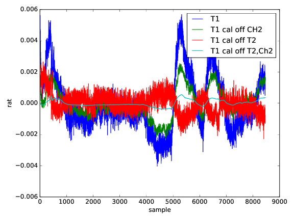

## Mar 1, 2017: Tone Stability Tests

Two tones at 1400 and 1401 MHz, get difference/sum via 180 hybrid, feed
into two channels. No amplifiers anywhere.

So I measure amplitude of four tones, two in each channel: T1C1, T2C1, T2C1, T2C2.

I then plot relative fluctuations of X as (X-meanX)/meanX for four
combinations:

### plots

 * T1 - just T1C1

 * T1C1/T1C2 - you can this of this as T1 measured in C1 calibrated off
C2. This will get rid of intrinsic fluctuations of T1 generator, but 1/f
differences between two channels will remain. [note that once we add
amplifiers, this will get way worse]

 * T1C1/T2C1 - you can think of this as T1 measured in C1, calibrated off
T2 measured *in the same channel*. This will get rid of any 1/f present
in CH1, but intrinsic fluctuations between two generators will remain.

 * T1C1 / T2C1 * T2C2/T1C2 - you can think of T1 measured C1, calibrated
off T2 measured in the same channel and corrected for fluctuations in
relative amplitude of tone generators from C2. Another way of thinking
is that this is what one would get if tone generators were
amplitude-wise perfect.

First plot show actual traces, second plot power spectra. I think it is
interesting how unstable tone generators are: digitizer C1/C2 are
relatively more stable to each other than T1/T2. The last case has
reached numerical floor for time scales of seconds but even that shows
1/f - it seems bandpass shape change over 1MHz range at the level of
1e-4 on hour timescales. Note that a single integration over 1MHz over
one 0.1 second gives you relative precision in power of 3e-3. So we want
to calibrate on short time scales to better than ~1e-3 even if we are
just going to rely on measured broadband over longer timescales. I'm
pretty sure all 21cm experiments suffer from this, but they probably
sweep it under the rug... :)

###  Are we seeing hybring changing with temperature

So far we assume that the 180 deg hybrid used to split/add tones is
perfectly stable. If it is not, sending more signal one way that the
other, it could mimic amplitude instability.

What Chris noticed is that cyan line in the plots I attach previously is
a) really correlated with others and b) could be caused not just by
bandpassed fluctuating, but more likely by the temperature (or
something) sensitivity of the hybrid, so I went, fitted it to the other
lines and subtracted.

I went, fitted that cyan line to the other lines and subtracted and
these are the resulting plot. It really improves, by a factor of 5-10,
except at the very beginning, but that could be the digitizer heating
up transient. See attached. So better to repeat this replacing hybrid
with just the coupler as we'll do at the end anyway.

