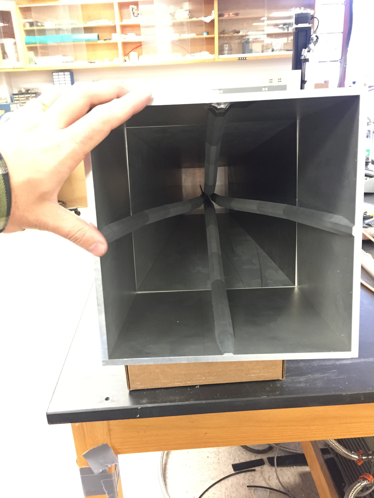
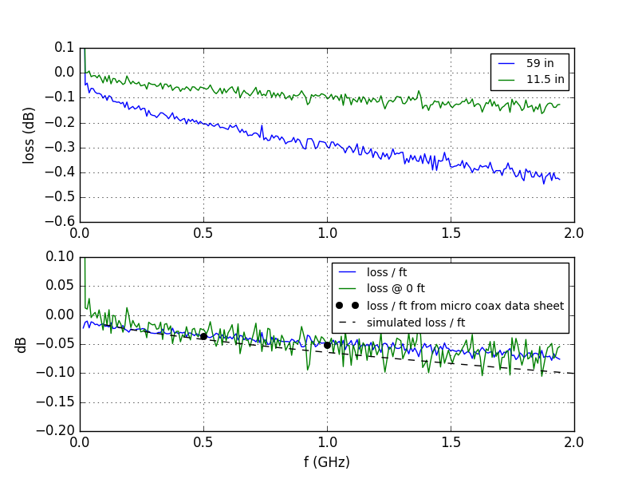

## March 21, 2017: New OMT S-parameter measurements 
Christopher D. Sheehy

### 1 - Introduction

In [a previous posting](../20161215_final_OMT_design.md), I detailed the design of a
new OMT that was an improvement over the previous OMT design, which had been characterizied in
[this posting](../20161025_OMT_measurements.md). The main improvements were
the substitution of larger diameter, ultra low loss coax, the addition of a
profiled transition to free space that can directly couple to a feed horn, and a
compactification of the OMT. Last week I went out to Michigan and
assembled the first two OMTs and made measurements on the VNA. This posting
shows those measurements.

### 2 - OMT assembly

Because the OMT and transition is now a single piece, I propose we refer to the
whole assembly as "the OMT." **Figure 1** shows the assembly process of the OMT. Two
opposing ridges (the ones with the coax hole closer to the ground plane, which
I'm defining as the y-polarization) are placed on the mounting block (a). The
location is set by dowel pins press fit into the mounting block and slip fit
into the bottom of the ridges.
An assembly jig is lowered around the ridges, which are then
bolted to it and lifted off the mounting block. One of the ridges is then removed
from the assembly jig (b). A length of coax is inserted through the hole (which
needs a little manual reaming with a drill bit). A 0.375" section of copper
jacket is cut off with a Dremel, leaving a 1.625" length at the end as the
resonator. The tolerances on these last two dimensions are +/- 0.01" and +/-
0.07", respectively, as shown in Figs 7 and 8 of the previous posting. The coax
is then pulled back until the cut section is flush with the ridge face and the
opposing ridge is put into place and bolted back to the assembly jig. The two
ridges are then placed back on the mounting plate (c). Steps a-c are then
repeated for the orthogonal ridges (d). Then the walls are screwed onto the
mounting plate and ridges (e). These walls add quite a bit of
stiffness. Finally, we aluminum tape the outside seams, solder SMA connectors to
the coax, and attach clamp blocks to the coax pigtails that keep it from slipping.
A final assembled OMT is shown in (f).

Note that in Figure 1c, you can see where I accidentally scored the center
conductor of OMT B y-pol with the dremel. As later plots show, this appears to
have no discernible effect. Also,
it must be noted that we dropped one of the ridges of OMT A and sheared off a
half-inch of the tip. We sort of aluminum taped it back in place, which you can
see in Figure 1f, but again, there is no obvious difference between OMT A and B.

It's obvious in Fig 1f that the mid section walls aren't perfectly squared. This
is because they are thin metal and only mount via three small tapped holes along
the center line of the back of each ridge. There is nothing constraining their
edges. With the OMT on the VNA, I pushed pretty hard on these walls and deformed
them by a few mm. Since there was no discernible effect on the S parameters I
don't think this should be a problem.

<b>Fig 1 - OMT assembly</b>
<table border="1">
<tr><th>a - two ridges
<th>b - installing coax
<th>c - two ridges assembled
<tr>
<td>
<td>
<td>
<tr><th>d - all four ridges
<th>e - almost assembled
<th>f - looking into aperture
<tr>
<td>
<td>
<td>

</table>

### 3 - S-parameter measurements

#### *OMT pointed at absorber*

The first measurement setup is shown in **Figure 2a**. An open ended OMT is
pointed at eccosorb absorber (VHP-12). This allows us to measure the reflection
S11 and the crosstalk between polarizations, but without access to S21 we
cannot measure loss.

The measurements and the HFSS sims of this setup are shown in **Figure
2b**. (Note that in Figure 2a, the connectors are jankily soldered surface mount
SMA connectors because we did not have the right parts yet. The measurements in
Fig 2b are
for the test setup depicted in Fig 1a but use the proper connectors.) The top panel of Fig 2b
shows S11. The agreement between sim and data is very impressive. There are
some minor differences, especially near the nulls of the y polarization, but
overall the agreement is excellent -- compare with the [same measurements of the
previous
OMT](https://cloud.githubusercontent.com/assets/6098508/19696255/5de577f4-9ab4-11e6-825f-5b419d630bea.png). The
improvement is probably a combination of the OMT tolerances themselves, a
slightly more realistic sim, and much more careful VNA calibration on my
part. Of the three effects, I suspect the latter is most important. Also good is
the repeatability between the two OMTs, labeled A and B.

The bottom panel of Fig 2b shows the crosstalk between polarizations. The data
show some minor structure that the sims do not predict, but the mean level is
correct, and at -40 dB is basically negligible. Also interesting to note is that
the sims predict the same crosstalk from x->y as y->x. This is reflected in the
data, but the structure is very different between OMTs A and B.

<table border="1" cellpadding="0" cellspacing="0">
<tr><td>
  <table border="0" cellpadding="5" cellspacing="0">
  <tr><th rowspan="2">Fig.&nbsp;2&nbsp;-</th>
      <th colspan="2">OMT pointed at absorber</th>
  </tr>
  <tr><td align="center"><b>a. </b> setup</td>
      <td align="center"><b>b. </b> results</td>
  </tr>
  <tr><td>&nbsp;</td>
      <td></td>
      <td></td>
  </tr>
  </table>
</td></tr>
</table>

Without a feed horn, there is a slightly higher reflection at the OMT
aperture. We thus expect S11 to be slightly lower with the feed horn in place.

#### *Two shorted OMTs*

Next, to measure S21 and the loss, we coupled two OMTs together. The
experimental setup is shown in Figure 3.

<table border="1" cellpadding="0" cellspacing="0">
<tr><td>
  <table border="0" cellpadding="5" cellspacing="0">
  <tr><th>Fig.&nbsp;3&nbsp;-</th>
      <th>OMTs shorted</th>
  </tr>
  <tr><td>&nbsp;</td>
      <td align=center></td>
  </tr>
  </table>
</td></tr>
</table>

I simulated this setup in HFSS but the model contains loss from only the coax dielectric
and aluminum but not the SMA connectors. We therefore made a measurement of the
connector loss with the following procedure: 
1. Connectorize a long length of
coax (59"), measure S11 and S21, and compute the loss as (S21+S22), where of
course S11 and S22 are expressed as fractional power instead of dB. This
includes the loss from two connectors and the coax. 
2. Cut the coax down to 12", reconnectorize, and repeat the measurement. 
3. Since loss in dB scales linearly with length, compute the slope and y-intercept of loss as a function
of coax length. The slope gives loss/ft and the y-intercept gives the loss at zero
length, i.e. the loss from the two connectors.

**Figure 4** shows the results of this procedure. The top panel shows the loss in dB measured for
  the two lengths. The bottom panel shows the loss/ft in blue. The dashed black
  line is the simulated loss in a 12" length of coax and it matches very
  well. (This is not incredibly surprising, as I tuned the teflon relative
  permittivity in HFSS to match the Micro Coax data sheet. The "ultra low
  density" teflon is not standard and makes a big difference.) The black points
  are loss/ft from the Micro Coax data sheet. This proves that we can simulate and
  measure loss accurately at these low levels. Lastly, the green line shows the
  zero point loss, attributable to the connectors. The fact that it is close to
  the blue line is probably a coincidence.

<table border="1" cellpadding="0" cellspacing="0">
<tr><td>
  <table border="0" cellpadding="5" cellspacing="0">
  <tr><th>Fig.&nbsp;4&nbsp;-</th>
      <th>Coax loss</th>
  </tr>
  <tr><td>&nbsp;</td>
      <td align="center"></td>
  </tr>
  </table>
</td></tr>
</table>

**Figure 5** shows the S-parameter measurements and simulations. I have added
  the zero point loss (green line in bottom panel Figure 4) to the S21
  sims. This is appropriate because there are two connectors in the shorted
  configuration. There are two sets of points for a "forward" and "reverse"
  measurement, which just refers to whether I'm plotting S21/S11 or S12/S22. The
  agreement between data and simulation is excellent and I think proves we
  understand what's going on. The agreement is certainly as good as, and maybe
  better than, the 
  [VLA paper](https://github.com/bmxdemo/bmxproject/files/655665/05722981.pdf)
  that this design is based on. (See Figs 14-16, and keep in mind this is for
  one OMT, not two.)

<table border="1" cellpadding="0" cellspacing="0">
<tr><td>
  <table border="0" cellpadding="5" cellspacing="0">
  <tr><th>Fig.&nbsp;5&nbsp;-</th>
      <th>Shorted OMT S-parameters</th>
  </tr>
  <tr><td>&nbsp;</td>
      <td align=center></td>
  </tr>
  </table>
</td></tr>
</table>

**Figure 6** shows the simulated and measured loss, both divided by two (in dB)
  to represent the loss from a single OMT. The points are the measured loss. (To
  be safe, since this is a 4 port measurement, I also terminated port 2 and
  measured S31 and S41 and included these in the loss measurement. The crosstalk
  in Fig 2b is so low that I expected this to be a negligible correction, and in
  fact it is.)  The dotted lines are the loss simulated in HFSS. The red and
  blue lines, which are difficult to see because they are behind the dashed
  black line, are the simulated loss plus half the measured zero point
  loss. With the correction for the zero point, the simulated loss now matches
  the measured loss.  Lastly, because there are multiple internal reflections in
  the shorted OMT setup, it's possible that measured loss / 2 is not the same as
  the loss of a single, open ended OMT. The dashed black line is the HFSS sim of
  a single OMT. Because, with the exception of lacking a few sharp nulls, it
  matches the red and blue lines, we can be sure that the loss measured in the
  shorted configuration is twice the loss of a single OMT.

<table border="1" cellpadding="0" cellspacing="0">
<tr><td>
  <table border="0" cellpadding="5" cellspacing="0">
  <tr><th>Fig.&nbsp;6&nbsp;-</th>
      <th>Single OMT loss</th>
  </tr>
  <tr><td>&nbsp;</td>
      <td align=center></td>
  </tr>
  </table>
</td></tr>
</table>

The loss is -0.08 dB at 1 GHz, which is 2%, and will contribute an extra 6 K of
noise temperature. We could work on trying to decrease the loss of the
connectors, but it's unclear how much there is to gain. Molex is a very
expensive, very high quality connector manufacturer, and [their SMA
connectors](http://www.molex.com/pdm_docs/ps/PS-89675-346.pdf) have total return
loss of -0.04 dB * sqrt(freq in GHz), which is our measured connector dissipative
loss. Some of Molex's return loss spec comes from reflections, which we don't
care about, so their dielectric losses could be better than 0.04 dB. But a 0.04
dB return loss from reflections would make S11 = -20 dB, which seems to high to
me, so I'd wager that most of that specification is due to dielectric losses
instead of reflections.  We could also shorten the coax pigtail, but there's
only 1-2 inches of excess, which would gain us 0.004 - 0.008 dB improvement. For
reference, the LNA has a 28 K noise temperature at 1 GHz, equivalent to a 0.4 dB
loss at room temperature.

### 4 - Calibration signal coupling

The last thing we did was see if we could couple a signal directly into the OMT
by inserting a coax into the unused hole opposite the pigtail. X and y
polarizations each get their own coupler. **Figure 7** shows the setup for
measuring the x-pol coupling.

<table border="1" cellpadding="0" cellspacing="0">
<tr><td>
  <table border="0" cellpadding="5" cellspacing="0">
  <tr><th>Fig.&nbsp;7&nbsp;-</th>
      <th>Calibration coupler setup</th>
  </tr>
  <tr><td>&nbsp;</td>
      <td align=center></td>
  </tr>
  </table>
</td></tr>
</table>

**Figure 8a** shows the co- and cross polar
coupling. The coupling is highly tunable and depends on how close the inserted
coax gets to the length of coax already inside. The closer it is, the higher the
coupling. -20 dB coupling is about as high I could get it without shorting. -40
was about as as low as I could get without pulling the coax out 
of the hole. The variation in the coupling in Fig 8a is due entirely to this
variable, which I deliberately varied.
We can tune it to be anything between these two extremes with not much
difficulty. An extra coax clamp block holds the calibrator coax nicely in place. We 
want to choose < -30 dB coupling to keep any extra noise temperature to a
minimum. The cross polar coupling is low, at least 35 dB down from the co-polar
coupling. 

The coupling is relatively flat in band, though it does have some
structure. Interestingly, it is very repeatable from OMT to OMT and doesn't
depend on the coupling strength, which indicates we can characterize it quite
well. I'm not sure that frequency structure matters much here, though. An
uncalibrated frequency dependent gain mimics a cosmological mode corresponding to
concentric spheres centered on the earth. This is just the k_perp = 0 mode,
which gets thrown out anyways. What we really need is the coupling to be stable
in time, and the repeatability of the coupling indicates it likely is.

**Figure 8b** shows that the insertion of the calibrator coax does not
  appreciably change S11 on the signal coax.

If we like this scheme, we could get rid of the 30 dB directional coupler, which
has 0.1 dB max loss. This would decrease our noise temperature by ~7 K.

<table border="1" cellpadding="0" cellspacing="0">
<tr><td>
  <table border="0" cellpadding="5" cellspacing="0">
  <tr><th rowspan="2">Fig.&nbsp;8&nbsp;-</th>
      <th colspan="2">Calibration signal injection</th>
  </tr>
  <tr><td align="center"><b>a. </b> coupling </td>
      <td align="center"><b>b. </b> change in S11 </td>
  </tr>
  <tr><td>&nbsp;</td>
      <td></td>
      <td></td>
  </tr>
  </table>
</td></tr>
</table>

## 5 - S-params with feed horn

The throughput with the feed horn will not be the same as with an open ended OMT,
nor will it be the same as half the shorted OMTs.  (The loss should not change
much as we're dominated by the coax and connectors, not the aluminum.)
Since we can trust our simulations, **Figure 9** shows S11 simulated for the OMT
plus a feed horn, where the horn is a 45" aperture, 30
degree flare angle pyramidal horn. S11 is better than -13 dB (95% throughput)
in the interval 0.71 - 1.55 GHz.

<table border="1" cellpadding="0" cellspacing="0">
<tr><td>
  <table border="0" cellpadding="5" cellspacing="0">
  <tr><th>Fig.&nbsp;9&nbsp;-</th>
      <th>S11 for OMT with feed horn</th>
  </tr>
  <tr><td>&nbsp;</td>
      <td align=center></td>
  </tr>
  </table>
</td></tr>
</table>

## 6 - Conclusions

* S-parameter and loss measurements of the new OMT match simulations very well
* S11 < -13 dB across the band (0.7-1.5 GHz), which is better than 95% throughput
* the loss of a signal OMT is 2%, dominated by coax and connectors, which
contribute roughly equally. We were hoping for 1%, which we would achieve without the connectors
* we can achieve -30 dB co-polar and < -60 dB cross-polar coupling directly at the OMT
* including the feed horn, we expect better than -13 dB (-95% throughput) across the band.

<!--

One panel

<table border="1" cellpadding="0" cellspacing="0">
<tr><td>
  <table border="0" cellpadding="5" cellspacing="0">
  <tr><th>Fig.&nbsp;1&nbsp;-</th>
      <th>Figure title</th>
  </tr>
  <tr><td>&nbsp;</td>
      <td></td>
  </tr>
  </table>
</td></tr>
</table>

Two panel

<table border="1" cellpadding="0" cellspacing="0">
<tr><td>
  <table border="0" cellpadding="5" cellspacing="0">
  <tr><th rowspan="2">Fig.&nbsp;1&nbsp;-</th>
      <th colspan="2">Figure title</th>
  </tr>
  <tr><td align="center"><b>a. </b> label a</td>
      <td align="center"><b>b. </b> label b</td>
  </tr>
  <tr><td>&nbsp;</td>
      <td></td>
      <td></td>
  </tr>
  </table>
</td></tr>
</table>

Three panel

<b>Fig 1 - Figure title</b>
<table border="1">
<tr><th>a - label 1
<th>b - label 2
<th>c - label 3
<tr>
<td>
<td>
<td>
</table>

-->
