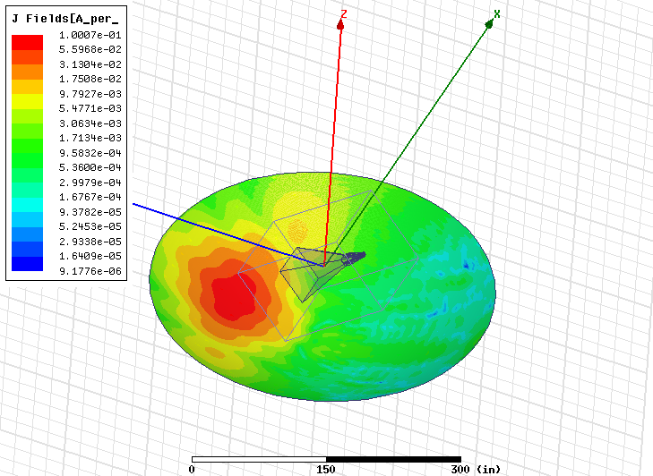
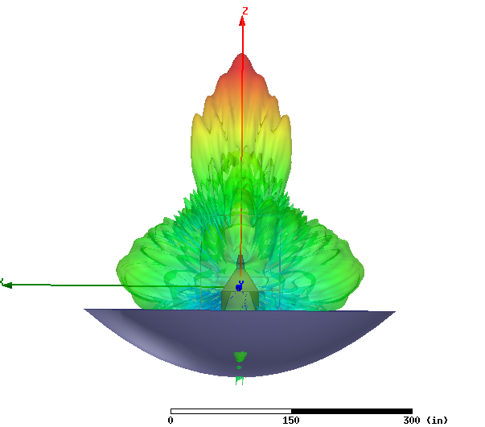

## March 23, 2017: Beam simulations
Christopher D. Sheehy

### 1 - Introduction

In [a previous posting](../20161215_feedhorn_sims.md), I simulated the beam of a
pyramidal feed horn with 46.5" diameter and 30 degree flare angle. The beam was
~14 deg FWHM and 30% elliptical (see figs 5 and 6). I also computed the near
field E-field and showed that E-field^2 was ~ -10 dB at the dish edges. In this
posting, I simulate the full OMT + horn + dish far field beam.

All of the beams shown in this posting are at 1 GHz.

### 2 - Flat mirror

Including the dish in the full simulation volume is too memory intensive to
solve. HFSS thus allows a hybrid approach, where a full simulation is run
for the feed horn, which then radiates into free space. A reflecting element can
then be included as a perfectly conducting 2D surface using an "integral
equation" method. To verify that this method is working correctly 

Figure 1a shows a pyramidal horn illuminating a flat mirror. The resulting far
field beam (in linear units) is also shown emanating from the origin of a
coordinate system whose z axis has been aligned with the *expected* reflected
angle. The fact that the beam points along the z axis is not by construction and
proves that the simulation gets the reflection right. Figure 1b shows the beam
as a function of polar latitude in this coordinate system. The different lines
are for different longitudinal slices through the beam. Comparing to [the beam
of the horn simulated by
itself](https://cloud.githubusercontent.com/assets/6098508/21246510/40e2963a-c2f7-11e6-97cf-cd5c4108b1c5.png),
it looks like it's the same. Therefore I think we can be assured that this
simulation method is accurate.

<table border="1" cellpadding="0" cellspacing="0">
<tr><td>
  <table border="0" cellpadding="5" cellspacing="0">
  <tr><th rowspan="2">Fig.&nbsp;1&nbsp;-</th>
      <th colspan="2">Pyramidal horn illuminating flat mirror</th>
  </tr>
  <tr><td align="center"><b>a. </b> simulation setup </td>
      <td align="center"><b>b. </b> beam </td>
  </tr>
  <tr><td>&nbsp;</td>
      <td></td>
      <td></td>
  </tr>
  </table>
</td></tr>
</table>

### 3 - Phase center calculation

We had been assuming that we needed to place the center of the horn aperture at
the dish focal point. It turns out this is not quite right. Technically, we need
to place the "phase center" of the system at the focal point. This is the point
from which radiating, far-field spherical wave fronts (in the time reverse
sense) appear to converge (in the time forward sense). This location is easy to
determine in HFSS. **Figure 2** shows the radiating E-field and a coordinate
system centered on the phase center for this horn.

<table border="1" cellpadding="0" cellspacing="0">
<tr><td>
  <table border="0" cellpadding="5" cellspacing="0">
  <tr><th>Fig.&nbsp;2&nbsp;-</th>
      <th>Radiating E-field and phase center</th>
  </tr>
  <tr><td>&nbsp;</td>
      <td align=center></td>
  </tr>
  </table>
</td></tr>
</table>

In Sections 4-5, the phase center is placed at the focus. The effect of placing
the aperture plane at the focus is to produce excess 
asymmetry. This is shown later in Section 6, Fig. 11.

### 4 - Beam simulations

####  *Perfect paraboloid*

First I drew in a perfect paraboloid reflecting the parameters given by Paul in
[this posting](../20160906_dish_parab_params.md). The horn phase center is at
the focal point and the horn is rotated up from nadir by 51 degrees, which points it at
cross bar 3. The results are sensitive to
the mesher surface accuracy, which I've set to 1 mm in this and the following
examples. Re-running select examples with 5 mm seems to give the same
results. **Figure 3** shows the aperture illumination on a log scale. **Figure
4** shows the 3D beam in dB. **Figure 5** shows the 2D beam in dB along three
longitudinal cuts. As expected, the beam size gets smaller.

<table border="1" cellpadding="0" cellspacing="0">
<tr><td>
  <table border="0" cellpadding="5" cellspacing="0">
  <tr><th>Fig.&nbsp;3&nbsp;-</th>
      <th>Perfect parabola, aperture illumination</th>
  </tr>
  <tr><td>&nbsp;</td>
      <td align=center></td>
  </tr>
  </table>
</td></tr>
</table>

<table border="1" cellpadding="0" cellspacing="0">
<tr><td>
  <table border="0" cellpadding="5" cellspacing="0">
  <tr><th rowspan="2">Fig.&nbsp;4&nbsp;-</th>
      <th colspan="2">Perfect parabola, 3D log beam</th>
  </tr>
  <tr><td align="center"><b>a. </b> side </td>
      <td align="center"><b>b. </b> front </td>
  </tr>
  <tr><td>&nbsp;</td>
      <td></td>
      <td></td>
  </tr>
  </table>
</td></tr>
</table>

<table border="1" cellpadding="0" cellspacing="0">
<tr><td>
  <table border="0" cellpadding="5" cellspacing="0">
  <tr><th>Fig.&nbsp;5&nbsp;-</th>
      <th>Perfect parabola, 2D beam (dB)</th>
  </tr>
  <tr><td>&nbsp;</td>
      <td align=center></td>
  </tr>
  </table>
</td></tr>
</table>

#### *Cut parabola*

Next I cut down the parabola to the dish outline and repeated. Now I'm only
showing the aperture illumination and 2D beam. The sidelobes seem to get better
(!). I'm not sure why this is. Maybe because the dish is now truly off axis and
scattering off the horn decreases? Also interesting is that ellipticity seems to
get a little better. I find this strange. One thing to note is that I've
accidentally pointed the horn slightly off the dish center line. It should be
pointed at the seam between the two petals, but instead is pointed at the
center line of the petal to the left of this seam. In practice this makes very
little difference except to induce a tiny amount of left/right asymmetry to the
beam. [The 3D beam plot](Screenshot-22.png) shows that this isn't an issue.

<table border="1" cellpadding="0" cellspacing="0">
<tr><td>
  <table border="0" cellpadding="5" cellspacing="0">
  <tr><th rowspan="2">Fig.&nbsp;6&nbsp;-</th>
      <th colspan="2">Cut parabola</th>
  </tr>
  <tr><td align="center"><b>a. </b> aperture illumination </td>
      <td align="center"><b>b. </b> beam (dB) </td>
  </tr>
  <tr><td>&nbsp;</td>
      <td></td>
      <td></td>
  </tr>
  </table>
</td></tr>
</table>

#### *Actual dish*

Next I sub in the actual dish with flat petals. Note the aperture illumination
is now linear scale. The sidelobes change a bit but it basically looks the same
as the cut parabola. This is a vindication of the flat sheet paraboloid approximation.

<table border="1" cellpadding="0" cellspacing="0">
<tr><td>
  <table border="0" cellpadding="5" cellspacing="0">
  <tr><th rowspan="2">Fig.&nbsp;7&nbsp;-</th>
      <th colspan="2">Dish</th>
  </tr>
  <tr><td align="center"><b>a. </b> aperture illumination </td>
      <td align="center"><b>b. </b> beam (dB) </td>
  </tr>
  <tr><td>&nbsp;</td>
      <td></td>
      <td></td>
  </tr>
  </table>
</td></tr>
</table>

### 5 - Alternate horns

Next I tried two alternate horns with the actual dish. 

#### *Compact pyramidal horn*

The first thing I tried was a
compact pyramidal feed horn, with an aperture = 27". 
This is shown
in **Figure 8**.  Comparing to Figure 7, the beam gets a little narrower and
the asymmetry in the near sidelobes gets better. The ground pickup (beam at 180
degrees) gets worse, which makes sense.

<table border="1" cellpadding="0" cellspacing="0">
<tr><td>
  <table border="0" cellpadding="5" cellspacing="0">
  <tr><th rowspan="2">Fig.&nbsp;8&nbsp;-</th>
      <th colspan="2">Compact pyramidal feed horn </th>
  </tr>
  <tr><td align="center"><b>a. </b> aperture illumination </td>
      <td align="center"><b>b. </b> beam (dB) </td>
  </tr>
  <tr><td>&nbsp;</td>
      <td></td>
      <td></td>
  </tr>
  </table>
</td></tr>
</table>

#### *Compact corrugated feed horn*

The next thing I tried was a corrugated feed horn with the same aperture diameter
as the compact pyramidal feed horn.  I happen to have a drawing of a very nice
X-band feed horn (10 GHz), which I scaled up to have the same aperture diameter
as the large pyramidal feed horn. This scaled horn works at 1 GHz. The corrugated
horn and its beam are shown in these two plots: [horn](Screenshot-52.png),
[beam](Screenshot-53.png). They should be compared to the pyramidal horn and
beam, shown in these two plots: [horn](Screenshot-57), [beam](Screenshot-58.png).
I then created a compact version of the corrugated horn by
cutting it down to have the same aperture as the compact pyramidal horn.  The results
of the compact corrugated horn pointed at the dish are shown in
**Figure 9**. This horn is not necessarily broad band enough for
us, but it is a working example of something that has the nicest, lowest
sidelobe, most Gaussian beam possible. Compared to the compact pyramidal
feed horn, the beam is less elliptical and the sidelobes get
better, particularly around 90 degrees. Nonetheless, when coupled to the dish,
the difference between the corrugated and pyramidal horns is not nearly as much
as when they are on their own.

<table border="1" cellpadding="0" cellspacing="0">
<tr><td>
  <table border="0" cellpadding="5" cellspacing="0">
  <tr><th rowspan="2">Fig.&nbsp;9&nbsp;-</th>
      <th colspan="2">Compact corrugated feed horn </th>
  </tr>
  <tr><td align="center"><b>a. </b> aperture illumination </td>
      <td align="center"><b>b. </b> beam (dB) </td>
  </tr>
  <tr><td>&nbsp;</td>
      <td></td>
      <td></td>
  </tr>
  </table>
</td></tr>
</table>

**A technical note: you'll notice that the air boxes drawn in Section 4 encompass
the entire horn, while in Section 5 they are only at the aperture. The larger
airbox contains the coaxial ports, which requires drawing it in as a "lumped
port" rather than a "wave port". The former is meant to be for internal
resonators like a dipole or patch antenna, while the latter is for driven
ports. Since I used a lumped port on the coax in Sec. 4, it radiates both into
the OMT *and* into the airbox. You can see this 4pi steradian radiation at the
bottom of Fig 2, and it shows up in the beam. In reality, of course, there's a
coax there feeding the port and it does not show up in the beam. I repeated
Fig. 8 with the lumped port and wave port setup and it made very little
difference. However, repeating Fig. 9 with the lumped port results in a broad
sidelobe from 45 deg - 140 deg. I think the difference is that the coax port is
small and not a good radiator, while the large circular port on the back of the
corrugated horn radiates well. So the plots in Sec. 4 might move around a little
if I fixed this problem, but not by much.*

### 6 - Dish obscuration

Because we need to put the horn at the phase center, the zenith pointing rays at
the inner edge of the dish now intersect the feed horn. The problem is worse for
the large pyramidal feed horn and better for the compact pyramidal horn. The top
view for both is shown in **Figure 10**.

<table border="1" cellpadding="0" cellspacing="0">
<tr><td>
  <table border="0" cellpadding="5" cellspacing="0">
  <tr><th rowspan="2">Fig.&nbsp;10&nbsp;-</th>
      <th colspan="2">Dish obscuration</th>
  </tr>
  <tr><td align="center"><b>a. </b> large pyramidal horn </td>
      <td align="center"><b>b. </b> compact pyramidal horn </td>
  </tr>
  <tr><td>&nbsp;</td>
      <td></td>
      <td></td>
  </tr>
  </table>
</td></tr>
</table>

With the compact horn, the zenith ray just barely grazes the horn. Also, because
the edge illumination is low, there's not much power in this part of the
beam. **Figure 11** shows what happens when you put the aperture plane of the
pyramidal horn at the focus. The problem is worse for large horn, where you can
clearly see the double peak. The double peak is not evident at 1 deg
resolution for the compact pyramidal horn, but comparing to Fig 8b, the main
beam becomes much more asymmetric.

<table border="1" cellpadding="0" cellspacing="0">
<tr><td>
  <table border="0" cellpadding="5" cellspacing="0">
  <tr><th rowspan="2">Fig.&nbsp;11&nbsp;-</th>
      <th colspan="2">Horn aperture plane at dish focus</th>
  </tr>
  <tr><td align="center"><b>a. </b> large pyramidal horn </td>
      <td align="center"><b>b. </b> compact pyramidal horn </td>
  </tr>
  <tr><td>&nbsp;</td>
      <td></td>
      <td></td>
  </tr>
  <tr><td>&nbsp;</td>
      <td></td>
      <td></td>
  </tr>

  </table>
</td></tr>
</table>

Lastly, I proved that the scattering off the horn is included in the
simulations. I did this by repeating the flat mirror setup of Figure 1 but
pointing the horn straight down, moving it closer to the mirror, and adding a
large obscuring plate at the back of the horn that does not affect the horn's
radiating beam but ought to scatter the reflected beam. The setup is shown in
**Figure 12a**. The resulting beam, shown in **Figure 12b**, is grossly
distorted compared to Figure 1b. This proves that presence of the horn is
included in the far field beam. (Interestingly, just pointing the horn down
induces higher sidelobes but doesn't make the beam particularly ugly. I was
expecting a central dip, but since the horn is only a few wavelengths across I'm
guessing that's not enough to cause a significant shadow.)

<table border="1" cellpadding="0" cellspacing="0">
<tr><td>
  <table border="0" cellpadding="5" cellspacing="0">
  <tr><th rowspan="2">Fig.&nbsp;12&nbsp;-</th>
      <th colspan="2">Horn and plate pointed straight down at mirror</th>
  </tr>
  <tr><td align="center"><b>a. </b> setup </td>
      <td align="center"><b>b. </b> beam </td>
  </tr>
  <tr><td>&nbsp;</td>
      <td></td>
      <td></td>
  </tr>
  </table>
</td></tr>
</table>

### 7 - Conclusions

* The flat petal dish is just as good as a true parabola at 1 GHz.
* A compact, 27" diameter pyramidal feed horn coupled to the dish has good performance, with
 ~ 5 deg FWHM, ~30 % ellipticity in the near sidelobes out to 10 deg off axis, and
  <-30 dB sidelobes beyond 10 deg.
* A corrugated horn has lower sidelobes and is not elliptical. Jeff and Michigan
  postdoc Sara Simon are thinking about profiled horns that could achieve
  sidelobe performance similar to a corrugate horn, though with a profile not
  quite as symmetrically Gaussian. See [Sara's
  thesis](https://www.princeton.edu/physics/graduate-program/theses/Thesis_Simon_8_8_2016.pdf).
* With the horn at the phase center, we obscure the dish slightly. While this
  might technically violate the off-axis requirement, with the compact horn the
  obscuration is very small. The effect is included in the simulations.

<!--

One panel

<table border="1" cellpadding="0" cellspacing="0">
<tr><td>
  <table border="0" cellpadding="5" cellspacing="0">
  <tr><th>Fig.&nbsp;1&nbsp;-</th>
      <th>Figure title</th>
  </tr>
  <tr><td>&nbsp;</td>
      <td></td>
  </tr>
  </table>
</td></tr>
</table>

Two panel

<table border="1" cellpadding="0" cellspacing="0">
<tr><td>
  <table border="0" cellpadding="5" cellspacing="0">
  <tr><th rowspan="2">Fig.&nbsp;1&nbsp;-</th>
      <th colspan="2">Figure title</th>
  </tr>
  <tr><td align="center"><b>a. </b> label a</td>
      <td align="center"><b>b. </b> label b</td>
  </tr>
  <tr><td>&nbsp;</td>
      <td></td>
      <td></td>
  </tr>
  </table>
</td></tr>
</table>

Three panel

<b>Fig 1 - Figure title</b>
<table border="1">
<tr><th>a - label 1
<th>b - label 2
<th>c - label 3
<tr>
<td>
<td>
<td>
</table>

-->
