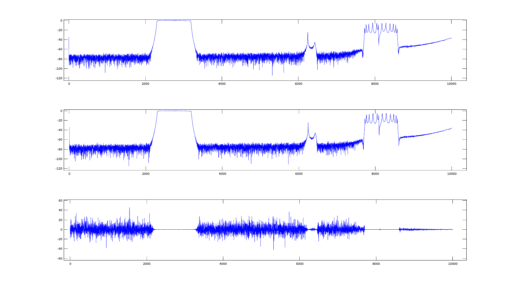
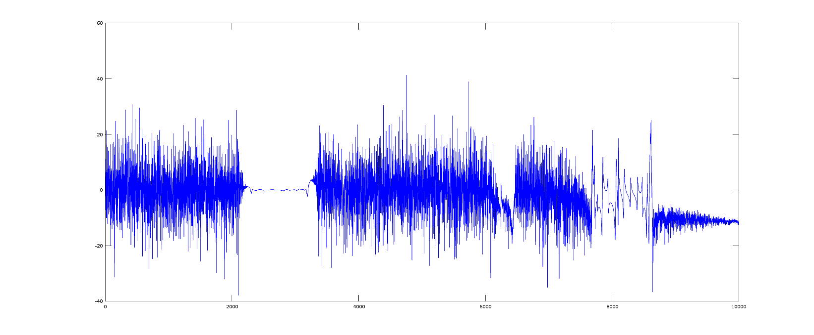

## March 28, 2017: Filter Measurements
posted by Justine Haupt

On 3/14 I used a Copper Mountain TR5048 VNA to measure the S21 parameter (forward gain) of BMX's two Lorch bandpass filters. A two-port calibration was done prior to measurement. The VNA was grounded to the filter chassis.

The filters are marked with serial numbers AU1 and AU2. Nominal center frequency is 1310MHz and nominal bandwidth is 395MHz. Attenuation is very low, around .25dB for both filters.

Both log magnitude and phase was measured in both direction for each filter (port 1 to port 2 and port 2 to port 1). I marked a "1" next to the left side port on each filter. The VNA software provides CSV files of the spectra of the measurements. Comments are included in the files.

### Summary of results for filter AU1
10,000 point scan from 20kHz to 4.8GHz

#### port 1 to port 2:

Center frequency: 1.31697GHz
Bandwidth: 422.91MHz
Q: 3.114
Loss: -.23dB

[log magnitude csv file](./S21LogMag_Lorch1310Filter_SerialAU1_0kHz-4p8GHz_Port1-2.csv)
 
[phase csv file](./S21Phase_Lorch1310Filter_SerialAU1_0kHz-4p8GHz_Port1-2.csv)

#### port 2 to port 1:

Center frequency: 1.31697GHz
Bandwidth: 421.91MHz
Q: 3.121
Loss: -.24dB

[log magnitude csv file](./S21LogMag_Lorch1310Filter_SerialAU1_0kHz-4p8GHz_Port2-1.csv)
 
[phase csv file](./S21Phase_Lorch1310Filter_SerialAU1_0kHz-4p8GHz_Port2-1.csv)

### Summary of results for filter AU2
10,000 point scan from 20kHz to 4.8GHz

#### port 1 to port 2:

Center frequency: 1.31776GHz
Bandwidth: 426.49MHz
Q: 3.090
Loss: -.25dB

[log magnitude csv file](./S21LogMag_Lorch1310Filter_SerialAU2_0kHz-4p8GHz_Port1-2.csv)
 
[phase csv file](./S21Phase_Lorch1310Filter_SerialAU2_0kHz-4p8GHz_Port1-2.csv)

#### port 2 to port 1:

Center frequency: 1.31777GHz
Bandwidth: 426.53MHz
Q: 3.089
Loss: -.26dB

[log magnitude csv file](./S21LogMag_Lorch1310Filter_SerialAU2_0kHz-4p8GHz_Port2-1.csv)
 
[phase csv file](./S21Phase_Lorch1310Filter_SerialAU2_0kHz-4p8GHz_Port2-1.csv)

### A simple analysis

A plot of the the S21 log magnitude from port 1 to port 2, from port 2 to port 1, and the difference:

This is the difference between the two filters (one direction, not an avereage of the two directions): 

### Note

There are some funny data points in the AU1 data for port 1 to port 2 that prevents a clean plot. They should be removed.

