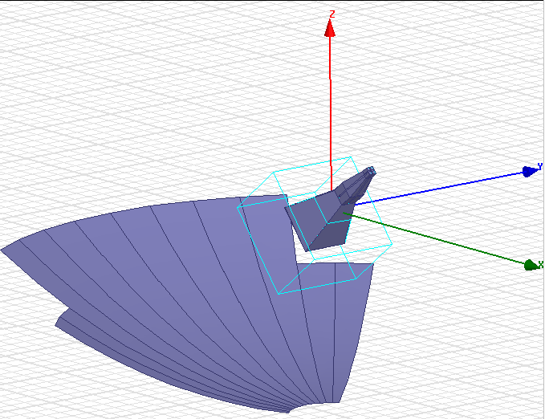
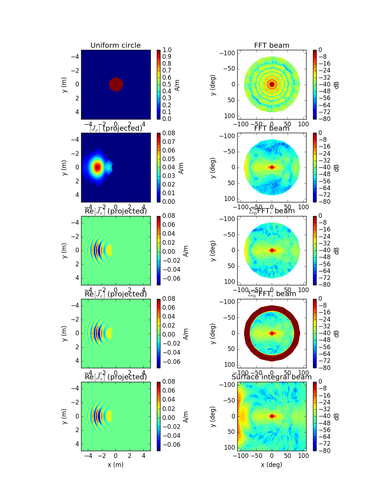
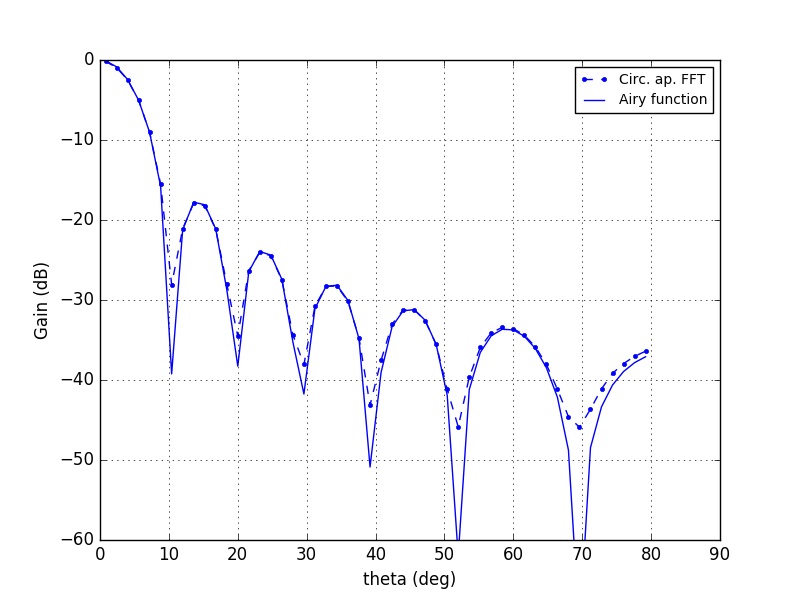
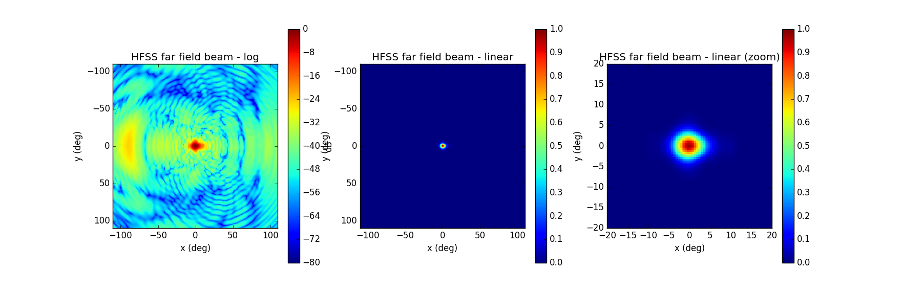
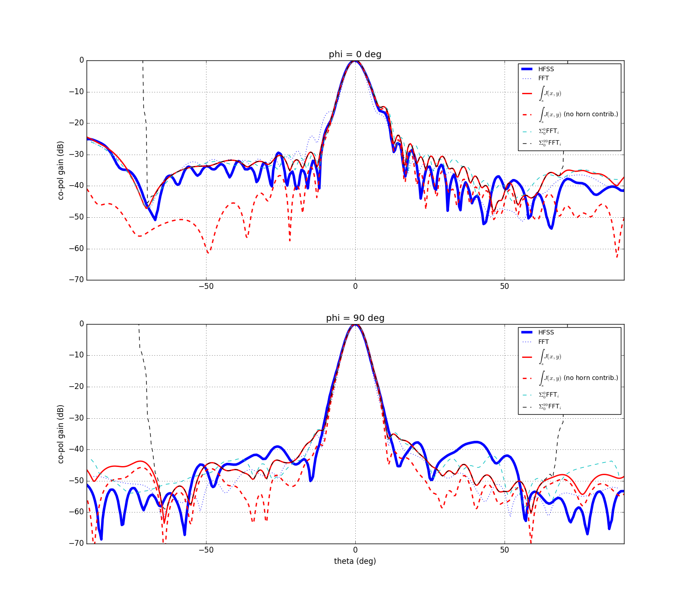

## April 7, 2017: Beam from aperture plane FFT
Christopher D. Sheehy

### 1 - Introduction

In [a previous posting](../20170323_beam_sims/index.md), I showed beams at 1 GHz
simulated using HFSS. In Fig 8, I showed the beam for the "compact" pyramidal
feed horn coupled to the dish. I also showed the surface current, J, induced on
the dish. The far field beam and the electric field in the aperture plane are
Fourier transforms of each other. Thinking in terms of the aperture illumination
is sometimes useful in interferometry. In this posting, I try to compute the far
field beam using the surface current output by HFSS and show that it equals the
far field beam output by HFSS.

Furthermore, this was a very useful exercise for figuring out how full sky
beam polarization conventions work.

### 2 - Method

The procedure follows [Rahmat-Samii,
1984](http://ieeexplore.ieee.org/document/7768593/), [pdf](rds2368.pdf). 

1. In HFSS, excite one OMT coax polarization.
2. Save the resulting complex surface current vector, **J**, defined on the dish
  surface 
3. Bin J in x,y pixels, which effectively projects it onto the xy plane
4. Manipulate J to get the far field beam

For step 4, we can do various things:
1. Compute |FFT(J)|^2 to get the far field beam
2. Apply Equation 11, which effectively multiplies J by the surface Jacobian of
  the parabola and FFTs to account for surface curvature. This is an expansion
  about small theta, and including higher order terms approximates the beam
  better. All terms are FFTs of J with different complex prefactors.
3. Directly compute the surface integral in Eq. 4, which should not be an
  approximation. 	   

A few things to keep in mind:

- FFTing the surface current does not account for obscuration caused by the
  horn. The dish is off axis, so the effect should not be large, but surely some
  rays are scattered at large angles. (I ran a test with a perfect parabola and
  a downward facing horn, and putting in the effect of the central obscuration
  by zeroing J at r<r_horn made a huge difference.)
- I approximated the surface as a parabola for computing the surface Jacobian
  and the complex prefactors. This I can improve, and it might make small
  differences. 

### 3 - Results

**Figure 1** shows the HFSS setup.

<i>Figure 1 - HFSS setup</i>

**Figure 2** shows the projected surface current in the left panels and the
  resulting beams in the right panel. The top row shows a uniformly illuminated
  circular aperture with no curvature. In rows 2-5, J does not change but I am
  sometimes plotting |J| and sometimes plotting Re[J] to reflect how the beam
  calculation is done. Row 2 shows the straight FFT of |J|. Rows 3-5 use the
  equations in the linked paper which include complex phase factors multipliying J, and therefore
  need complex J in the FFT. Row 3 shows the first FFT term of the beam approximation. Row 4 is
  the sum over the first 100 FFT terms, which breaks down as theta->90 deg. Row 5 shows the full numerical
  integration of the surface current.

The max polar latitudinal angle of the FFTed beams is set by the sampling of the x/y plane. HFSS
decides this on its own so there's not much I can do to decrease it. The surface
integral beam has no such limitation.

An important note: in the right hand column Figure 2 I added the contribution from direct horn/sky coupling by running
HFSS with the horn but no dish and adding the horn and dish beams as (sqrt(B_horn) +
sqrt(B_dish))^2. The beams plotted are the "Ludwig third definition" co-polar beam,
which I compute from the x, y, and z polarized beams. Basically, I have complex Jx, Jy
and Jz, and from these can compute the far field Ex, Ey, and Ez. (In the left column, I'm only
showing Jx.) Bx and By are co and cross
polar near theta=0, but at large theta they break down. For instance, Bz is zero
at theta=0, but at (theta, phi) = (90,0), Bz is a maximum and Bx is zero. To get
around this one then projects the x, y, z beams onto the theta and phi spherical
coordinate unit vectors. This is not a good basis because B_theta and B_phi are not aligned
with the dominant polarization axes at theta=0, so this Ludwig definition thing
(Eq. 14-15) is used as the commonly accepted definition of co and cross polar
beams. 

<i>Figure 2 - projected surface current and resulting far field beam</i>

**Figure 3** shows the azimuthal average of the top right panel of Fig 3
  compared to the Airy function, the theoretical expectation. The fact they
  agree means I'm getting the FFT frequency axis and power units correct. Side
  note: I assume that Jy=Jz=0 for the circular aperture, and I need to plot Bx
  instead of B_co-pol to match the Airy function. 

<i>Figure 3 - circular aperture check</i>

**Figure 4** shows the 2D gridded beam from HFSS, which I'm regarding at
  "truth." HFSS outputs on the sphere, so despite the projection distortions
  here, the beam as a function of (theta,phi) is correct. The full beam goes all
  the way out to theta=180, but I'm stopping it here.

<i>Figure 4 - HFSS beam</i>

Lastly, **Figure 5** shows x and y cross sectional slices (phi=0/90) through all
the beams. The thick blue line is the HFSS "true" beam. The straight FFT is the
dotted blue line, and isn't terrible, but doesn't get the main beam shape quite
right. Doing the FFT but accounting for curvature using the first term of the
Rahmat approximation is shown as the dashed cyan line. This captures the main
beam asymmetry. Including 100 terms in the approximation gets us to dashed black
line, which is exactly the same as the full surface integral beam up to theta = 75. Neither of these is a big improvement over just the first term. Nonetheless,
I'm pretty happy that this seems to be working.

The dashed red line is the same as the solid red line but does not include the
direct coupling of the horn to the sky. You can see it makes a pretty big
difference at all angles, especially at phi=0, theta=-50, where it is required
to explain the beam. It's clear that the large -25 dB lobe at the left end of
Fig 4 is from spillover. Since the way I included the effect of the horn was
pretty kludgy (for instance, not taking into account any coherent interference
from path length differences) I expect that much of the beam structure that the
surface integral fails to account for comes from not including the horn
coupling. (The HFSS beam of course includes this.)

<i>Figure 5 - beam cross sections</i>

### 4 - Conclusions

FFTing the surface current on the dish and accounting for dish curvature
captures the directly calculated HFSS beam quite well. This exercise is partly
academic, because we will use the direct HFSS beam in any simulation pipelines
we use. However, it shows that the effect of direct horn/sky coupling is at ~-30
dB effect at 45 degree zenith angles, so we cannot naively apply the HFSS beam
at these large angles to calculate interferometer fringing from sources at these
angles. For now (and maybe forever) we plan to make the flat sky approximation
and use only the mean beam down to -30 dB or so, so this will be fine.

Future work: compute the beam as a function of frequency in HFSS and input into
BMX pipeline; tile aperture illumination for 4 dishes and compute autocorrelation to get
automatically beam convolved uv plane coverage with realistic high ell cutoff. 

<!--

One panel

<table border="1" cellpadding="0" cellspacing="0">
<tr><td>
  <table border="0" cellpadding="5" cellspacing="0">
  <tr><th>Fig.&nbsp;1&nbsp;-</th>
      <th>Figure title</th>
  </tr>
  <tr><td>&nbsp;</td>
      <td></td>
  </tr>
  </table>
</td></tr>
</table>

Two panel

<table border="1" cellpadding="0" cellspacing="0">
<tr><td>
  <table border="0" cellpadding="5" cellspacing="0">
  <tr><th rowspan="2">Fig.&nbsp;1&nbsp;-</th>
      <th colspan="2">Figure title</th>
  </tr>
  <tr><td align="center"><b>a. </b> label a</td>
      <td align="center"><b>b. </b> label b</td>
  </tr>
  <tr><td>&nbsp;</td>
      <td></td>
      <td></td>
  </tr>
  </table>
</td></tr>
</table>

Three panel

<b>Fig 1 - Figure title</b>
<table border="1">
<tr><th>a - label 1
<th>b - label 2
<th>c - label 3
<tr>
<td>
<td>
<td>
</table>

-->
