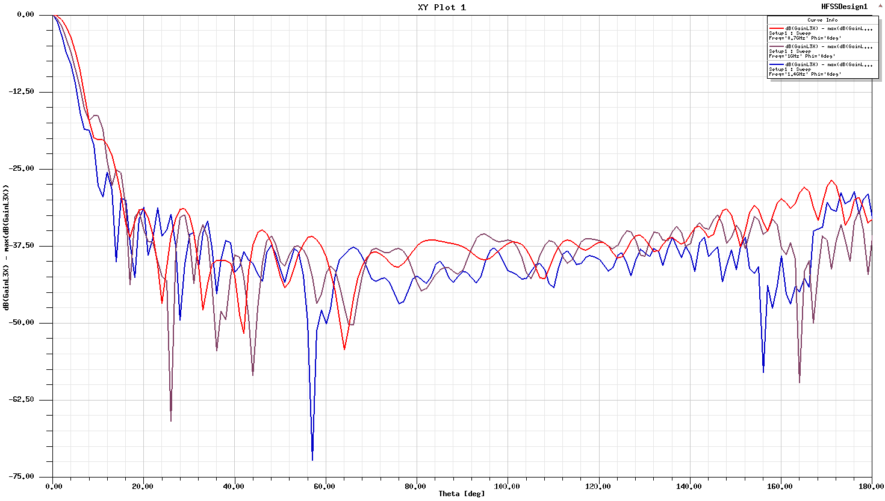
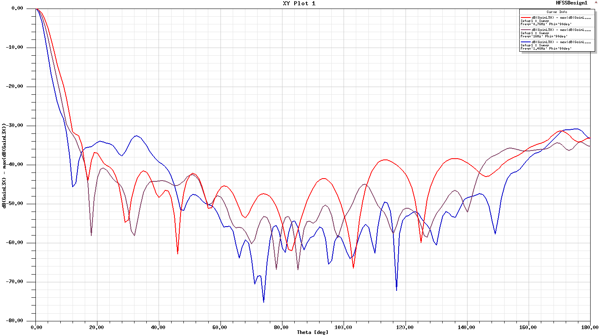
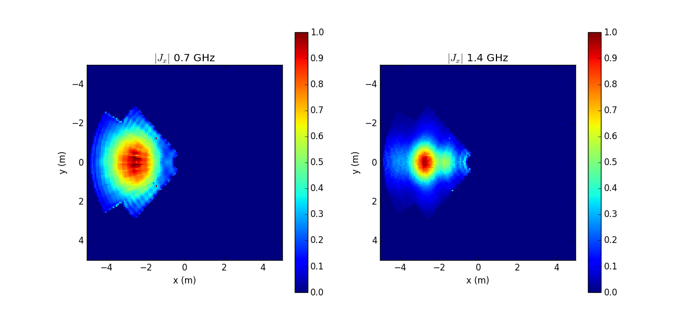
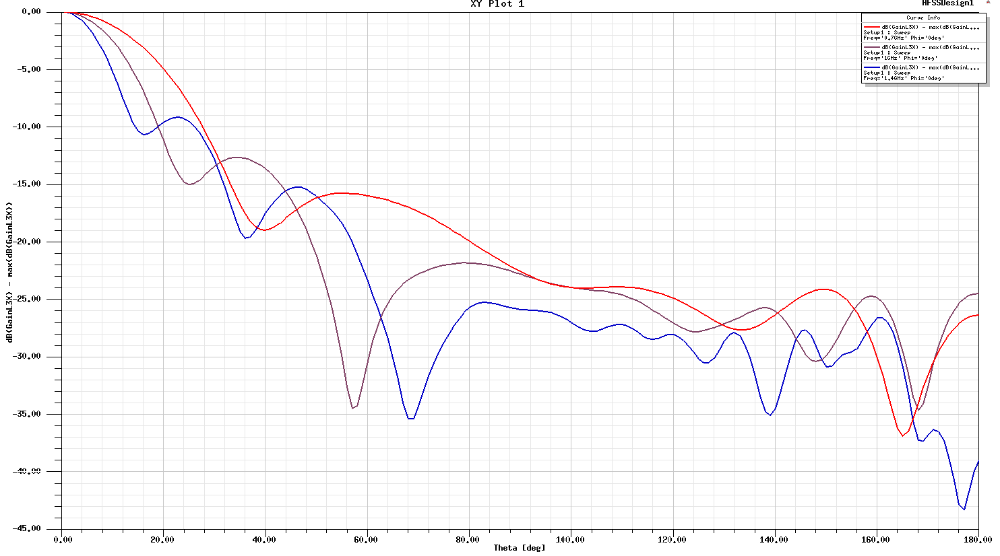
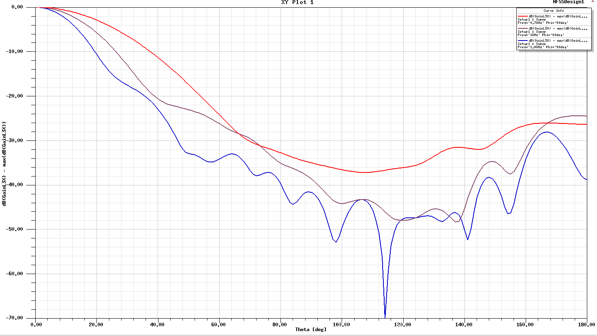
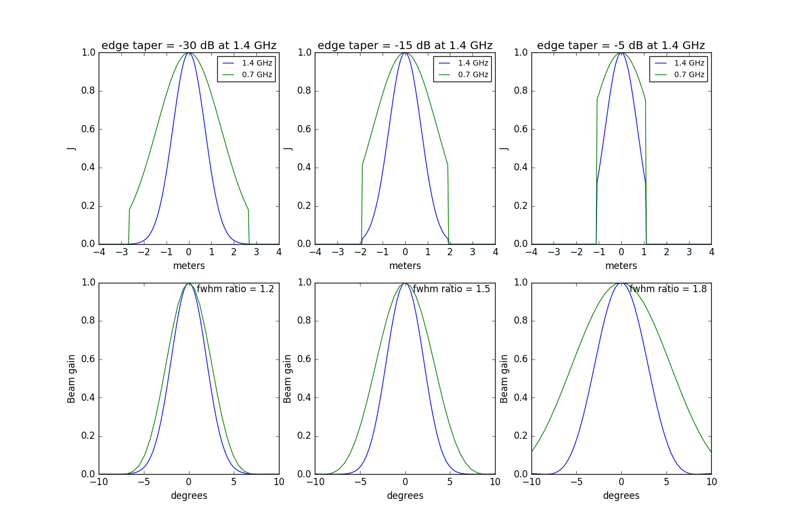
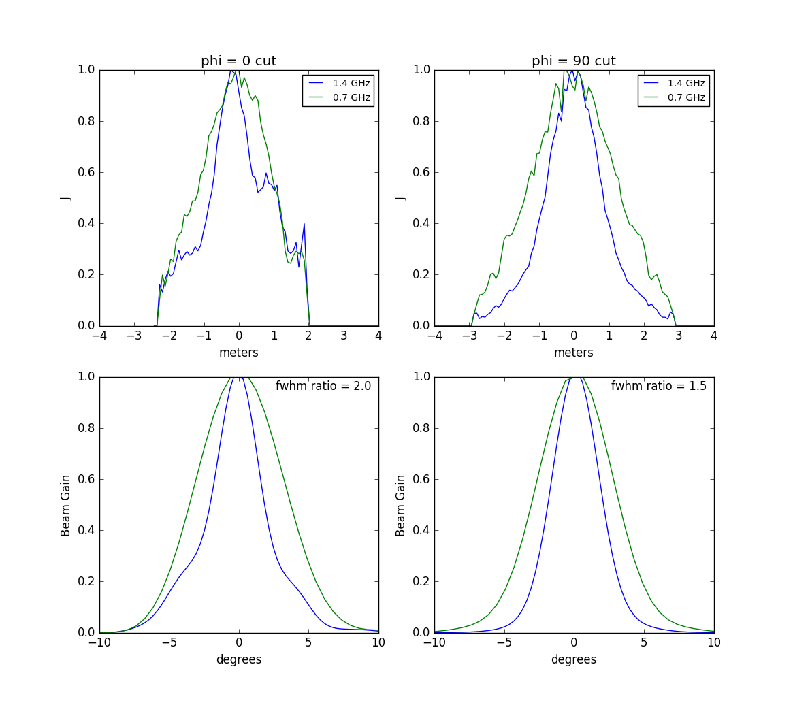

## April 11, 2017: Beam chromaticity
Christopher D. Sheehy

### 1 - Introduction

In [a previous posting](../20170323_beam_sims/index.md), I showed beams at 1 GHz
simulated using HFSS. In this posting I extend this to other frequencies and
have a look at beam chromaticity.

### 2 - Results

**Figure 1** shows the beams simulated in HFSS at 0.7, 1.0, and 1.4 GHz. The OMT
x-pol coax is excited and the co-polar beam is plotted.

<table border="1" cellpadding="0" cellspacing="0">
<tr><td>
  <table border="0" cellpadding="5" cellspacing="0">
  <tr><th rowspan="2">Fig.&nbsp;1&nbsp;-</th>
      <th colspan="2">co-pol horn + dish beam</th>
  </tr>
  <tr><td align="center"><b>a. </b> phi=0 cut</td>
      <td align="center"><b>b. </b> phi=90 cut</td>
  </tr>
  <tr><td>&nbsp;</td>
      <td></td>
      <td></td>
  </tr>
  </table>
</td></tr>
</table>

Given the under-illumination of the primary, I had expected less variation with
frequency. **Figure 2** shows the aperture illumination, specifically surface current J,
and therefore proportional to the E-field not |E|^2. It looks as expected.

<table border="1" cellpadding="0" cellspacing="0">
<tr><td>
  <table border="0" cellpadding="5" cellspacing="0">
  <tr><th>Fig.&nbsp;2&nbsp;-</th>
      <th>Aperture illumination</th>
  </tr>
  <tr><td>&nbsp;</td>
      <td></td>
  </tr>
  </table>
</td></tr>
</table>

The shelf in the 1.4 GHz illumination is expected given the compact
pyramidal horn's beam, shown in **Figure 3**. (The dish subtends an angle of
approximately 65 degrees when viewed from the center of the horn.) We also
expect a bump in the 1 GHz illumination along the x direction, which we indeed
see in Figure 2 of [this posting](../20170407_beam_fft/index.md).

<table border="1" cellpadding="0" cellspacing="0">
<tr><td>
  <table border="0" cellpadding="5" cellspacing="0">
  <tr><th rowspan="2">Fig.&nbsp;3&nbsp;-</th>
      <th colspan="2">co-pol horn beam</th>
  </tr>
  <tr><td align="center"><b>a. </b> phi=0 cut</td>
      <td align="center"><b>b. </b> phi=90 cut</td>
  </tr>
  <tr><td>&nbsp;</td>
      <td></td>
      <td></td>
  </tr>
  </table>
</td></tr>
</table>

### 3 - Toy model

To see if this amount of beam chromaticity makes sense, I constructed a toy
model of a Gaussian illuminated circular aperture at 0.7 and 1.4 GHz. I
truncated the illumination at various radii, effectively scaling the dish up and
down, and FFT to get the far field beams. ([This
posting](../20170407_beam_fft/index.md) proves I know how to FFT aperture
illuminations, including on curved surfaces, to get the far field beam. Though
I'm not showing it here, I
verified that my FFT machinery yields the predicted HFSS beam at 0.7 and 1.4
GHz. Previously I had only shown this at 1 GHz.) The results of the toy model are shown in 
**Figure 4**. As expected, more aggressive illumination leads to greater beam
chromaticity. I'm somewhat surprised that the middle panels yields a FWHM ratio
as high as it does. In power units, the edge taper at the lowest frequency is
0.4^2 = 0.16, and the illumination of the highest frequency tapers to
effectively zero. Nonetheless, the beam is about halfway between fully
achromatic and scaling as lambda.

<table border="1" cellpadding="0" cellspacing="0">
<tr><td>
  <table border="0" cellpadding="5" cellspacing="0">
  <tr><th>Fig.&nbsp;4&nbsp;-</th>
      <th>Gaussian illumination toy model</th>
  </tr>
  <tr><td>&nbsp;</td>
      <td></td>
  </tr>
  </table>
</td></tr>
</table>

I then made this plot for the HFSS simulated surface current. This is shown in
**Figure 5** for two cross sectional cuts. In the x direction (phi=0) the beam
scales as lambda. We can understand this looking at the top left panel because
the edge taper is basically the same for the two frequencies. This makes sense
given Figure 3a. Looking at the phi=90 cut, the illumination look a bit like the
middle panel of Figure 5. The 1.4 GHz illumination is less than the 0.7
illumination everywhere, and the 1.4 GHz edge taper looks similar. In this
direction, the beam is less chromatic, having a FWHM ratio = 1.5.

<table border="1" cellpadding="0" cellspacing="0">
<tr><td>
  <table border="0" cellpadding="5" cellspacing="0">
  <tr><th>Fig.&nbsp;5&nbsp;-</th>
      <th>HFSS simulated illumination</th>
  </tr>
  <tr><td>&nbsp;</td>
      <td></td>
  </tr>
  </table>
</td></tr>
</table>

### 4 - Conclusions

Despite being under-illuminated, we still have significant beam
chromaticity. The beam widths scale differently with lambda in different
directions, a behavior which makes rough sense given a toy model of Gaussian
illumination. I think this means that the main beam shape will be a non-trivial
function of frequency. Previously we had assumed that this would be true only of
the sidelobes.

<!--

One panel

<table border="1" cellpadding="0" cellspacing="0">
<tr><td>
  <table border="0" cellpadding="5" cellspacing="0">
  <tr><th>Fig.&nbsp;1&nbsp;-</th>
      <th>Figure title</th>
  </tr>
  <tr><td>&nbsp;</td>
      <td></td>
  </tr>
  </table>
</td></tr>
</table>

Two panel

<table border="1" cellpadding="0" cellspacing="0">
<tr><td>
  <table border="0" cellpadding="5" cellspacing="0">
  <tr><th rowspan="2">Fig.&nbsp;1&nbsp;-</th>
      <th colspan="2">Figure title</th>
  </tr>
  <tr><td align="center"><b>a. </b> label a</td>
      <td align="center"><b>b. </b> label b</td>
  </tr>
  <tr><td>&nbsp;</td>
      <td></td>
      <td></td>
  </tr>
  </table>
</td></tr>
</table>

Three panel

<b>Fig 1 - Figure title</b>
<table border="1">
<tr><th>a - label 1
<th>b - label 2
<th>c - label 3
<tr>
<td>
<td>
<td>
</table>

-->
