## April 21, 2017: Complex beam response
Christopher D. Sheehy

### 1 - Introduction

I am moving toward incorporating the chromatic beam into the simulation
pipeline. Thinking ahead to the interferometer configuration, I thought it would
be best to save the complex x and y polarized responses (really, theta and phi
polarized responses, which are well defined over the entire sphere). In HFSS,
this is designated rE, the polarized E-field * distance as a function of sky
position. The net result of this posting is that everything is as
expected. However, I spent quite a while scratching my head over the results
because I was saving the complex response defined w.r.t. the dish focal point and
not its phase center. In the process of doing this, I learned a lot complex
representation of phase, so I'm documenting it. (Thanks to Paul for useful
discussions.)

### 2 - Complex response w.r.t. dish focal point

Previously, I've made plots of the horn + dish gain, which does not include
phase information. I'd also previously found the phase center of the OMT + horn
because this is the location that needs to be placed at the dish focal point. I
therefore initially plotted the phase of the response w.r.t. the focal
point. Below, I show this phase for a few different configurations.

#### *Symmetric parabola*

First I computed the phase for a symmetric parabola and downward facing horn.
**Figure 1** shows the phase as a function of zenith angle theta for three
 different longitudinal slices. The phase is unwrapped, so don't mind the
 difference at theta=0, it is a multiple of 360. There's a certain amount of
 axial asymmetry which must be from the asymmetry of the horn's illumination.

<table border="1" cellpadding="0" cellspacing="0">
<tr><td>
  <table border="0" cellpadding="5" cellspacing="0">
  <tr><th rowspan="2">Fig.&nbsp;1&nbsp;-</th>
      <th colspan="2">Symmetric parabola</th>
  </tr>
  <tr><td align="center"><b>a. </b> configuration</td>
      <td align="center"><b>b. </b> phase</td>
  </tr>
  <tr><td>&nbsp;</td>
      <td><a href="Screenshot-6.png">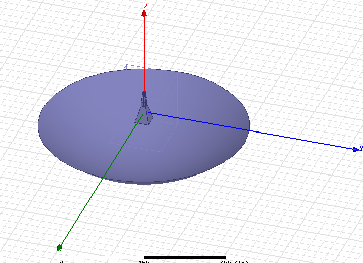</a></td>
      <td><a href="Screenshot-8.png">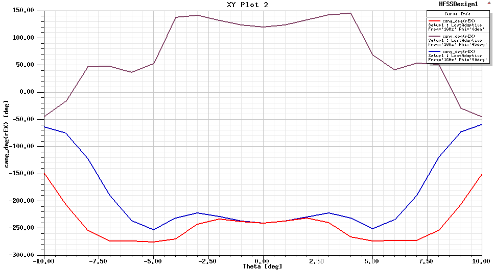</a></td>
  </tr>
  </table>
</td></tr>
</table>

#### *Asymmetric parabola*

Next I tilted the horn so that the aperture illumination is
asymmetric. **Figure 2** shows the result. Now, the phase along the y-axis
(phi=90) is asymmetric about theta = 0. The phase along x is symmetric. This
initially concerned me quite a bit, because I was imagining that the correlated
signal between two rotated dishes would be washed out. It turns out this is not
the case, but it explains why I went to the trouble of doing some of the work
that is in this posting.

<table border="1" cellpadding="0" cellspacing="0">
<tr><td>
  <table border="0" cellpadding="5" cellspacing="0">
  <tr><th rowspan="2">Fig.&nbsp;2&nbsp;-</th>
      <th colspan="2">Asymmetrically illuminated parabola</th>
  </tr>
  <tr><td align="center"><b>a. </b> configuration</td>
      <td align="center"><b>b. </b> phase</td>
  </tr>
  <tr><td>&nbsp;</td>
      <td><a href="Screenshot.png">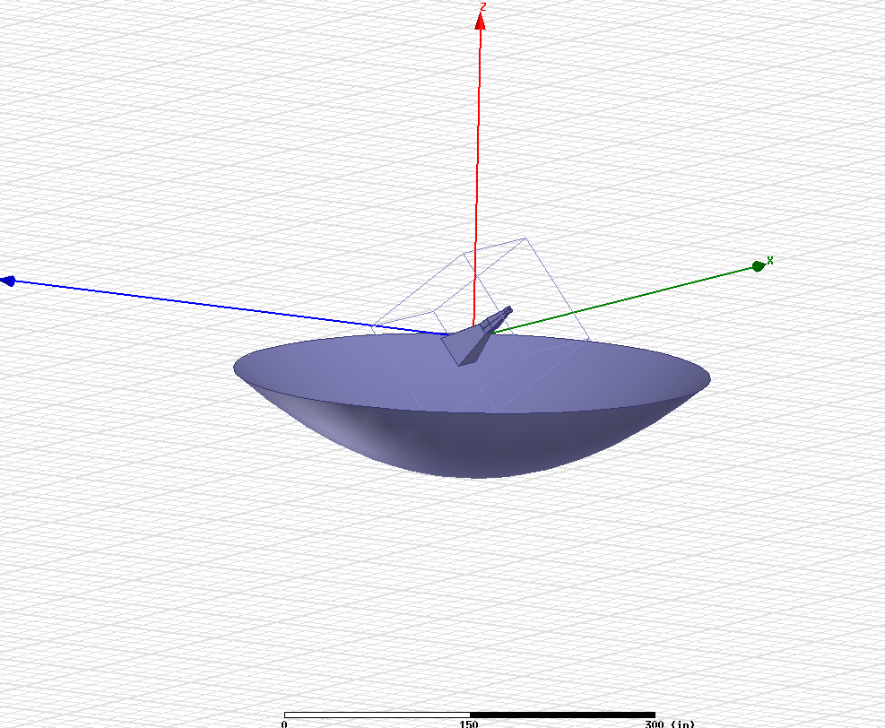</a></td>
      <td><a href="Screenshot-2.png">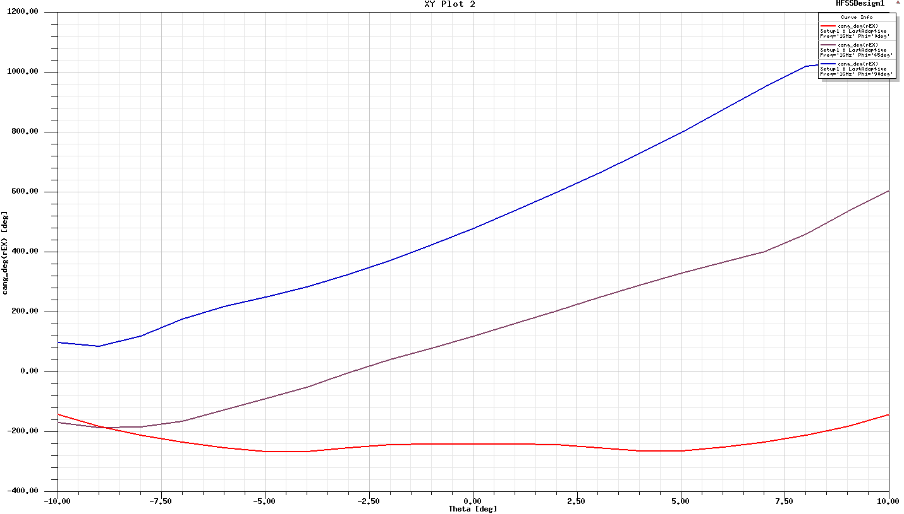</a></td>
  </tr>
  </table>
</td></tr>
</table>

**Figure 3** shows the phase for the off axis dish, which is qualitatively the
  same as an asymmetrically illuminated full parabola. (The phi angle of the
  symmetric phase slice is different because the coordinate system is stupidly rotated
  about the z axis.)  For reference, the FWHM of
  the beam is 4 deg.

<table border="1" cellpadding="0" cellspacing="0">
<tr><td>
  <table border="0" cellpadding="5" cellspacing="0">
  <tr><th rowspan="2">Fig.&nbsp;3&nbsp;-</th>
      <th colspan="2">Off-axis dish</th>
  </tr>
  <tr><td align="center"><b>a. </b> configuration</td>
      <td align="center"><b>b. </b> phase</td>
  </tr>
  <tr><td>&nbsp;</td>
      <td><a href="Screenshot-3.png">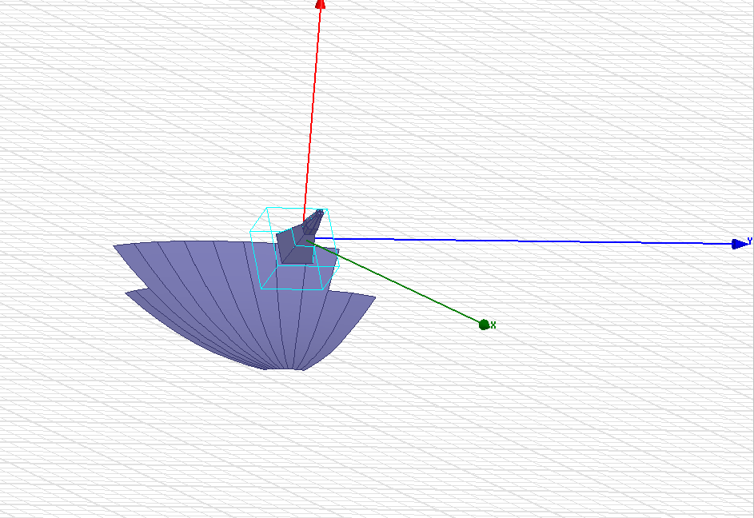</a></td>
      <td><a href="Screenshot-5.png">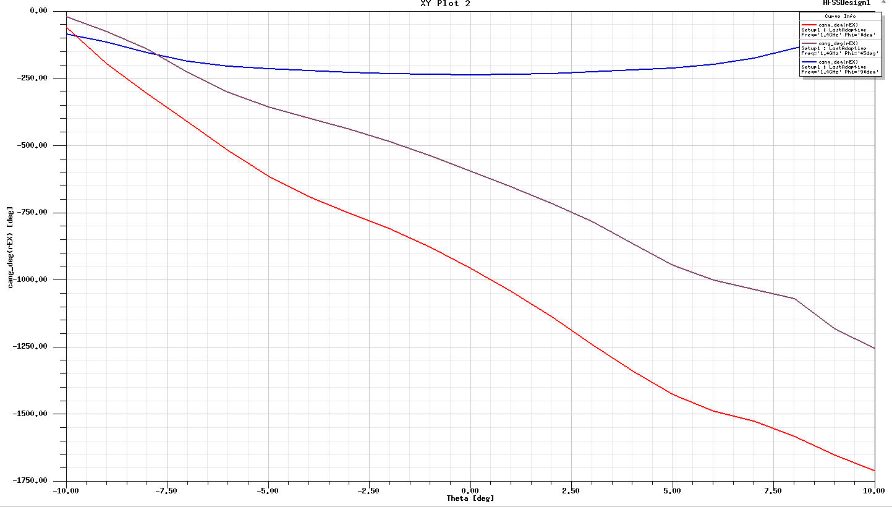</a></td>
  </tr>
  </table>
</td></tr>
</table>

Initially these results made no sense to me, so I calculated the expected phase
for a uniformly illuminated 2D parabola, symmetric and off-axis. **Figure 4**
shows the calculation. 

Obviously, all zenith directed rays originating from the
focal point have phase=0 in the horizontal plane containing the focal point. At
the surface of an almost infinitely large sphere of radius r and centered at the
focal point, the path length of these zenith directed rays is 2f + r. Rays that
hit the dish at a point x away from the central axis and diffract at some angle
theta have a different path length to the sphere of radius r. There is a path
length difference delta h to the plane of the focal point, and a path length
difference r - r' from this plane to the sphere. The total path length difference is
written at the bottom right of the board.

Next, it makes sense to average the path length over x, since cos(theta) +
cos(theta-phi) = 2cos(phi/2)cos(theta-phi/2) -- in other words, adding two out
of phase sinusoids gets out another sinusoid of different amplitude but phase
that is the average of the two. The average is shown in the boxed equation at
left. 

For a symmetric parabola, the limits of integration are x1=-D/2, x2 = D/2. The
x^2 term goes to zero and we're left with something that is an even function of
theta. Therefore, the phase is necessarily symmetric about the zenith. For an
off axis parabola, the limits of integration are x1=0, x2=D. Now, the x^2 term
remains and depending on the values of D and f can possibly dominate. If it
does, then the phase is an odd function of theta.

Plugging in realistic numbers, D=4.0 m, f = 2.9 m, and plotting 360*dl/lambda, I
get **Figure 5**. This basically agrees with Figures 1-3, so I'm satisfied I
understand the HFSS results.

<table border="1" cellpadding="0" cellspacing="0">
<tr><td>
  <table border="0" cellpadding="5" cellspacing="0">
  <tr><th>Fig.&nbsp;4&nbsp;-</th>
      <th>Path length of parabolic reflector</th>
  </tr>
  <tr><td>&nbsp;</td>
      <td><a href="board.jpg">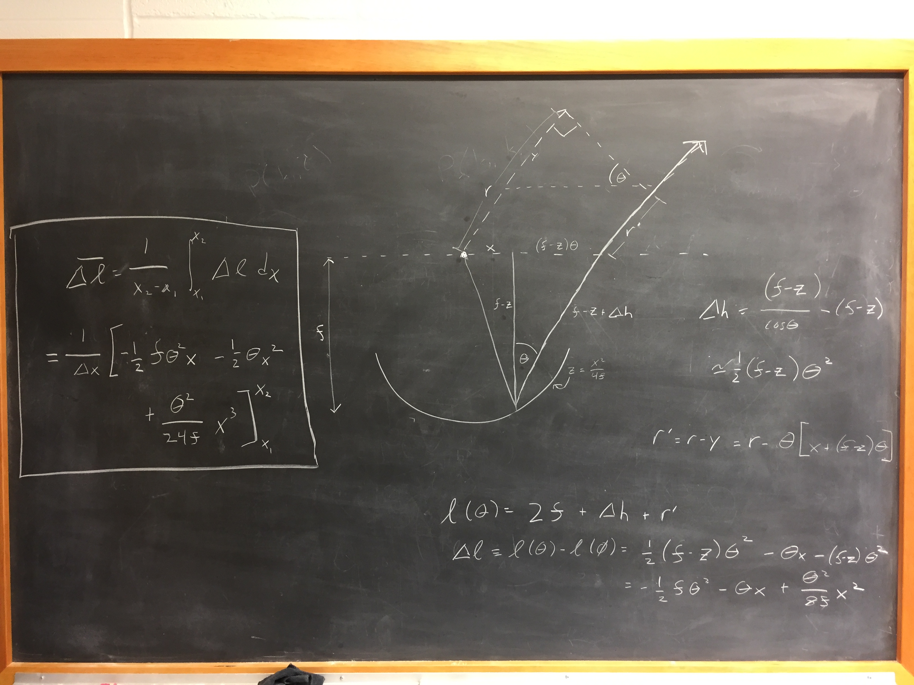</a></td>
  </tr>
  </table>
</td></tr>
</table>

<table border="1" cellpadding="0" cellspacing="0">
<tr><td>
  <table border="0" cellpadding="5" cellspacing="0">
  <tr><th>Fig.&nbsp;5&nbsp;-</th>
      <th>Simplified phase of reflector</th>
  </tr>
  <tr><td>&nbsp;</td>
      <td><a href="phasecalc.png">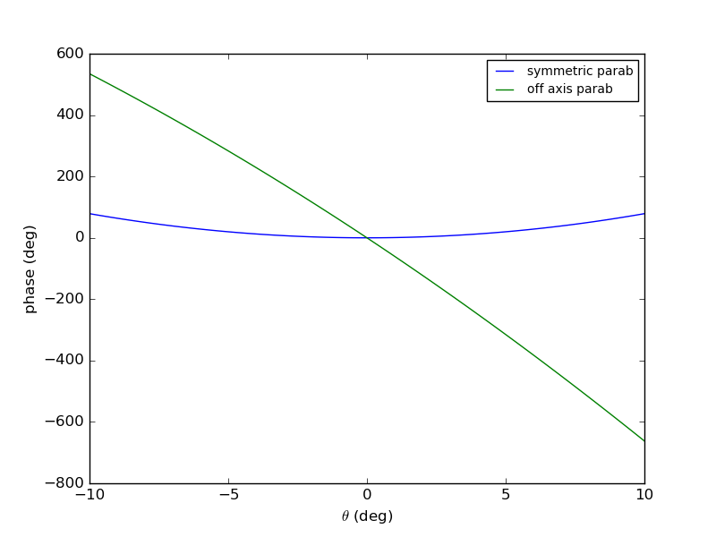</a></td>
  </tr>
  </table>
</td></tr>
</table>

### 3 - Interferometer fringes with dish focal point as phase center

Next, I saved the HFSS complex response on a (theta,phi) grid and calculated the
interferometric fringing we expect. It turns out doing this using the focal
point as the phase center is a dumb thing to do, so skip to
Section 4 if you just want the real results.

**Figure 6** shows the gain and phase (now
wrapped) of the response. I suspect some of the weirdness at the beam center is
an interpolation artifact. 

<table border="1" cellpadding="0" cellspacing="0">
<tr><td>
  <table border="0" cellpadding="6" cellspacing="0">
  <tr><th>Fig.&nbsp;6&nbsp;-</th>
      <th>Response, gain and phase</th>
  </tr>
  <tr><td>&nbsp;</td>
      <td><a href="fig_1.png">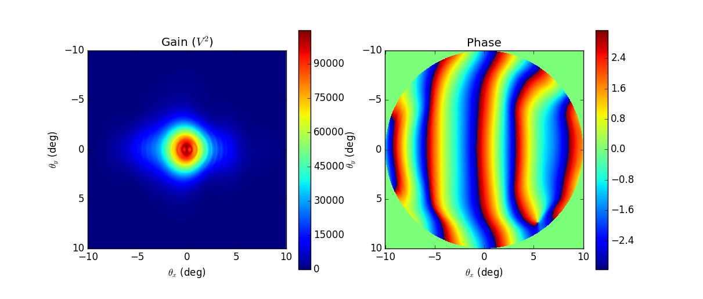</a></td>
  </tr>
  </table>
</td></tr>
</table>

**Figure 7** shows the real part of the complex response for two beams. A1 is
  the beam from Figure 5 and A2 is the same beam rotated around its center by
  some angle. The three rows from top to bottom have A2 rotated by 0, 90 and 180
  degrees. The left column is the real part of A1. The right column is the real
  part of A2. The left column is the real part of (A1 A2*).

<table border="1" cellpadding="0" cellspacing="0">
<tr><td>
  <table border="0" cellpadding="7" cellspacing="0">
  <tr><th>Fig.&nbsp;7&nbsp;-</th>
      <th>Real part of complex response for two beams rotated w.r.t. each other</th>
  </tr>
  <tr><td>&nbsp;</td>
      <td><a href="fig_2.png">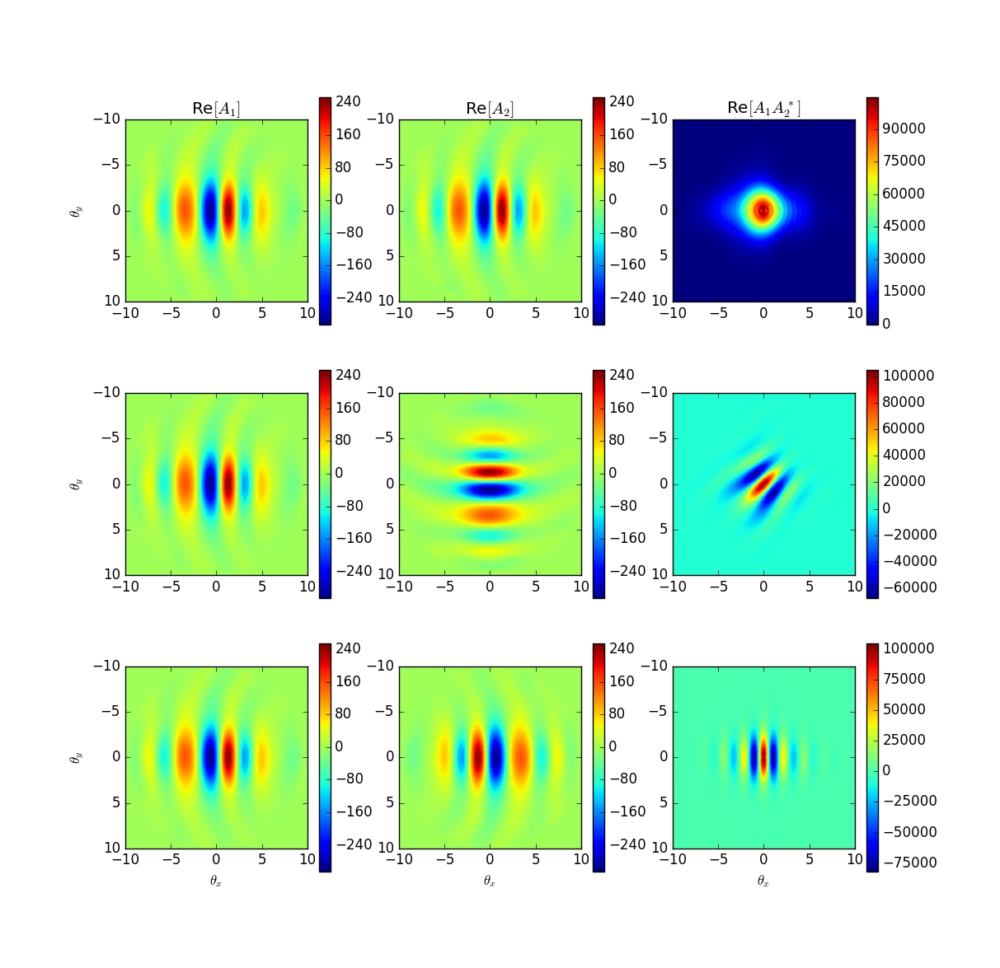</a></td>
  </tr>
  </table>
</td></tr>
</table>

**Figure 8** is where it gets interesting. The time average of the complex product of
the signal from two antennas is known as the visibility, and it is given by:

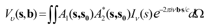

For an isotropic antenna, A1 = A2 = 1, and the fringe pattern of the
interferometer is just a sinusoid. For a 10 m baseline at 1
GHz, the fringe pattern has about 20 corrugations over a 20 degree arc. The **top
left panel** shows such a fringe pattern for a baseline oriented in
the x direction. (The fringe is actually a
sinusoid in phase lag, not angle, but for small angles sin(theta)=theta, so my
approximation of the fringe pattern as a sinusoid in theta_x should be fine.)

Unless I_nu is a sinusoid of the same period, the integral goes to zero. This is the
familiar idea that a two baseline interferometer picks out a particular Fourier
component of the sky intensity. The **top right panel** shows the
2D Fourier transform of the fringe pattern, which is unsurprisingly a delta function in the
(u,v) plane. 

For real antennas, A1 and A2 are functions of sky coordinate, s. The **second
row** shows the fringe pattern and FT for A1=A2=A_HFSS. The resulting fringe
pattern is windowed, and the delta function in the (u,v) plane is now convolved
with the FT of the response, smearing it out.

The **third row** now rotates A2 by 90 degrees. We see that the interferometer
is now picking out a new Fourier component, one at an angle to the nominal
baseline.

The **fourth row** rotates A2 by 180 degrees from A1. Now, the fringe pattern is
along the same axis as the unrotated fringe pattern, but is picking up a Fourier
component of lower frequency.

<table border="1" cellpadding="0" cellspacing="0">
<tr><td>
  <table border="0" cellpadding="7" cellspacing="0">
  <tr><th>Fig.&nbsp;8&nbsp;-</th>
      <th>Fringe pattern with focal point as phase center</th>
  </tr>
  <tr><td>&nbsp;</td>
      <td><a href="fig_3.png">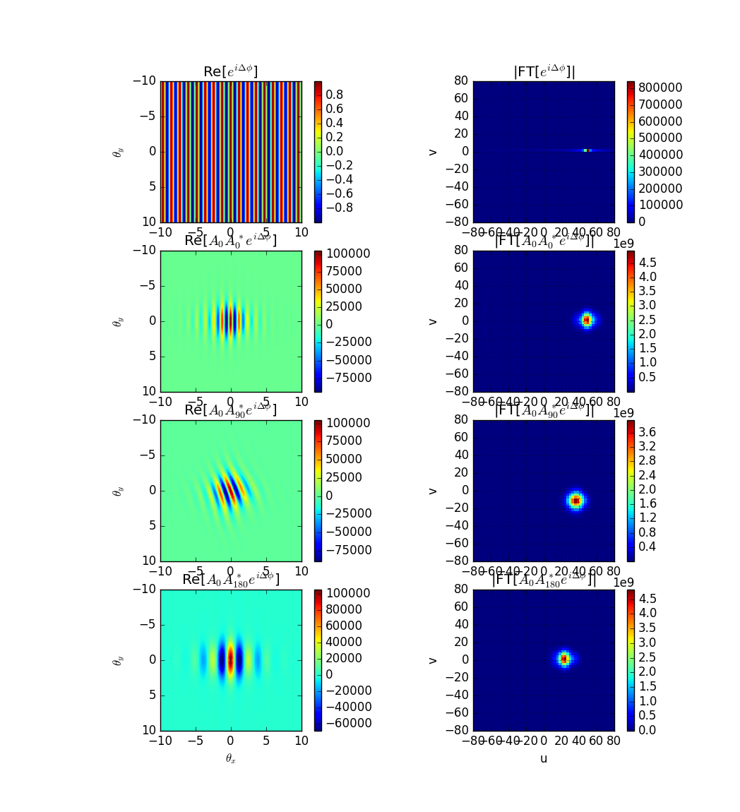</a></td>
  </tr>
  </table>
</td></tr>
</table>

This result confused me for a long time. However, what's going on is actually
quite obvious. The illuminated dish has a phase center that is not at the focal
point. It is actually somewhere close to the middle of the dish. 

The top left panel defines a fixed baseline between two dishes' nominal phase
centers, where the nominal phase center is just the arbitrary origin of the HFSS
coordinate system, i.e. the focal point of the dish. The true fringe
pattern, however, doesn't care about the baseline between the nominal phase
centers -- it
cares about the baseline between the true phase centers.
A rotation of the response about its center corresponds physically
to a rotation of the dish about the center of the coordinate system in
which the response is defined.
Therefore, rotating the responses rotates the dish about the focal point and not
its center. A 90 degree rotation puts the
true baseline at a diagonal to the unrotated baseline. A 180 degree rotation
maintains the baseline direction but moves the dishes closer together, leading
to a slower fringe pattern.
Of course, none of this matters for symmetric parabolas, where the true phase center
coincides with the focal point.

### 4 - Interferometer fringes using true phase center

Having figured this out (hat tip to Paul), I went back to HFSS and found the
phase center of the dish just like I found the phase center of the horn. It is
located 2.77 meters from the focal point over the center of the dish. (The z
location doesn't matter.)

**Figure 9** shows the phase of the dish with the phase center properly
  defined. (The phase is wrapped, unlike in Fig 3.) It looks much better
  compared to Figure 3! There is still some axial asymmetry, but at 4 degrees
  off axis the gain is close to zero, and the phases diverge by only 50 degrees
  or so. So the degradation in the correlated signal will not be great.

<table border="1" cellpadding="0" cellspacing="0">
<tr><td>
  <table border="0" cellpadding="5" cellspacing="0">
  <tr><th rowspan="2">Fig.&nbsp;9&nbsp;-</th>
      <th colspan="2">Off-axis dish, proper phase center</th>
  </tr>
  <tr><td align="center"><b>a. </b> configuration</td>
      <td align="center"><b>b. </b> phase</td>
  </tr>
  <tr><td>&nbsp;</td>
      <td><a href="Screenshot-9.png">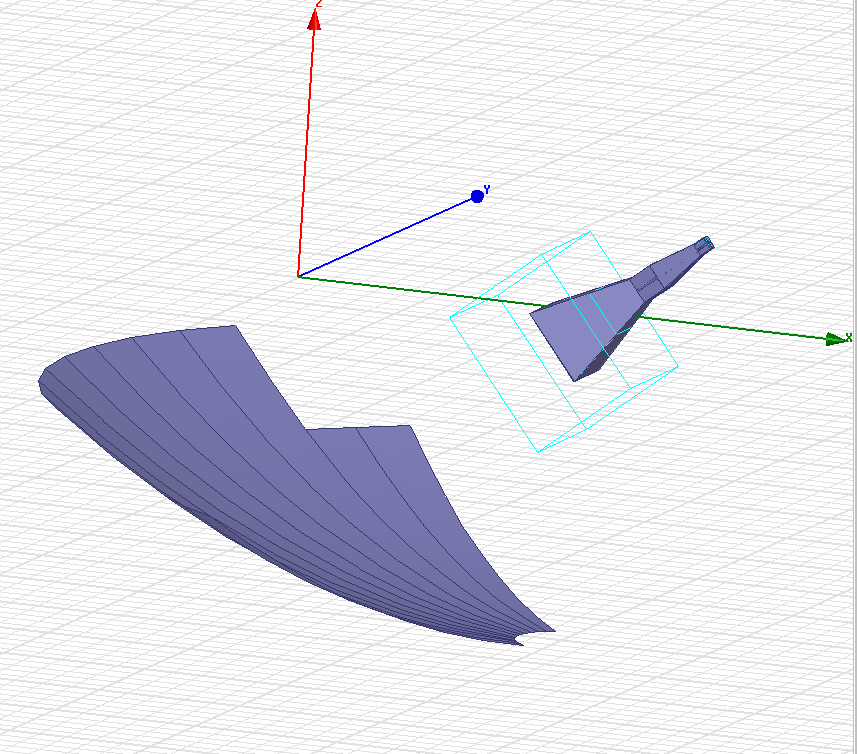</a></td>
      <td><a href="Screenshot-10.png">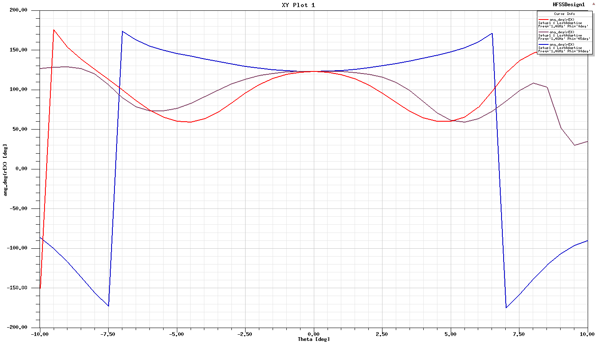</a></td>
  </tr>
  </table>
</td></tr>
</table>

**Figures 10-12** are identical to Figures 6-8 but with the correct phase
  center, and now look much more sensible. 

<table border="1" cellpadding="0" cellspacing="0">
<tr><td>
  <table border="0" cellpadding="6" cellspacing="0">
  <tr><th>Fig.&nbsp;10&nbsp;-</th>
      <th>Response, gain and phase (proper phase center)</th>
  </tr>
  <tr><td>&nbsp;</td>
      <td><a href="fig_pc_1.png">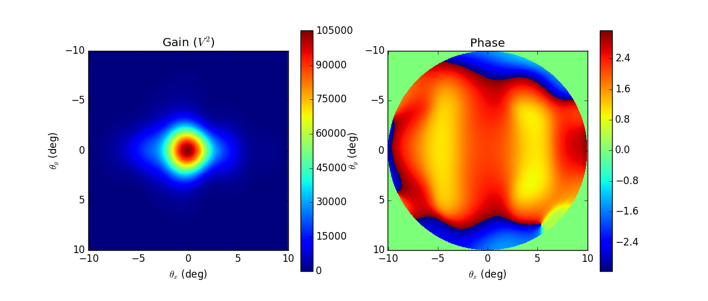</a></td>
  </tr>
  </table>
</td></tr>
</table>

<table border="1" cellpadding="0" cellspacing="0">
<tr><td>
  <table border="0" cellpadding="7" cellspacing="0">
  <tr><th>Fig.&nbsp;11&nbsp;-</th>
      <th>Real part of complex response (proper phase center)</th>
  </tr>
  <tr><td>&nbsp;</td>
      <td><a href="fig_pc_2.png">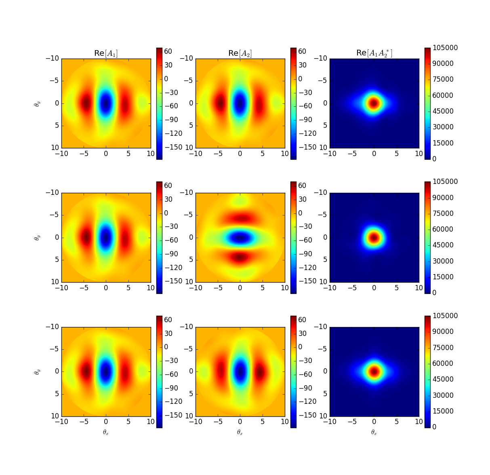</a></td>
  </tr>
  </table>
</td></tr>
</table>

<table border="1" cellpadding="0" cellspacing="0">
<tr><td>
  <table border="0" cellpadding="7" cellspacing="0">
  <tr><th>Fig.&nbsp;12&nbsp;-</th>
      <th>Fringe pattern with true phase center as phase center</th>
  </tr>
  <tr><td>&nbsp;</td>
      <td><a href="fig_pc_3.png">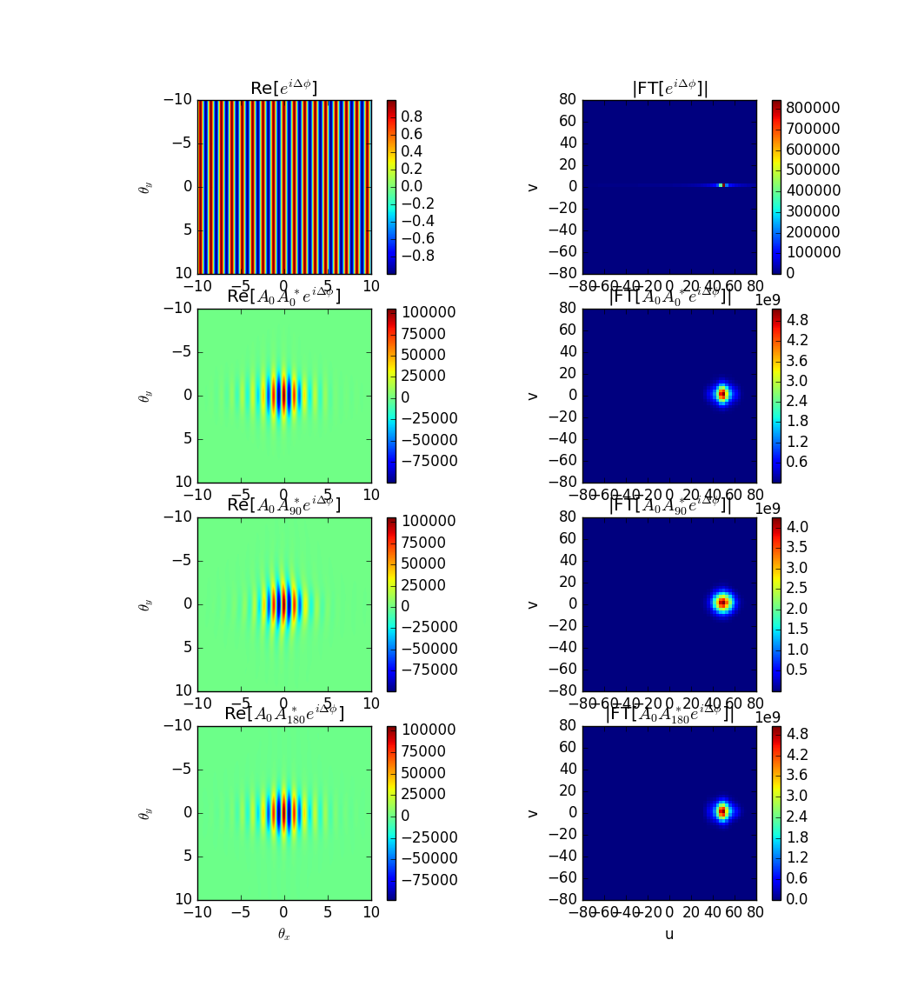</a></td>
  </tr>
  </table>
</td></tr>
</table>

Lastly, I can take a sinusoid of the same period as the fringe pattern in the
top left panel of Fig 12, call it I in the visibility equation shown above, and
compute the complex visibility by multiplying it by the windowed fringes in Fig
12 and summing. Doing, that I get the following:

1. `Sum[A_0 A_0* cos(dphi) * exp(i*dphi)] = (2659661340.88 - 9371.96i)`
2. `Sum[A_0 A_0* sin(dphi) * exp(i*dphi)] = (-9371.96 + 2660408412.90i)`
3. `Sum[A_0 A_0* cos(dphi) * exp(i*(dphi+pi/2))] = (9371.96 + 2659661340.88i)`
4. `Sum[A_0 A_90* cos(dphi) * exp(i*dphi)] = (2150549555.10 - 3040907.12i)`
5. `Sum[A_0 A_180* cos(dphi) * exp(i*dphi)] = (2606354541.49 + 0.00i)`
6. `Sum[A_0 A_180* cos(dphi/2) * exp(i*dphi)] = (-177056.39 - 0.00i)`

This all makes sense. The visibility of a cosine is real (1). The visibility of a
sine (2), or of a cosine but with the fringe shifted by pi/2 (3), is imaginary. 
~~There is a decrease in the visibility caused by the beam asymmetry, which will
reduce s/n, but it is
not large: 19% for the 90 degree rotated beam (4) and 2% for the 180 degree
rotated beam (5).~~ **Update 20170426:** The sum over the u-v plane is the same in both cases. Therefore, instead of a reduced s/n we just have a little more mode mixing. Not a big deal unless we are cosmic variance limited and need more independent modes/baselines. There is zero sensitivity to a pattern on the sky that does
not match the fringe period (6).

### 5 - Conclusion

The complex response should be defined w.r.t. the true phase center of the
dish. Not doing so isn't physically incorrect but is less intuitive. BMX's off
axis dishes will work as an interferometer, ~~suffering at most a 20% decrease in
fringe amplitude for dishes rotated 90 degrees from each other.~~

<!--

One panel

<table border="1" cellpadding="0" cellspacing="0">
<tr><td>
  <table border="0" cellpadding="5" cellspacing="0">
  <tr><th>Fig.&nbsp;1&nbsp;-</th>
      <th>Figure title</th>
  </tr>
  <tr><td>&nbsp;</td>
      <td></td>
  </tr>
  </table>
</td></tr>
</table>

Two panel

<table border="1" cellpadding="0" cellspacing="0">
<tr><td>
  <table border="0" cellpadding="5" cellspacing="0">
  <tr><th rowspan="2">Fig.&nbsp;1&nbsp;-</th>
      <th colspan="2">Figure title</th>
  </tr>
  <tr><td align="center"><b>a. </b> label a</td>
      <td align="center"><b>b. </b> label b</td>
  </tr>
  <tr><td>&nbsp;</td>
      <td></td>
      <td></td>
  </tr>
  </table>
</td></tr>
</table>

Three panel

<b>Fig 1 - Figure title</b>
<table border="1">
<tr><th>a - label 1
<th>b - label 2
<th>c - label 3
<tr>
<td>
<td>
<td>
</table>

-->
