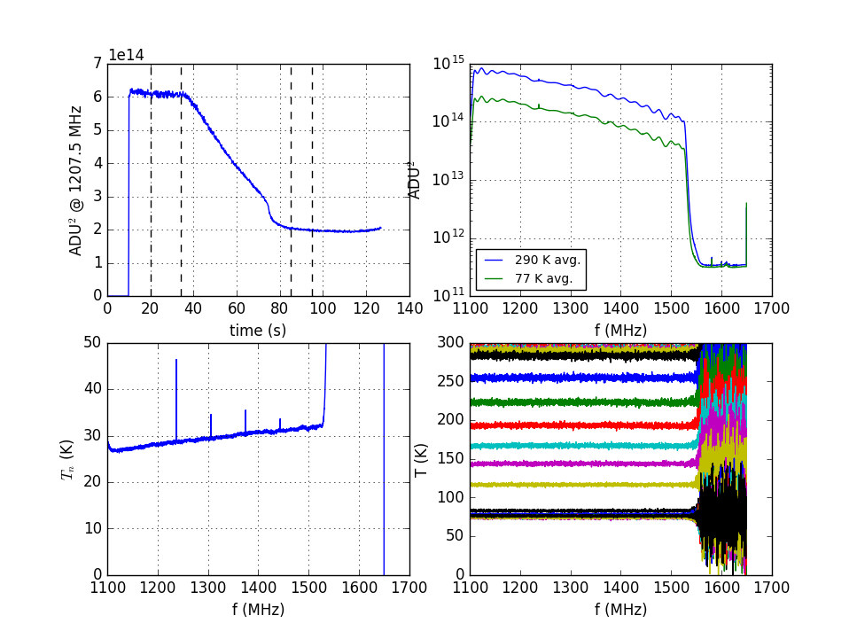

## April 25, 2017: Amplifier chain noise temperature II
Christopher D. Sheehy

### 1 - Introduction

In my [previous posting](../20170421_amp_chain/index.md), I measured the noise
temperature of the amplifier chain and it was way too high. I rearranged some
components and repeated the measurement, which I show in this posting. Skip to
Figure 3 for the punchline.

### 2 - Noise temperature

The previous posting showed the noise temperature for two configurations:

coupler -> LNA -> -3dB -> bandpass -> AMP2 -> lowpass -> ADC

LNA -> -3dB -> bandpass -> AMP2 -> lowpass -> ADC

The coupler added a constant ~8K, in line with its measured loss, but the base
noise level without the coupler was way too high: 100 K at 1100 MHz, increasing
to 200 K at 1500 MHz. According to the LNA spec sheet, we expect 28 K at 1000
MHz, increasing to 32 K at 1500 MHz. Swapping the amps out for new ones made no
difference. I also added a second LNA after the first and nothing changed,
arguing against digitization noise.

I then noticed that the out-of-band noise floor was non-negligible compared to
the in-band spectra.  I added extra attenuation after the LNA and observed that
the in-band spectra went down but not the noise floor. The noise floor did go
down by many orders of magnitude with the amps powered off. This pointed to
excess noise from the 2nd stage amp. This seemed strange, as the simple
calculation of the excess noise from AMP2 indicated it should be small compared
to the LNA. It occurred to me that we could be seeing out of band noise 
aliasing back into the band. The bandpass blocks anything out of band from the
LNA, and the lowpass blocks anything > 2 GHz from AMP2, but any noise from AMP2
at f<1100 or 1650<f<2000 aliases back into the band. I had put the bandpass
first to minimize the out of band noise on AMP2 to avoid saturating it (I've
seen problems like this before) but this was probably overkill, since the power
going into the LNA is so small. (It could be an issue in the field when we have
RFI.) I therefore switched the bandpass and lowpass and repeated the
measurement. This is shown in **Figure 1**.

<table border="1" cellpadding="0" cellspacing="0">
<tr><td>
  <table border="0" cellpadding="5" cellspacing="0">
  <tr><th>Fig.&nbsp;1&nbsp;-</th>
      <th>LNA -> lowpass -> AMP2 -> bandpass -> ADC</th>
  </tr>
  <tr><td>&nbsp;</td>
      <td></td>
  </tr>
  </table>
</td></tr>
</table>

The noise temperature is now much reduced, meaning I think my hypothesis about
out of band noise was correct. It is still higher than we expect, however. Since
the noise floor is still non-negligible, it seems noise from the second stage
AMP is non-negligible. I therefore added another LNA 
after the first, separated by a -3 dB
attenuation. The result is shown in **Figure 2**.

<table border="1" cellpadding="0" cellspacing="0">
<tr><td>
  <table border="0" cellpadding="5" cellspacing="0">
  <tr><th>Fig.&nbsp;2&nbsp;-</th>
      <th>LNA1 -> -3dB -> LNA2 -> lowpass -> amp2 -> bandpass -> ADC</th>
  </tr>
  <tr><td>&nbsp;</td>
      <td></td>
  </tr>
  </table>
</td></tr>
</table>

The noise floor stays in the same place but the signal spectrum goes up. This is
good news. The noise from the 2nd stage amp is now negligible and the in-band
signal is dominated by whatever is coming out of the LNAs. However, the noise
temperature now matches the spec sheet at 1100 MHz, but climbs by 12 K across
the band. It should only increase by 4 K according to the spec sheet. It turns
out this is from the -3 dB attenuator after LNA1.

Putting attenuators between amplifiers is one of those things you are always
told you must do to avoid instabilities in the system. Basically, a signal gets
reflected off the input to amp2, goes backward through amp1, gets reflected
again somewhere else and then passes back through amp1, where it is
amplified. The signal keeps reflecting back and forth, getting amplified each
time, and you get a catastrophic runaway. Putting an attenuator between the amps
counteracts this. This is still probably good practice, but our LNA has fairly
low gain, decreasing from 17 dB to 13 dB over our band. The LNA noise output is
30 K times the gain, so 450 K mid band. The attenuator has 50% loss and so adds
300 K * 0.5 = 150 K to the total noise, which is fractionally large. The
decreasing gain with frequency means the attenuator contribution to the noise is
relatively larger at higher frequencies, leading to the turn up.

I removed the attenuator and did not notice any oscillations. (We should
probably use one anyways, but one that is commensurate with the low LNA gain,
maybe 1 dB or 0.5 dB.) The results are shown in **Figure 3**.

The noise temperature now rocks, in line with the LNA spec sheet.

<table border="1" cellpadding="0" cellspacing="0">
<tr><td>
  <table border="0" cellpadding="5" cellspacing="0">
  <tr><th>Fig.&nbsp;3&nbsp;-</th>
      <th>LNA1 -> LNA2 -> lowpass -> amp2 -> bandpass -> ADC</th>
  </tr>
  <tr><td>&nbsp;</td>
      <td></td>
  </tr>
  </table>
</td></tr>
</table>

A few notes about the measurement and various tweaks I tested:

* The LNAs want +3.0V. The 2nd stage amps want +2.8V. The noise temperature
  measurement is the same if I give them these voltages or if I give +2.9V to
  each. 
* Dunking the terminator in LN2, it's possible for the LNA to cool down, which
  would affect the measurement. In the time windows I chose for the 77 K spectrum,
  the LNA still felt room temperature to the touch. I repeated the measurement
  with a much shorter connection between the terminator and LNA input,
  and the LNA cooled down. I saw a corresponding decrease of ~8 K in noise
  temperature. I then put a shield between the terminator and LNA (just a piece
  of paper with a hole poked in it) which prevented direct exposure of the LNA
  to the cold nitrogen vapor boiling off. The LNA stayed warm, and the noise
  temperature went back to what it is in Fig 3. 
* I never did a fair comparison of just switching the bandpass and lowpass. When
  I switched them, I also removed the -3dB attenuator. There is therefore some
  ambiguity between added noise from the attenuator and aliased noise from
  not having the bandpass last. The difference between Figs 2 and 3 shows that
  the attenuator adds only ~10 K, while switching the bandpass and lowpass and
  removing the attenuator reduces the noise by 60 K. So I think both are an
  issue.

### 3 - Conclusions

The noise temperature is awesome, increasing from 28 K to 32 K over our
band. This is what we expected. The OMT will add another 6 K (measured). The
coupler will add 8 K if we put it in front of the LNA (measured), and the 90 deg
hybrid will add 14 K (expected). Losses from the horn and dish will add some unknown
amount, as will beam spillover to the ground.

<!--

One panel

<table border="1" cellpadding="0" cellspacing="0">
<tr><td>
  <table border="0" cellpadding="5" cellspacing="0">
  <tr><th>Fig.&nbsp;1&nbsp;-</th>
      <th>Figure title</th>
  </tr>
  <tr><td>&nbsp;</td>
      <td></td>
  </tr>
  </table>
</td></tr>
</table>

Two panel

<table border="1" cellpadding="0" cellspacing="0">
<tr><td>
  <table border="0" cellpadding="5" cellspacing="0">
  <tr><th rowspan="2">Fig.&nbsp;1&nbsp;-</th>
      <th colspan="2">Figure title</th>
  </tr>
  <tr><td align="center"><b>a. </b> label a</td>
      <td align="center"><b>b. </b> label b</td>
  </tr>
  <tr><td>&nbsp;</td>
      <td></td>
      <td></td>
  </tr>
  </table>
</td></tr>
</table>

Three panel

<b>Fig 1 - Figure title</b>
<table border="1">
<tr><th>a - label 1
<th>b - label 2
<th>c - label 3
<tr>
<td>
<td>
<td>
</table>

-->
