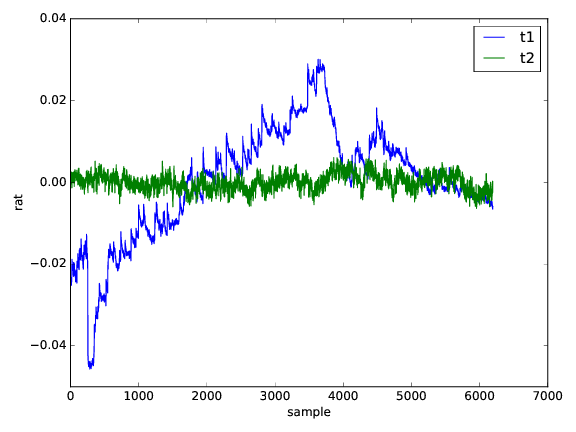
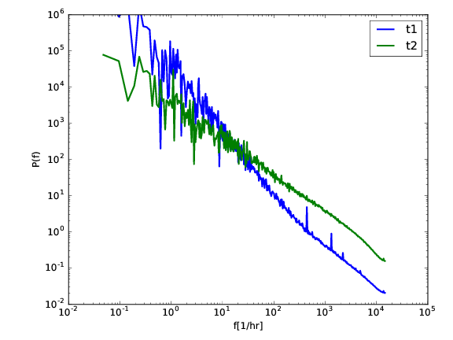
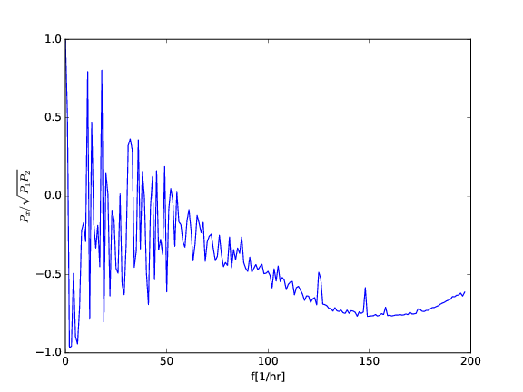

## Apr 26, 2017: Tone Stability Tests 2 [AS]

This is a new version of  the
[Tone stability measurement using two tones + 180 hybrid](..//20170301_tone_stability/index.md).

To avoid the potential instability of 180 hybrid, we use the 30 db
coupler. Two tones at 1400 and 1401 MHz, the 1401 with a maxed out
power on tone generator but attenuated by 30dB. Combined signal input
into CH2, nothing in CH1. No amplifiers anywhere.

### plots

(plots made using `stability2.py` in bmxhacks)

First plot is the actual two traces. T1 is the un-attenuated path and T2 is the attenuated one.
Something is clearly going on with T1. 

Second plot is the two power spectra.

Third plot is the cross-correlation between the two traces. We see
that they are anti-correlated on short (but not terribly short)
timescales and uncorrelated on longer ones.

A couple of options

* loose connector or something like that -- botched experiment

* 30 dB couple instability -- I'd say this is unlikely but note that
   anti-correlations is consistent with this. Amplifier gain
   fluctuations wouldn't work this way -- here we see first tone
   increasing in power while the second one decreases. 

* tone generator actually amplitude unstable at these low amplitudes
   (note that t2 is attenuated, so it is generated at much higher
   amplitude)
   

