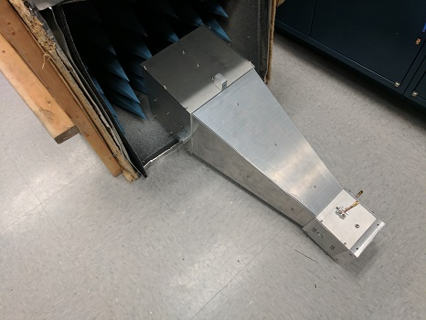
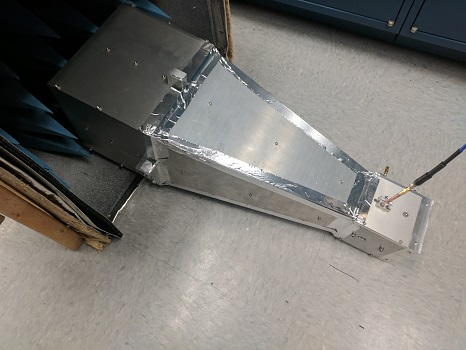
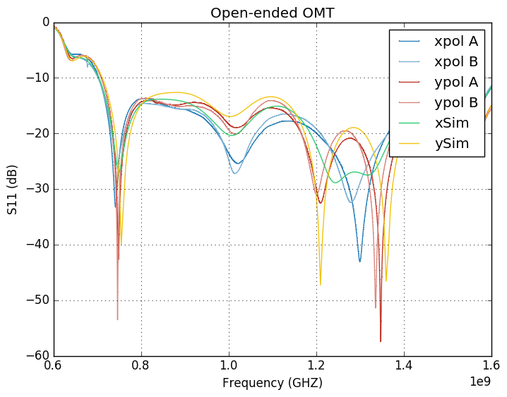
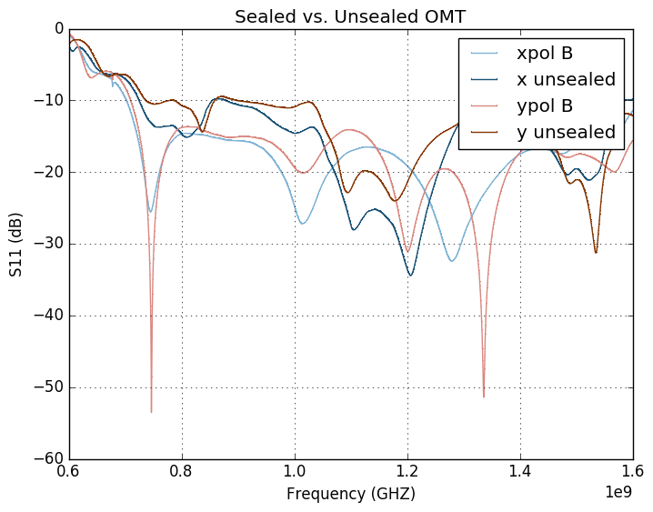

## June 12, 2017: Repaired OMT S-Parameter measurement pt. 1
Chandler Conn

### Introduction
Continuing in the same vein as [an earlier posting from Chris](../20170321_new_omt/index.md "Click me! :)"), much of this posting will be bookkeeping and present data from the rebuilt version of two OMTs (A and B). The rebuild was necessary due to damage suffered in transit (shown in **figures 1a, 1b**) from Michigan that affected the coaxial conductor. Nothing else was changed about the OMT--no new design was implemented and as much detail as I could muster was put into rebuilding with care.

| | |
|:---|:---|
| **Figure 1a (noticeable chip damage)** | **Figure 1b (damage relative to normal)**|

---

### S-Parameter measurements
Measurements were performed on the VNA in the fast imaging lab, in the same manner as Chris's most recent writeup (OMT aimed at absorber). Data is presented below following the images of the setup. Sealed vs. unsealed data was only taken for one of the OMTs. Crosspol data was not taken, but it was very similar to the last trial and was entirely in the -40dB range.

| | |
|:----|:----|
|**Figure 2a (no aluminum tape)** | **Figure 2b (aluminum tape)**|

--------

#### Data
| Sealed OMT (Figure 2b) |  |
|:---:|:---:|
|**Unsealed vs. sealed (Figures 2a, 2b)**| |

The data appears to be consistent with theory, except in two areas that stand out to me. First, the 1.3GHz xpol behavior is unimodal as opposed to the predicted bimodal (and less intense) behavior. This, however, is consistent with the data taken from the previous setup of OMTs.

Another point of interest is the 1.2GHz ypol peak-the simulated curve has this peak as a null, while the data taken does not indicate this. The number of data points was increased from ~200 to 2048 in an effort to recover this null, to no avail. This is somewhat alarming as this behavior is *not* consistent with the [previous OMT S-param results](../20170321_new_omt/index.md "Click me! :)"). However, taking into account the sealed vs. unsealed data, we see that this region of the spectrum is very dependent on proper sealing. Without sealing, there was no null, and adding aluminum tape recovered two of them. The missing one might be because my taping etiquette is different from Chris's.

Next will be the shorting of the two OMTs in order to determine the S21 parameters for loss measurement.
