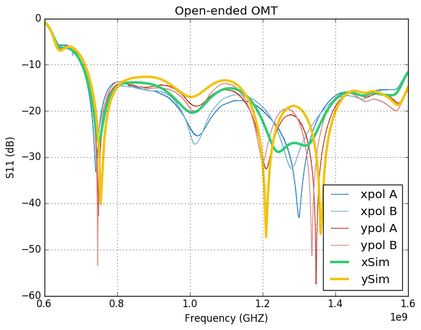
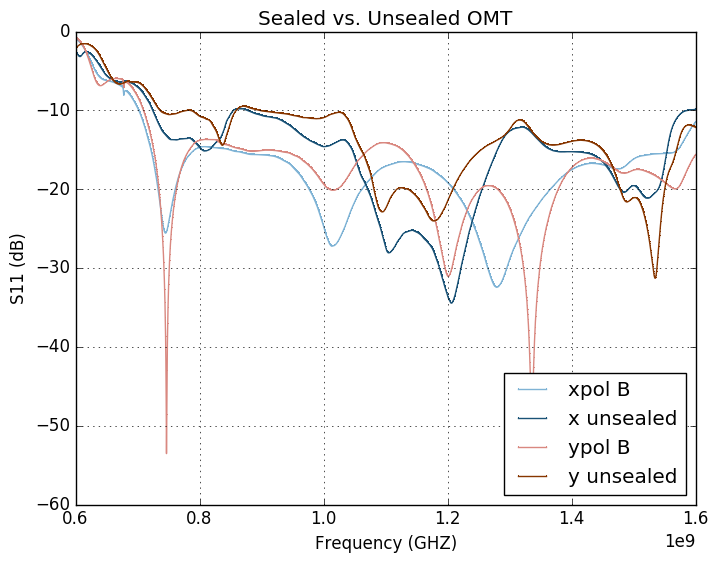

## June 12, 2017: Repaired OMT S-Parameter and loss measurements
Chandler Conn

### Introduction
Continuing in the same vein as [an earlier posting from Chris](../20170321_new_omt "Click me! :)"), much of this posting will be bookkeeping and present data from the rebuilt version of two OMTs (A and B). The rebuild was necessary due to damage suffered in transit (shown in **figures 1a, 1b**) from Michigan that affected the coaxial conductor. Nothing else was changed about the OMT--no new design was implemented and as much detail as I could muster was put into rebuilding with care.

| | |
|:---|:---|
| **Figure 1a (noticeable chip damage)! **| **Figure 1b (damage relative to normal)**|

---

### S-Parameter measurements
Measurements were performed on the VNA in the fast imaging lab, in the same manner as Chris's most recent writeup (OMT aimed at absorber). Data is presented below following the images of the setup. Sealed vs. unsealed data was only taken for one of the OMTs. Crosspol data was not taken, but it was very similar to the last trial and was entirely in the -40dB range.

| | |
|:----|:----|
|**Figure 2a (no aluminum tape)** | **Figure 2b (aluminum tape)**|

--------

#### Data
| Sealed OMT (Figure 2b) |  |
|:---:|:---:|
|**Unsealed vs. sealed (Figures 2a, 2b)**| |
