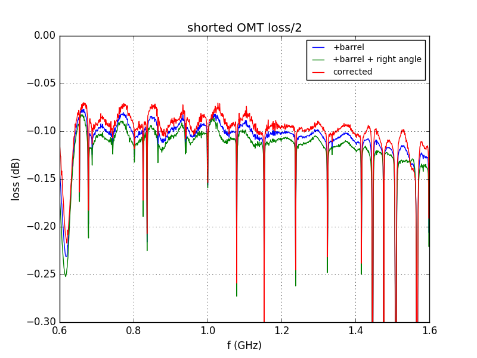

### June 14, 2017 - Repaired OMT S-Parameter (pt. 2) and loss measurements 
Chandler Conn

### Introduction
In my [last post](../20170612_Repaired_OMT/index.md "last measurements") I gathered the S11 measurements from the rebuilt OMTs and found that they were very similar to Chris's [earlier measurements](../20170321_new_omt/index.md "Click me! :)"). This posting is a simple continuation whereby I will gather the S12 parameters and subsequently the loss of the rebuilt OMTs.

---------------------------------------

### S12 measurements
The data gathering methods are exactly the same as they were earlier. Simple photos and data will be presented:

#### Results

This data is a big mess, in part because of the number of data points we collected (prohibiting us from using simple dots or crosses as data points). For the most part it looks great, barring the region from 1.2-1.4GHz. I'm not exactly sure what's going on here-there was this behavior in Chris's testing, but not to this extent it seems.

This data looks better. However, some things to note: we have some nulls that were not present in Chris's testing. This might be in part because we added an order of magnitude to the number of data points we collected, but it is still a point of concern. Nulls are very responsive to poor sealing from the aluminum tape, and it is likely that my taping job was not the same as the last iteration as well. Otherwise this plot resembles the last testing of these OMTs.

--------------------------------------

### Loss (two trials)

With the S11 and S21 values from above, I calculated the loss in dB. In order to better understand the effects of the coaxial connector on increasing the loss, Chris and I repeated these measurements with the regular connector as well as with an additional right angle connector, to view the effect of adding a connector to the mechanism. This information is in the second plot. However, the two plots cannot be compared directly, as there was a different calibration between the two, as well as potentially different OMT orientation (as they were moved and replaced prior to recording data the second time).

|Trial 1 (Chandler, both polarizations, one connector) |  |
|:----: | :----: |
| **Trial 2 (Chris+Chandler, separate calibration, one polarization, multiple connectors)** |  |

Some notes:
 * General trend in my (Chandler) plot hints at poor calibration
 * Approximately equal magnitudes - good!
 * Bad testing cables could lead to higher measured loss
 * Need for an uncalibrated connector (because of the two male jacks on the VMA and two male jacks on the OMT) which adds to the loss
    * Approximately calculted out in Chris's plot
