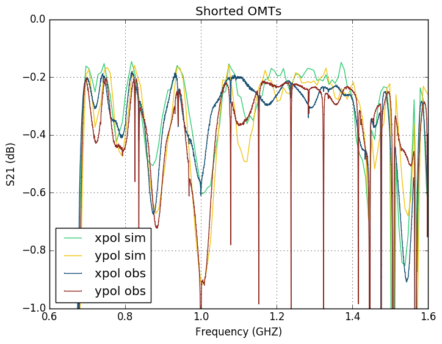
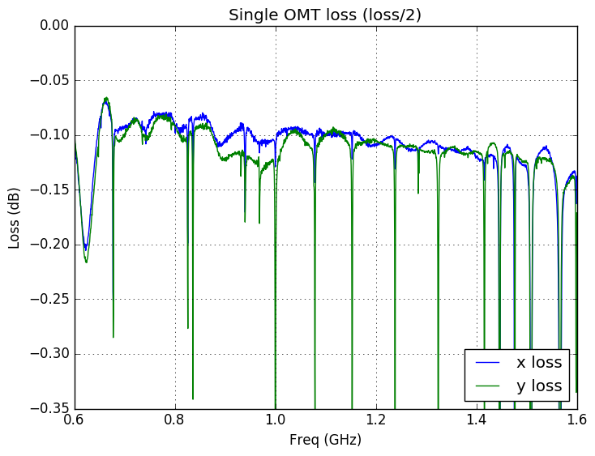

### June 14, 2017 - Repaired OMT S-Parameter (pt. 2) and loss measurements 
Chandler Conn

### Introduction
In my [last post](../20170612_Repaired_OMT/index.md "last measurements") I gathered the S11 measurements from the rebuilt OMTs and found that they were very similar to Chris's [earlier measurements](../20170321_new_omt/index.md "Click me! :)"). This posting is a simple continuation whereby I will gather the S12 parameters and subsequently the loss of the rebuilt OMTs.

### S12 measurements
The data gathering methods are exactly the same as they were earlier. Simple photos and data will be presented:

#### Results

This data is a big mess, in part because of the number of data points we collected (prohibiting us from using simple dots or crosses as data points). For the most part it looks great, barring the region from 1.2-1.4GHz. I'm not exactly sure what's going on here-there was this behavior in Chris's testing, but not to this extent it seems.

This data looks better. However, some things to note: we have some nulls that were not present in Chris's testing. This might be in part because we added an order of magnitude to the number of data points we collected, but it is still a point of concern. Otherwise this plot resembles the last testing of these OMTs.

#### Loss

