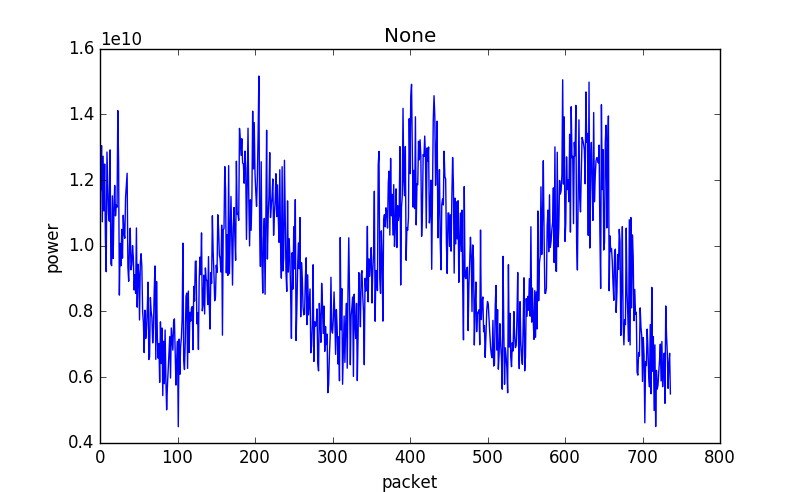
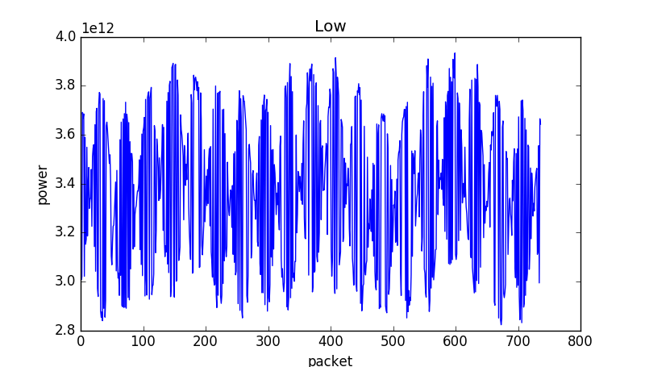
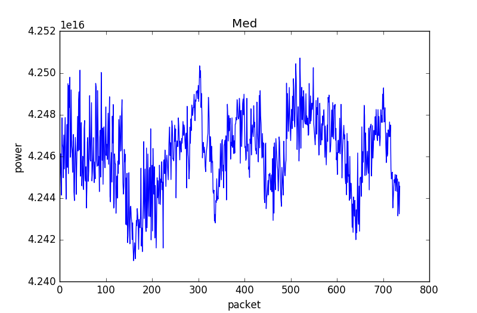
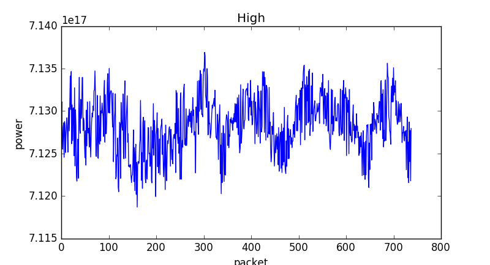
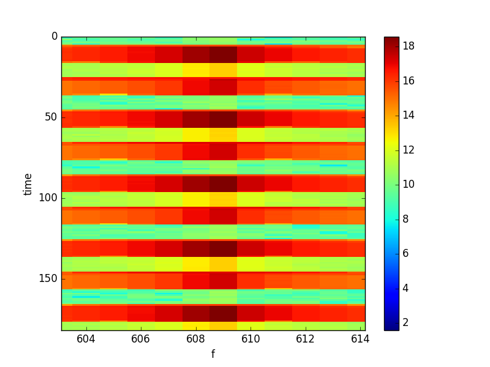
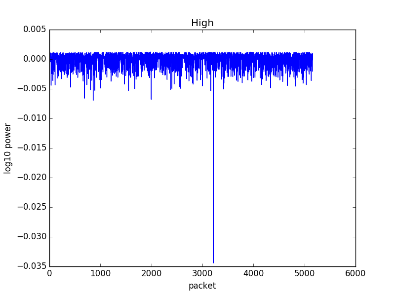
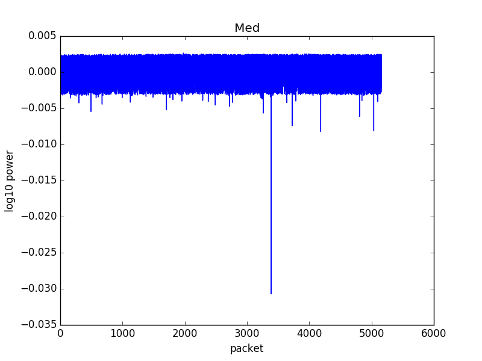
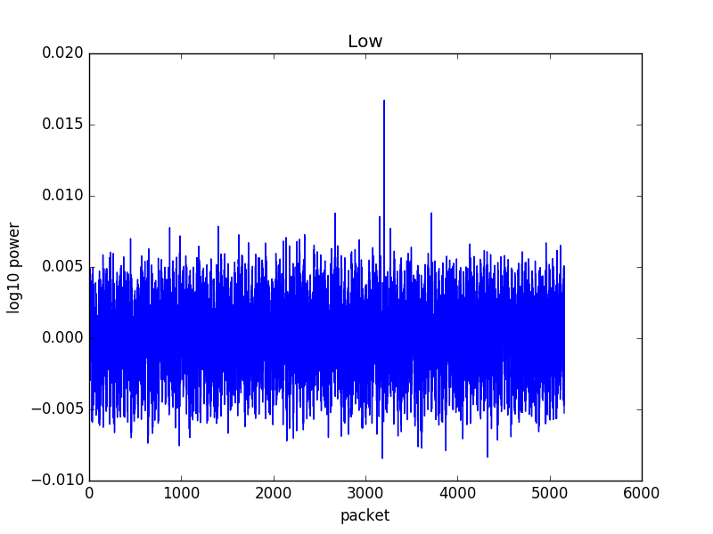
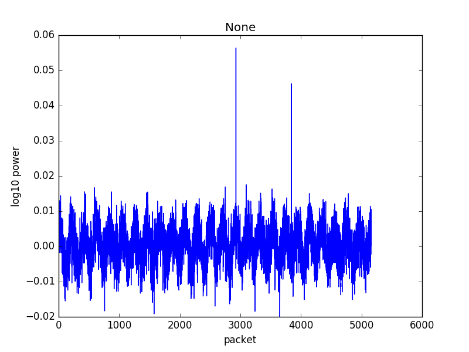

## June 22, 2017 - OMT Tone Stability plots
Chandler Conn

### Introduction

In this posting, I present the tone stability plots for the rebuilt OMTs.

### Data

#### Better data

For these following data points, my mode of analysis was simply taking the mean power as a function of time. The breakdown of these plots is explained following their presentation.

One hour of data at 100MHz:

|||
|----|----|
|||

I noticed 4 distinct regions when zooming in: a high amplitude (high amp) region, a low amp region, a medium amp region, and one with apparently no amplitude. This below plot (Figure 1) should illustrate that concept (this is most likely already known to anyone reading this).
Packet number on the x-axis is simply the number of the time packet for that amplitude. For example, each dark red region is one "packet" of high amplitude, and each seafoam green horizontal stripe is one "packet" of no amplitude.

|Figure 1||
|:---:|:---:|

Some things to note immediately in the four-plot breakdown: there are clearly patterns in the "no" and "low" amplitude regions. A repetitive, sinusoidal pattern is found in the "no" region, and an enveloped sine wave is in the "low" region, as seen in the plots. These patterns are not seen in the medium and high regions, which resemble traditional stochastic noise. I am not quite sure what the physical significance of this is.

#### Less good data (but still illustrative)

Next, I updated to work with 8+ hours of data. Here is a plot of the spread of measured amplitude (measured-mean)/mean, where the mean is taken to be the mean value in the first hour of collection, so as to see any time-dependent variations in the mean. I realize that this method might not be the best, but I already made these plots gosh darn it so I figured I might as well include them. They by no means encompass as much information as the plots above.

|||
|:---:|:---:|
|||

As can be seen, the changes over time are minimal to none. The stability seems very high, but keep in mind this is at log10 scales for data taken on 20170615 by Anze for ~8 hours. If desired I can run this same plot generator over other data sets but I feel this speaks volumes to the stability.

Sharp peaks are present, and I have a few hypotheses. First, they are still relatively small on these scales, so they might be due to a random occurrence in the room. More likely, however, is that my function that separates data clusters into the different amplitudes occasionally misassigns the data to a wrong section. This happens in, what I've found, around 1 part in 4000+-1000. Sharp peaks are most likely data points that were improperly labeled. This idea is preferential in my mind because of how inconsequential these peaks are, as they do not follow any real patterns from the data around them.

If desired, I have the data for 300MHz as well as for many different hours of plotting. I have the code necessary to do these plots if it is so desired, and I could easily make them, but they all present the same relative degree of information.
