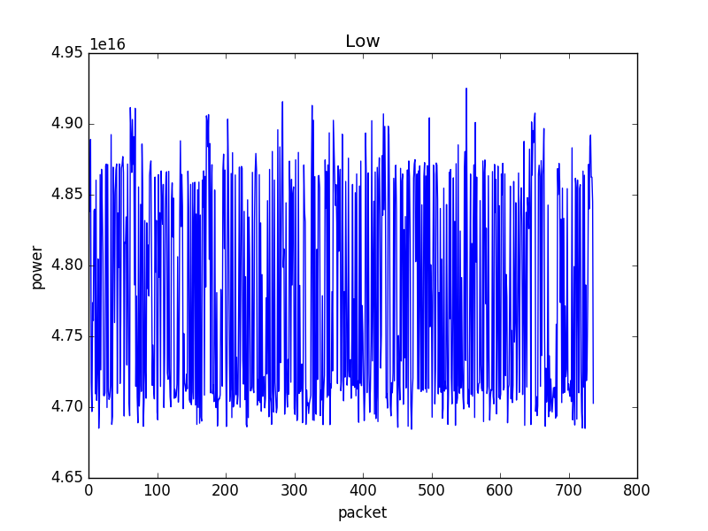
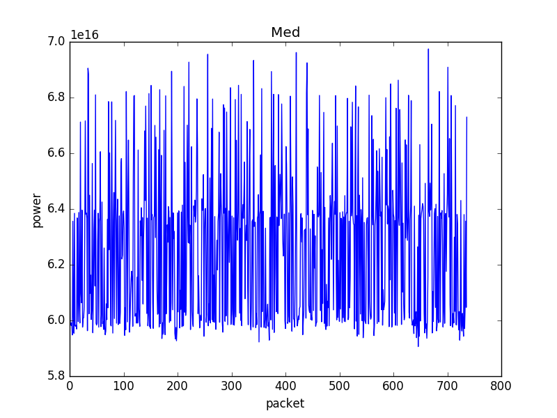
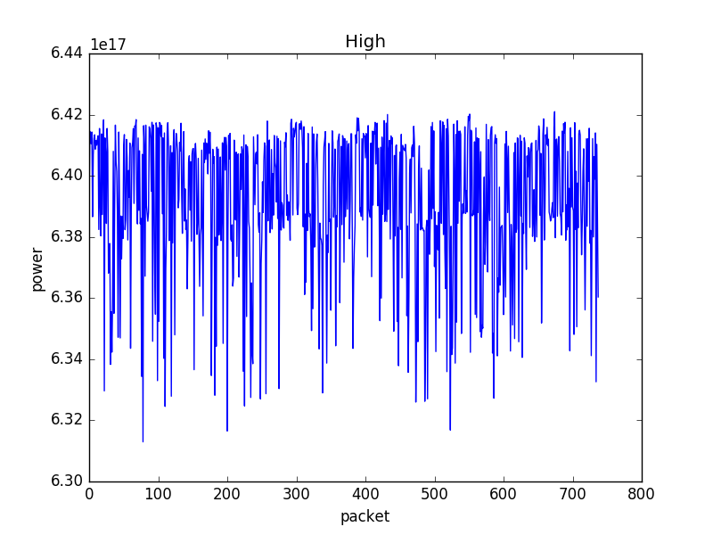
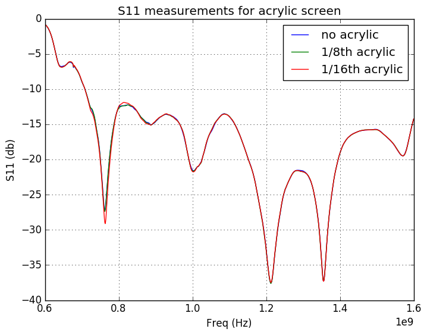

## June 22, 2017 - OMT Tone Stability plots and acrylic reflection (S11) measurements
Chandler Conn

### Introduction

In this amalgamation, I present two unrelated data sets: the first of these sets is a measurement of the stability of the OMT measurements in response to a tone generator, while the second is a measurement of the reflectiveness of two thicknesses of acrylic when placed in front of the OMT.

### Tone Stability

For these following data points, my mode of analysis was simply analyzing the mean (log10) power as a function of time. The breakdown of these plots is explained following their presentation.

One hour of data:

|||
|----|----|
|||

I noticed 4 distinct regions when zooming in: a high amplitude (high amp) region, a low amp region, a medium amp region, and one with apparently no amplitude. This below plot (Figure 1) should illustrate that concept (this is most likely already known to anyone reading this).
Packet number on the x-axis is simply the number of the time packet for that amplitude. For example, each dark red region is one "packet" of high amplitude, and each seafoam green horizontal stripe is one "packet" of no amplitude.

|Figure 1||
|:---:|:---:|

Next, I updated to work with 8+ hours of data. Here is a plot of the spread of measured amplitude (measured-mean)/mean, where the mean is taken to be the mean value in the first hour of collection, so as to see any time-dependent variations in the mean.

|||
|:---:|:---:|
|||

As can be seen, the changes over time are minimal to none. The stability seems very high, but keep in mind this is at log10 scales for data taken on 20170615 by Anze for ~8 hours. If desired I can run this same plot generator over other data sets but I feel this speaks volumes to the stability.

Sharp peaks are present, and I have a few hypotheses. First, they are still relatively small on these scales, so they might be due to a random occurrence in the room. More likely, however, is that my function that separates data clusters into the different amplitudes occasionally misassigns the data to a wrong section. This happens in, what I've found, around 1 part in 4000+-1000. Sharp peaks are most likely data points that were improperly labeled. This idea is preferential in my mind because of how inconsequential these peaks are, as they do not follow any real patterns from the data around them.

### Acrylic Reflection

As we can see, there is no noticeable reflectivity change due to adding acrylic of any thickness.

I tried plotting the difference between the two plots (with respect to the logarithm, as to do it correctly) and the difference in S11 was on the order of -200 dB for both thicknesses. So, it is fair to say that the acrylic changes nothing.
