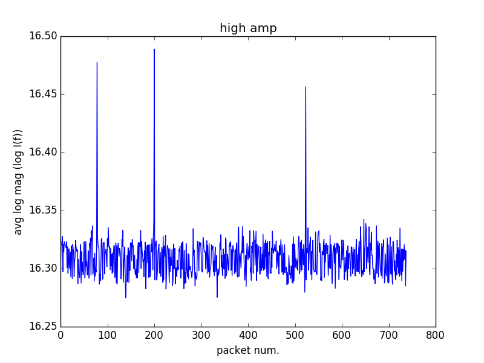
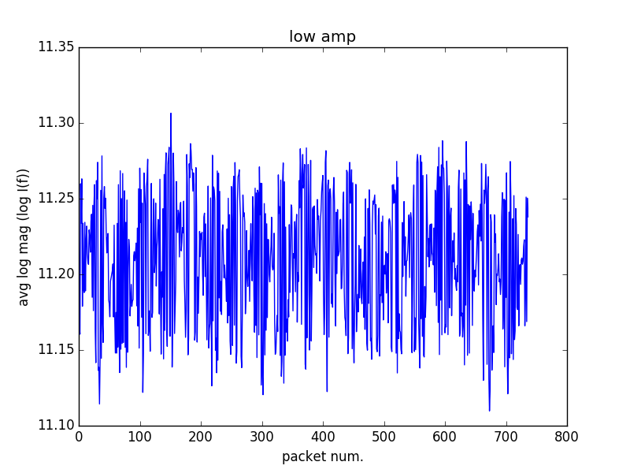
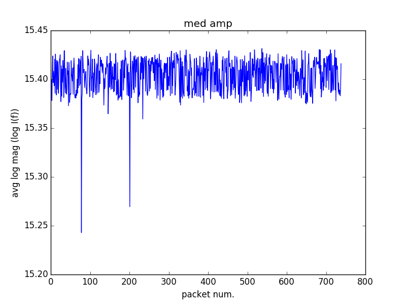
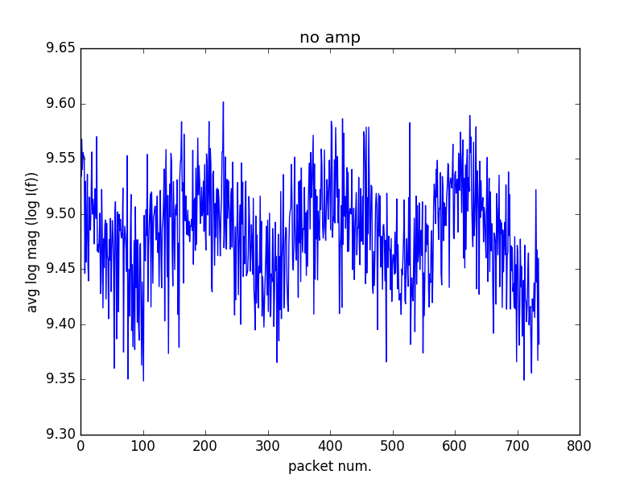

## June 22, 2017 - OMT Tone Stability plots and acrylic reflection (S11) measurements
Chandler Conn

### Introduction

In this amalgamation, I present two unrelated data sets: the first of these sets is a measurement of the stability of the OMT measurements in response to a tone generator, while the second is a measurement of the reflectiveness of two thicknesses of acrylic when placed in front of the OMT. This entry is a work in progress and will most likely be finished by Friday, as now I am just focused on entering the plots for others who are interested to see.

### Tone Stability
One hour of data:

|||
|----|----|
|||

I noticed 4 distinct regions when zooming in: a high amplitude (high amp) region, a low amp region, a medium amp region, and one with apparently no amplitude. This below plot (Figure 1) should illustrate that concept (this is most likely already known to anyone reading this).
Packet number on the x-axis is simply the number of the time packet for that amplitude. For example, each dark red region is one "packet" of high amplitude, and each seafoam green horizontal stripe is one "packet" of no amplitude.

|Figure 1||
|:---:|:---:|

### Acrylic Reflection

As we can see, there is no noticeable reflectivity change due to adding acrylic of any thickness.
