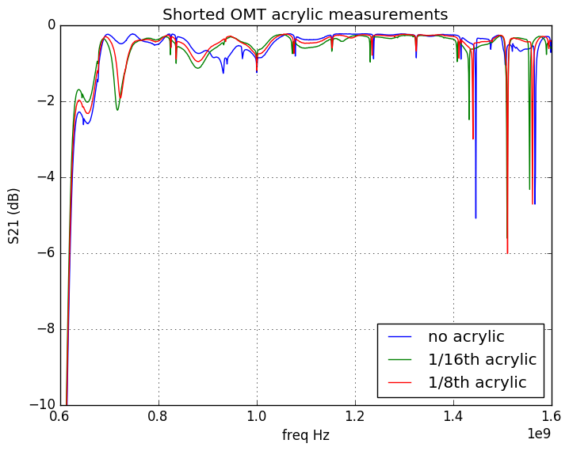
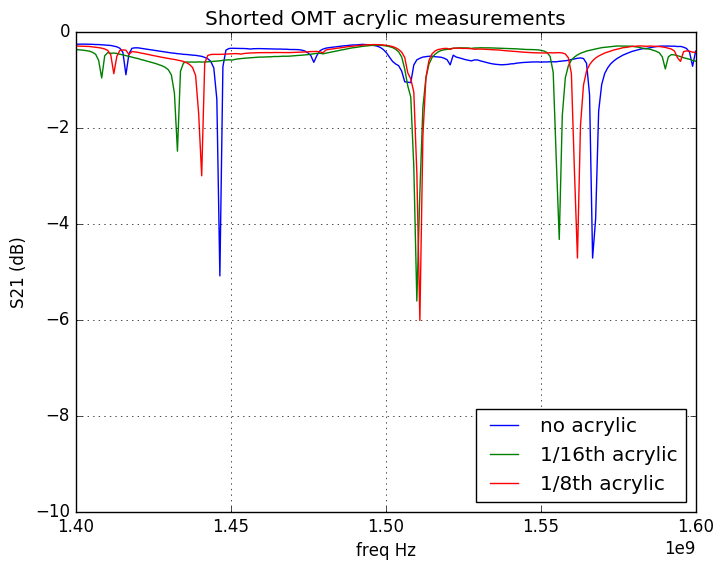
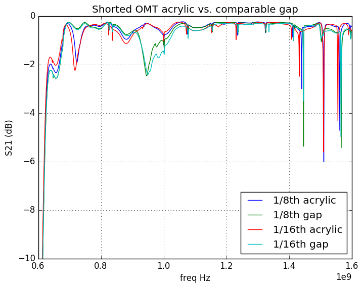
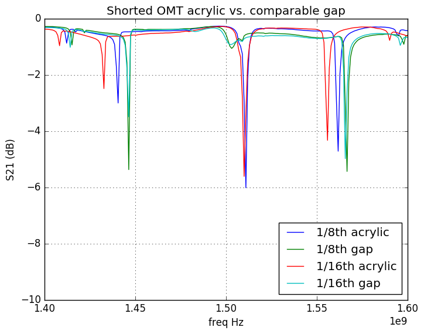
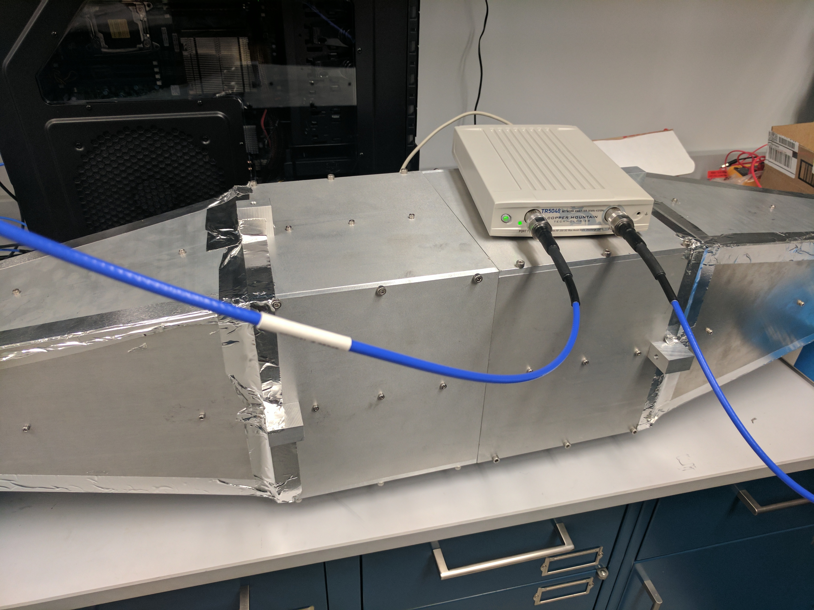
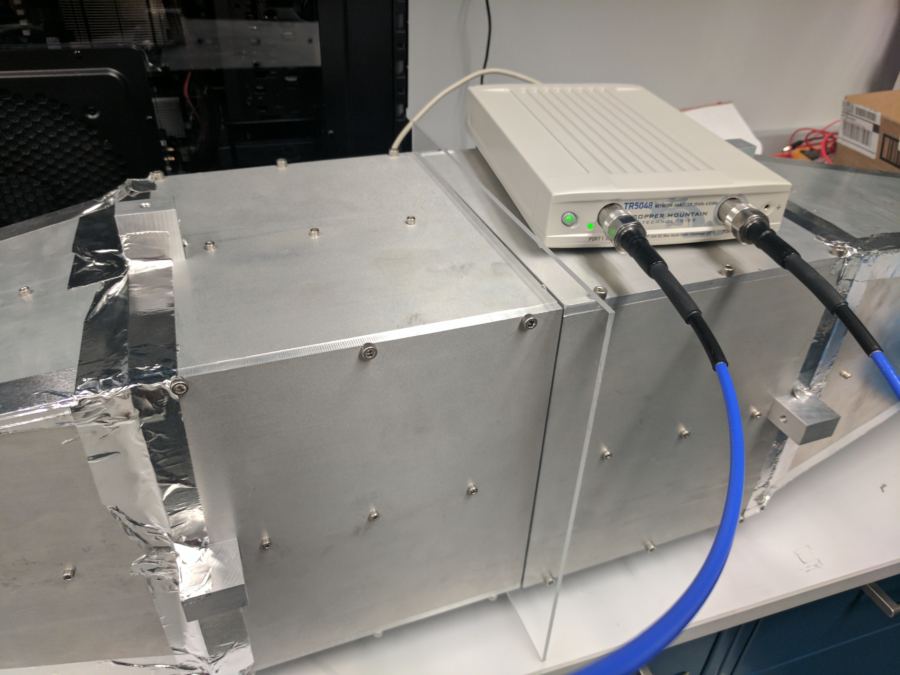

### June 28, 2017 - Acrylic reflectivity and absorption measurements for OMT

Chandler Conn

### Introduction

To prevent local avian fauna from habitating our experiment, it is likely necessary to add an acrylic sheet in front of the OMT to physically block entry. Two sheets were purchased for testing - one of 1/8th inch, and one of 1/16th inch acrylic. The results of the S11 (reflectivity) parameter measurements are given below, with the S12 immediately following.

### Reflectivity

| Secured acrylic (holding with two hands tightly to the OMT)| |
|:----:|:----:|
|**Unsecured acrylic (holding with one hand, not tightly secured)**||
|**Difference between no acrylic and unsecured acrylic (in dB)**||
|**Unsecured acrylic held at 10, 45 degrees (with respect to OMT face)**||
|**Zoom on ~1.2GHz peak of the previous plot**||

note: wobbly means that I just held with one hand, so as to simulate small variations or non-flatness in the acrylic.

There is a slight pattern in the zoomed in plot: increasing thickness of acrylic results in a lowering of intensity of the peak. There is, however, no pattern in the angle of the acrylic, indicating that it is purely a product of the thickness.

All of these reflectivity plots seem to indicate that the acrylic would serve as a good physical barrier (see next paragraph, however) without affecting the signal transmission in any way. In many of the plots the plot appears black because of how closely the different measurements are. Even at an extreme angle of 45 degrees, the change due to adding the acrylic is negligable. The changes due to adding acrylic are noticeable in some parts (such as the peaks in the full plot) but the extent of this change is almost nothing. I am not sure how much of an effect this would have, but the difference plot seems to suggest that it would be on the order of none.

However, this is not the complete information. The absorptivity(??) of the acrylic also needs to be measured.

### Absorption

The absorption was measured through the S12 parameters. The plots are below, accompanied by experimental photos.

In the first two plots, the two shorted OMTs were attached as closely as I could get them, but not taped together (Figure 1a) (see paragraph below for the implications of not taping them together). This was compared against the 1/16th and 1/8th inch acrylic inserted between the two OMTs (Figure 1b). In the lower two plots, the same acrylic measurements are plotted, but this time they are plotted against a gap of their respective widths, instead of against the two OMTs placed flat against each other. The point of this second measurement was to see if the effects present in the first plots were actually a result of the separation of the two OMTs, and not because of the acrylic presence (this turns out not to be the case, at least it seems).

|Shorted OMT S12 measurement with/without acrylic|Zoom on interest area|
|:---:|:---:|
|||
|**1/16th and 1/8th inch gaps vs. 1/6th and 1/16th and 1/8th inch acrylic**|**Zoom on interest area**|
|||

Some things to note immediately: the shorted OMTs are VERY sensitive to holes and other gaps. I noticed that whenever there was an unsecured gap, such as when I took the 1/16th and 1/8th inch gap measurements, simply moving my hands around the area between the two OMTs (but not blocking anything or sticking my hand in between) produced a noticeable change in the data. This was similar when the acrylic was in place, as well. Even though I tried to secure it as much as possible, the data reacted to me moving my hand around the acrylic just as it had to me moving my hand around a gap. 

While this is an important thing to consider, the data still shows relatively clear patterns, such as some significant changes in two regions: the region on which I zoomed in for both plots, as well as around 0.9 GHz. I'm not exactly sure of the significance of this, I am just bringing attention to it.

|Figure 1a||
|:---:|:---:|
|**Figure 1b**||
