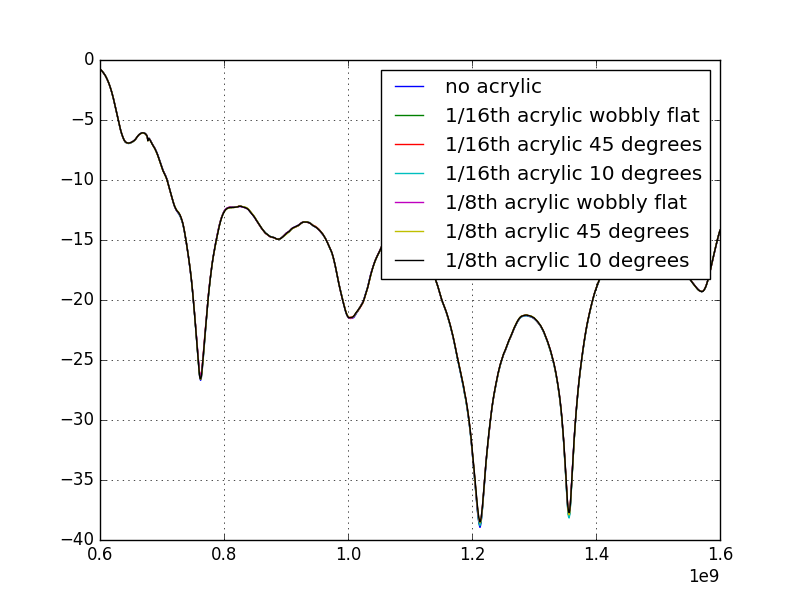
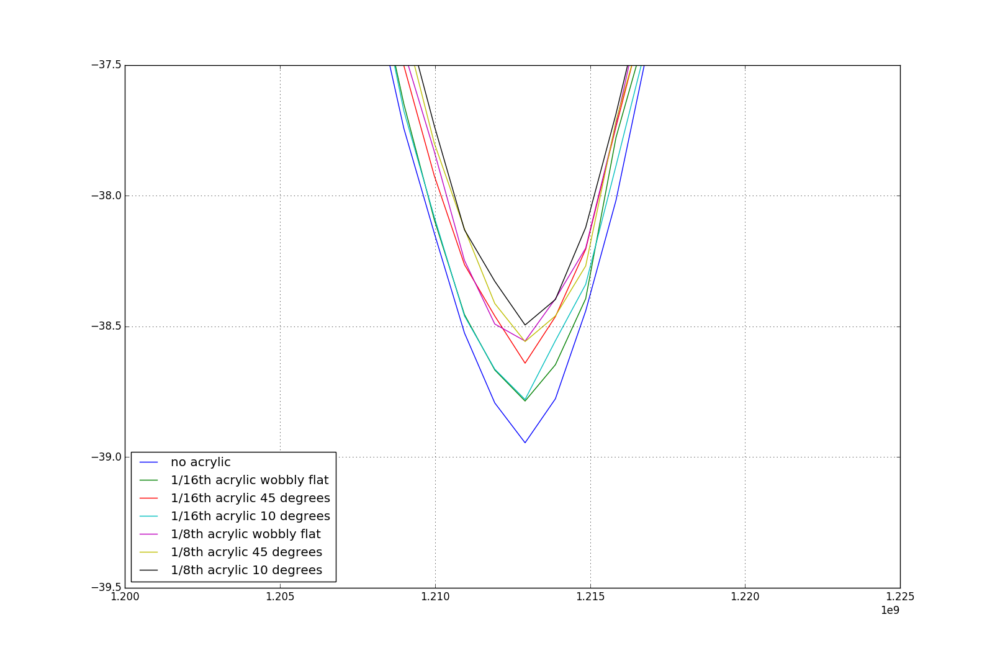

### June 28, 2017 - Acrylic reflectivity measurements for OMT

Chandler Conn

### Introduction

To prevent local avian fauna from habitating our experiment, it is likely necessary to add an acrylic sheet in front of the OMT to physically block entry. Two sheets were purchased for testing - one of 1/8th inch, and one of 1/16th inch acrylic. The results of the S11 (reflectivity) parameter measurements are given below.

#### Measurements

| Secured acrylic (holding with two hands tightly to the OMT)| |
|:----:|:----:|
|**Unsecured acrylic (holding with one hand, not tightly secured)**||
|**Difference between no acrylic and unsecured acrylic (in dB)**||
|**Unsecured acrylic held at 10, 45 degrees (with respect to OMT face)**||
|**Zoom on ~1.2GHz peak of the previous plot**||

note: wobbly means that I just held with one hand, so as to simulate small variations or non-flatness in the acrylic.

There is a slight pattern in the zoomed in plot: increasing thickness of acrylic results in a lowering of intensity of the peak. There is, however, no pattern in the angle of the acrylic, indicating that it is purely a product of the thickness.

All of these plots seem to indicate that the acrylic would serve as a good physical barrier without affecting the signal transmission in any way. In many of the plots the plot appears black because of how closely the different measurements are. Even at an extreme angle of 45 degrees, the change due to adding the acrylic is negligable. The changes due to adding acrylic are noticeable in some parts (such as the peaks in the full plot) but the extent of this change is almost nothing. I am not sure how much of an effect this would have, but the difference plot seems to suggest that it would be on the order of none.
