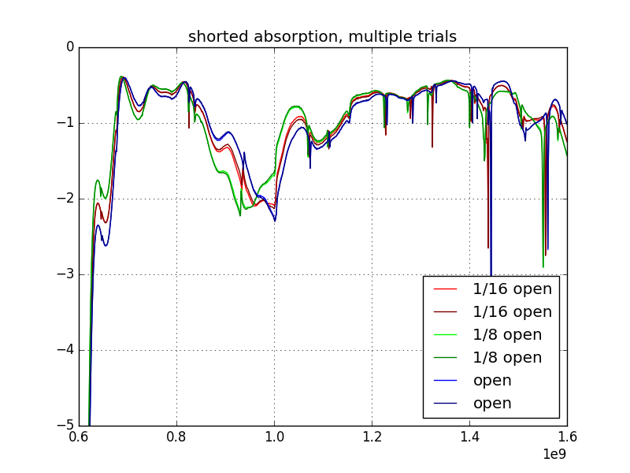
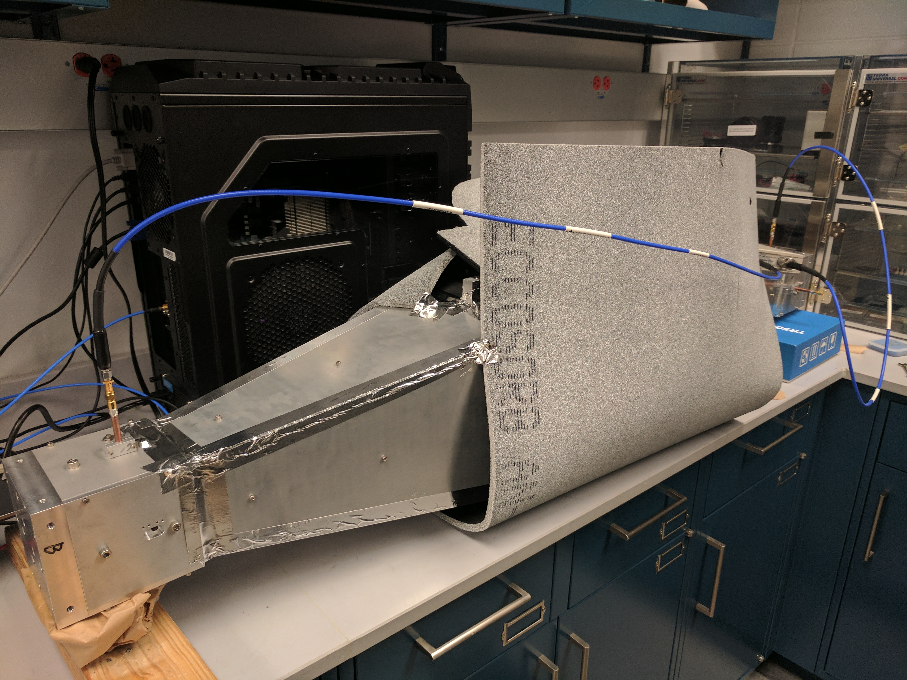

### June 30, 2017 - Acrylic absorption measurements

Chandler Conn

### Introduction

In my [last posting](../20170628_Acrylic/index.md) I measured the reflectivity of the acrylic sheet and found it to be essentialyl negligible. However, it came to my attention that the absorption might also play a role in signal reduction, so this post is dedicated to measuring S21 to find the acrylic absorption.

### Absorption

The absorption was measured through the S21 parameters. The plot is below, accompanied by an experimental photo. The reason for the absence of many different plots is for the strangeness of the plot below, but this will be explained after. 

**Note:** The reason why the change in S21 can be interpreted as solely due to the absorption is because we showed in the [last posting](../20170628_Acrylic/index.md) that the reflectivity plays almost no part, so adding acrylic should only change S21 because of absorption.

For this experiment, I "shorted" the two OMTs, by pointing them together but leaving a ~1/2 inch gap between them. This gap length was maintained as a constant for all of the data points, to eliminate any effects that that would have. Because the two shorted OMTs are very sensitive to holes or gaps in their construction, where signal can leak out or in, I surrounded it with as much foam absorbing material as I could that would not get in the way of the acrylic. I collected the S21 measurements with no acrylic first, then with 1/8th inch acrylic, then 1/16th inch acrylic, then I started again to get another round of data (to see if something had changed over time, such as moving the absorbers on accident). I took a bunch of other measurements that aren't shown here that basically confirmed that the experimental setup had not changed (the same measurement at ~10 different points during the course of the experiment). 

|Fig 1 (frequency Hz vs S21 dB)||
|:---:|:---:|

This data is apparently non-intuitive - there is an increase in S21 in some regions of the plot upon adding acrylic. I noticed this with previous data sets and repeated it to produce the data above. Each color (RGB) has two plots associated with it, where I took a full round of data (open, 1/16th sheet, 1/8th sheet) once and then repeated the whole cycle afterwards to demonstrate the repeatability. I specifically set up the data collection (figure 2) so as to be insensitive to swapping out the acrylic sheets, by setting up the foam absorbers in such a way that the acrylic never came in contact with them when I was moving it. Even so, the order in which I took data should add to the fact that this is in fact "correct" for what I was doing - if there was some sort of error due to the absorbers being shifted halfway or another transient source of change, then there would be an overall shift between the first and the second round of data for at least some of the plots, but this is not seen. Each RGB color is practically exactly the same and was repeated many times outside of these plots as well. This leads me to believe that there is either something fundamentally wrong with this means of collecting data (wrong type of signal, I don't know really, any help would be appreciated) or the acrylic has some behaviors that are almost counterintuitive. 

--------------------
|Fig 2||
|:---:|:---:|
