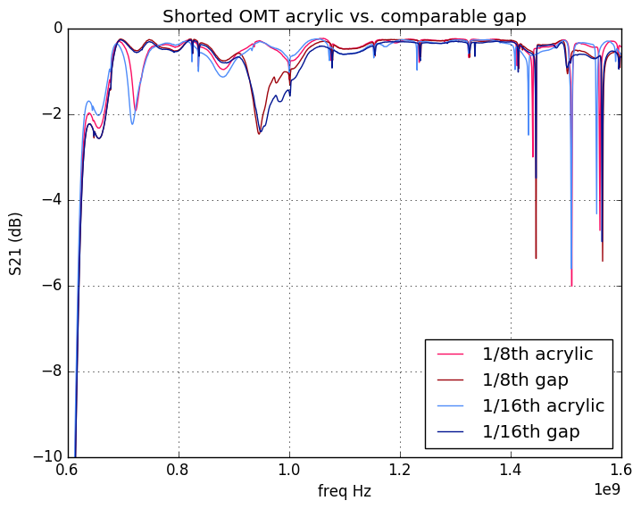

### June 30, 2017 - Acrylic absorption measurements

Chandler Conn

### Introduction

In my [last posting](../20170628_Acrylic/index.md) I measured the reflectivity of the acrylic sheet and found it to be essentialyl negligible. However, it came to my attention that the absorption might also play a role in signal reduction, so this post is dedicated to measuring S21 to find the acrylic absorption.

### Absorption

The absorption was measured through the S21 parameters. The plots are below, accompanied by experimental photos. The reason why the change in S21 can be interpreted as just the absorption is because we showed in the [last posting](../20170628_Acrylic/index.md) that the reflectivity plays almost no part, so adding acrylic should only change S21 because of absorption.

In the first two plots, the two shorted OMTs were attached as closely as I could get them, but not taped together (Figure 1a) (see paragraph below for the implications of not taping them together). This was compared against the 1/16th and 1/8th inch acrylic inserted between the two OMTs (Figure 1b). In the lower two plots, the same acrylic measurements are plotted, but this time they are plotted against a gap of their respective widths, instead of against the two OMTs placed flat against each other. The point of this second measurement was to see if the effects present in the first plots were actually a result of the separation of the two OMTs, and not because of the acrylic presence (this turns out not to be the case, at least it seems).

|Shorted OMT S21 measurement with/without acrylic|Zoom on interest area|
|:---:|:---:|
|||
|**1/16th and 1/8th inch gaps vs. 1/6th and 1/16th and 1/8th inch acrylic**|**Zoom on interest area**|
|||

Some things to note immediately: the shorted OMTs are VERY sensitive to holes and other gaps. I noticed that whenever there was an unsecured gap, such as when I took the 1/16th and 1/8th inch gap measurements, simply moving my hands around the area between the two OMTs (but not blocking anything or sticking my hand in between) produced a noticeable change in the data. This was similar when the acrylic was in place, as well. Even though I tried to secure it as much as possible, the data reacted to me moving my hand around the acrylic just as it had to me moving my hand around a gap. 

While this is an important thing to consider, the data still shows relatively clear patterns, such as some significant changes in two regions: the region on which I zoomed in for both plots, as well as around 0.9 GHz. I'm not exactly sure of the significance of this, I am just bringing attention to it.

|Figure 1a||
|:---:|:---:|
|**Figure 1b**||

