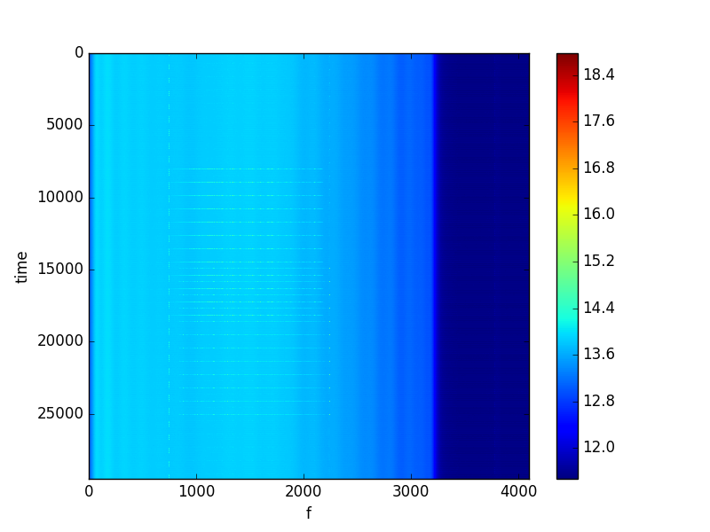
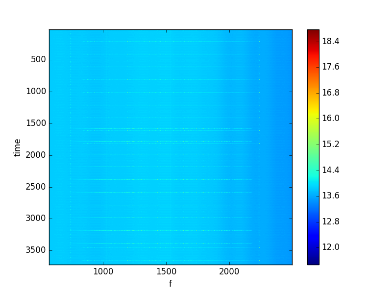
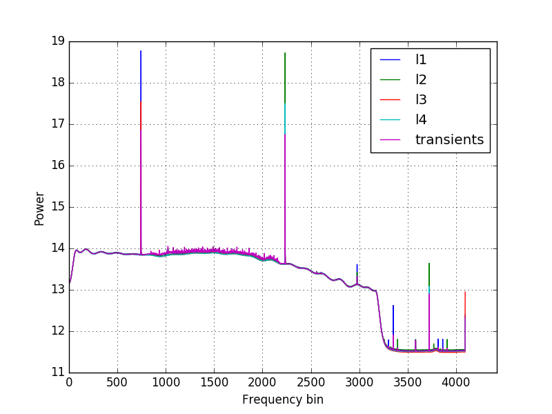
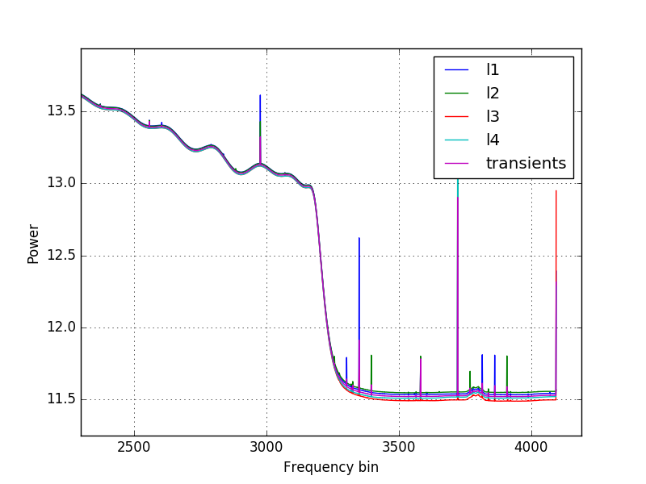
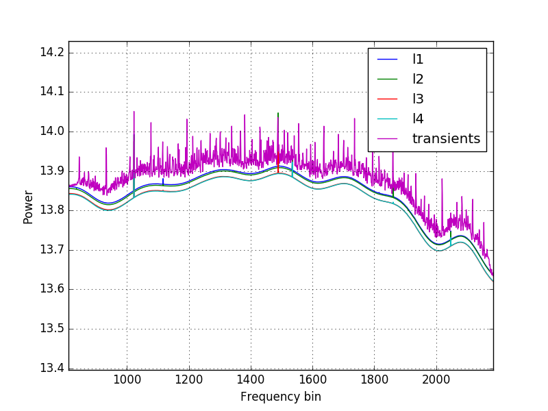
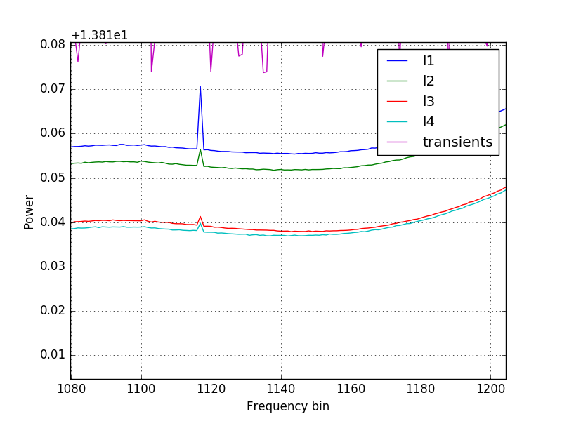
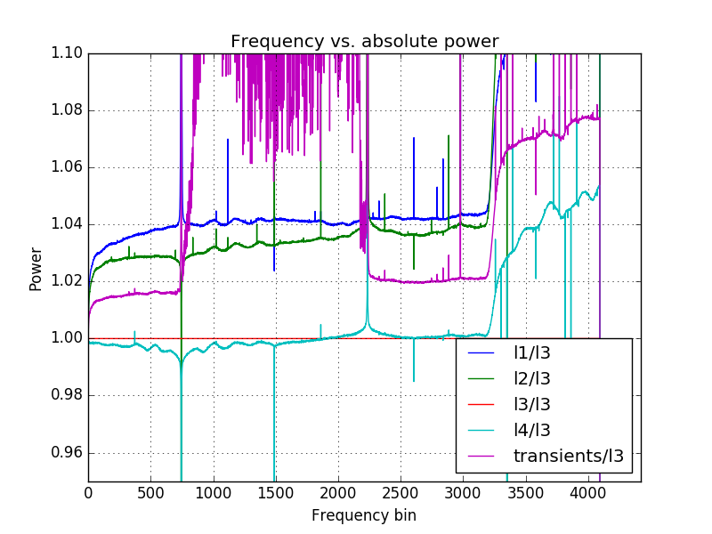

### July 05 2017 - OMT tone stability (further) discussion

Chandler Conn

### Introduction

In [a previous posting](../postings/20170622_ToneStability_and_Acrylic/index.md), I examined the tone stability results from the rebuilt OMT tests. However, I neglected to consider a certain feature from the waterfall plot (figure 1 below): the transient values as the signal generator switches between the amplitude regimes. In the plot below, there are clear transient amplitudes that might be of importance.

| Figure 1| |
|:---:|:---:|

Now, however, I will be drawing my data not from the frequency slices around our input frequencies (the waterfall plot above is centered at 100 MHz and only extends +- 0.005 MHz) but from the entire spectrum (0-550 MHz). The plot of this, and its zoom, is given below:

| Full plot|Zoomed to see the 100, 300 MHz peaks (at about 450 and 2500 on x-axis)|
|:---:|:---:|
|||

### New plots

To get the data from the transients, I split the entire dataset into 40-time chunks (one full power cycle). I then further separated these cycles into 4 groupings of 10 points, corresponding to the different aplitude regions. However, instead of keeping all 10 points, I only kept the middle 6 so as to ignore the transient values, and I placed the discarded transient values into a separate bin. Now, with five arrays spanning the entire frequency spectrum, but over ~1/4 of the time each, I averaged each frequency value over the entire time range to keep the frequency resolution but allowing me to plot a single trace. 

Below is this plot. l1-l4 correspond to the four different power regimes, but I didn't designate them "high, low, med, no" because these are not appropriate descriptors as the 100 MHz peak starts with a high amplitude while the 300 MHz peak starts with a medium one. Thus, I just kept the lists nameless as such. 

In log-scale, here is the plot of the different regions:

|Full plot|Zoom on upper tail|
|:---:|:---:|
|||
|**Zoom between 100 MHz and 300 MHz peaks**|**Further zoom in this region**|
|||

Next, I went back to absolute power (not log scale) and picked a random trace (l3 in my case) by which to divide all of the traces. The results are below, where I examine the region very close to 1:

We see a widening of the 300 MHz peak (evident on the cyan trace) implying that we used a bit too much power for what we wanted. The transients, however, are the more important and unusual feature. Overtones are also very prevalent in this plot, as a result of the chosen frequencies (100 and 300 MHz). 

### Interpretation

The behavior of these transients is beyond me. Between our two tone peaks we find transients that are of greater amplitude than the highest amplitude signal, with a pattern typical of noise. Outside of this region, however, the transients are on the order of halfway between the medium and low powers, which qualitatively makes some sense to me (if we interpret the transients as the interpolation of the power when switching regions, then they would have a power characteristic of the average total power). 

Now, the effect from these transients would not be nearly as visible if we weren't changing magnitude so frequently - the transients make up ~40% of the total data points! If we switched power on the second timescale instead of the millisecond tlimescale, they would be almost negligible. 
