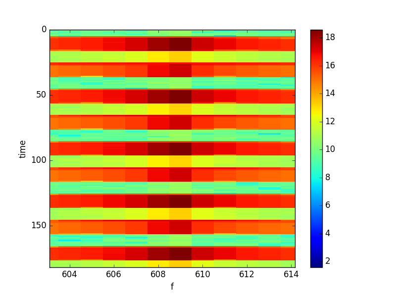

### July 05 2017 - OMT tone stability (further) discussion

Chandler Conn

### Introduction

In [a previous posting](../postings/20170622_ToneStability_and_Acrylic/index.md), I examined the tone stability results from the rebuilt OMT tests. However, I neglected to consider a certain feature from the waterfall plot (figure 1 below): the transient values as the signal generator switches between the amplitude regimes. In the plot below, there are clear transient amplitudes that might be of importance.

| Figure 1| |
|:---:|:---:|
