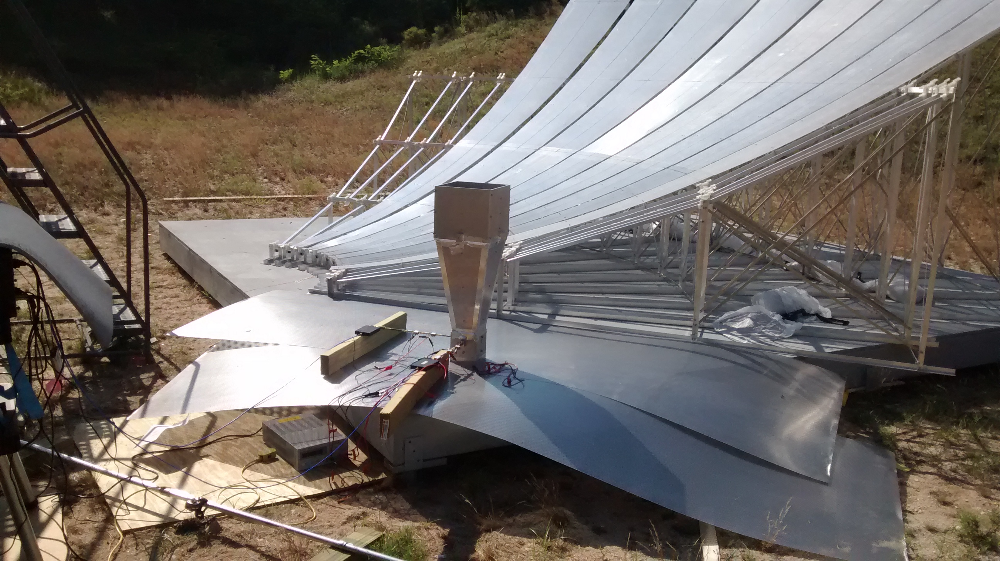
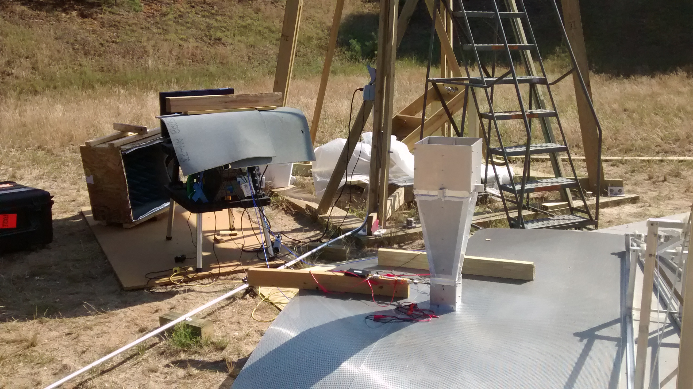
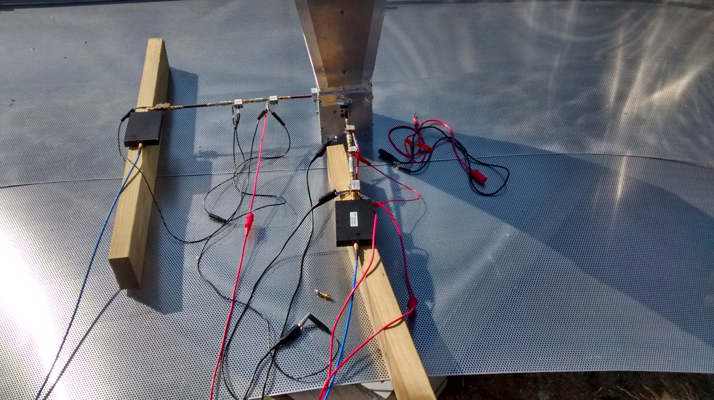
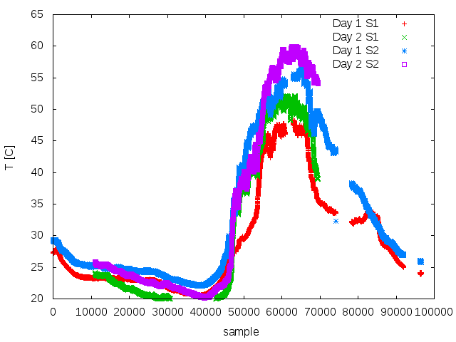
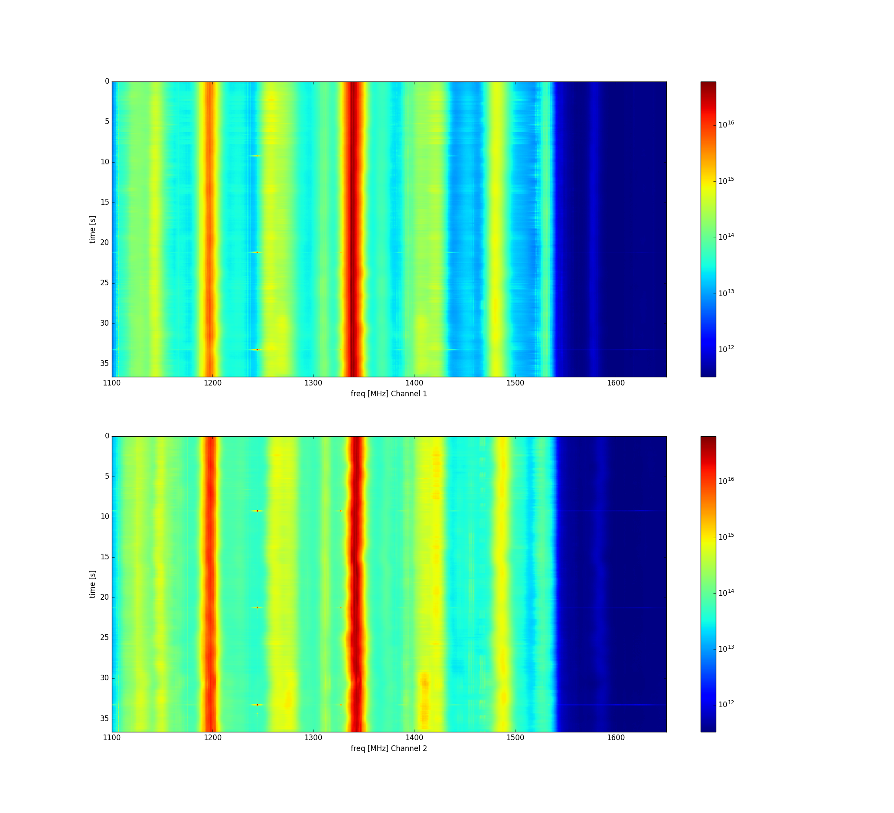
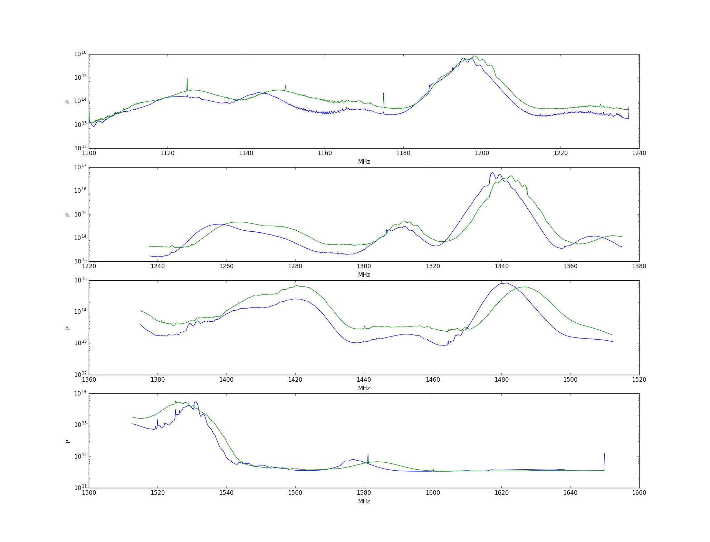
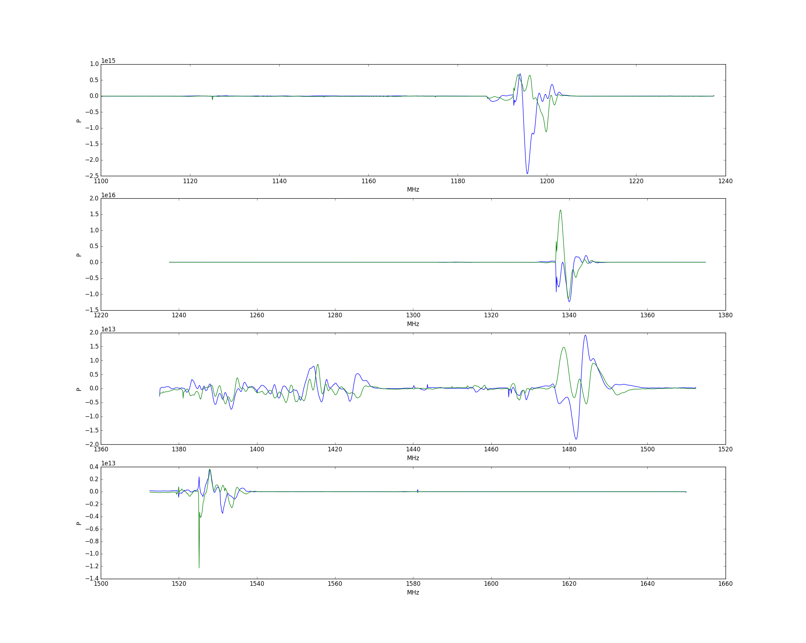
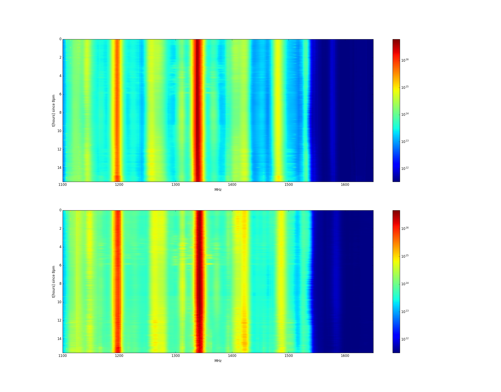
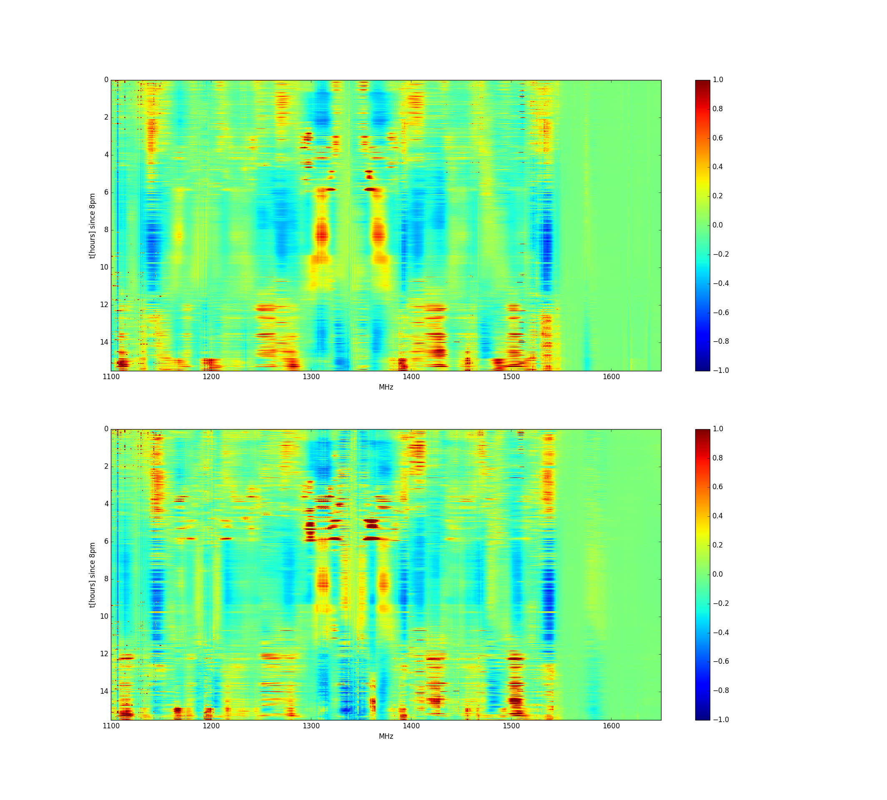

### July 20 2017 - OMT in the basin

A Slosar

### Setup

The basic purpose of this experiment was to do some measurements for
Chandler, but also just test the entire setup including network
connectivity, aux data aquisition, etc.

The setup at the end of Wednesday was something like this:

||
||
||

OMT was pointing straight up, both channels were connected, taking
data at 1.1GHz sampling with both channels connected to the digitizer
(I believe for the first time). The two channels has marginally
different set-up -- one had an attenuator rather than first filter
between amps. But otherwise the set up was exactly the same.

# Webcam data

We were taking webcam data throughout. Two intesteresting movies on
the second day (two file reaquisition starts at midnight):

[CAM1](https://www.dropbox.com/s/pqpn1qaohmtmjei/170720_0000_cam0.avi?dl=0)
[CAM2](https://www.dropbox.com/s/q7gl47m746vj4ba/170720_0000_cam1.avi?dl=0)

# Temperature data

The temperature sensors were running too:

||

Clearly the temperatures >50 seems suspiciously high even though they
were under the sun. We need more sensible timestamping too, but it basically workse.

# Connectivity

Connectivity was fine, getting sustaing 7Mb transfers to astro cluster

# Data

Data were  taken with  RFI filtering  with 0.95ms  chunks and  4 sigma
rejection.  All   the  rejected   samples  were  saved.   This  caused
uncontrolled   increased   in   file   sizes  that   filled   up   the
disk. Therefore, we have data overnight from 7pm to 11AM on first day,
some daylight data with long interruptions  and then data 9PM - 2PM on
the second day.

# RFI rejection

See * [RFI Rejection Tests](postings/20170724_RFI_Rejection_Tests/index.md) note.

# First look at the data

Waterfall of typical 30 seconds of data for two channels:

 
 We see ticking of the radar every 12s or so. This is investigated in 
 note [Radar detection ](..//20170730_Radar/index.md).

Spectrum of both channels here, averaged over one hour, filtering
radar data.

One can see a few RFI frequencies as tight spikes. But general
features are shifted between two channels, indicating they are
response of the system rather than something we pick up. The mystery
is why is this variation so great and why it is so much greater than
what we used in the lab.

The real and imaginary cross powers are here:

Note that this is now linear, rather than log scale.

Waterfall plot for full 11 hours:

After dividing by mean and plotting fractional changes, we get:

Further fourier filtering to keep stuff that is fast varying in
frequency and slowly varying in time, we get:

