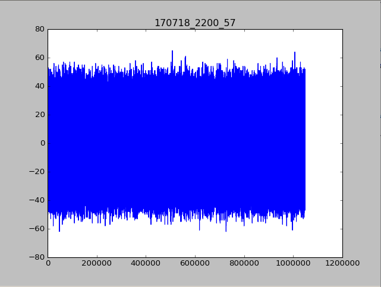
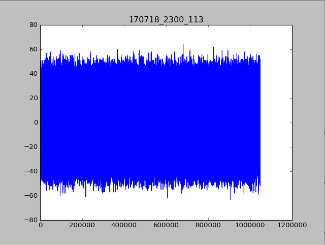
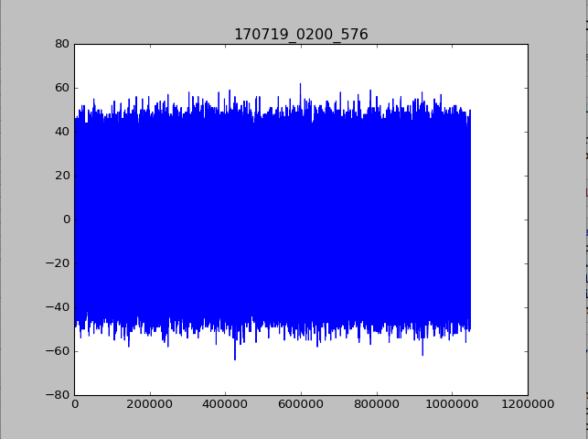
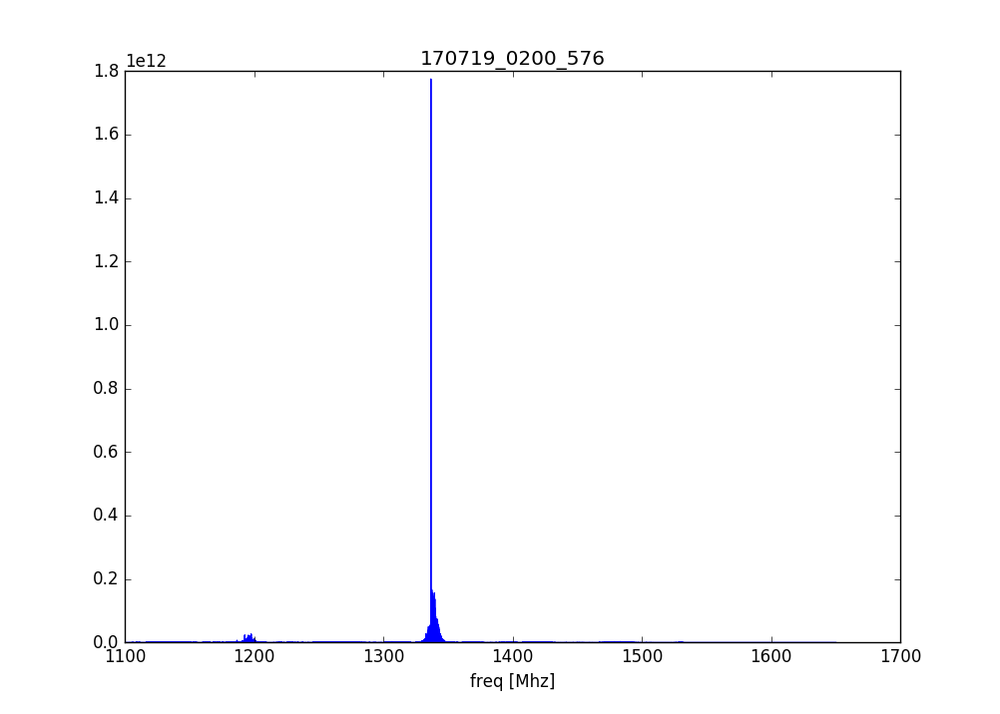
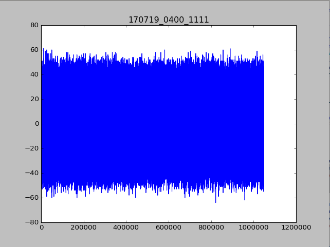
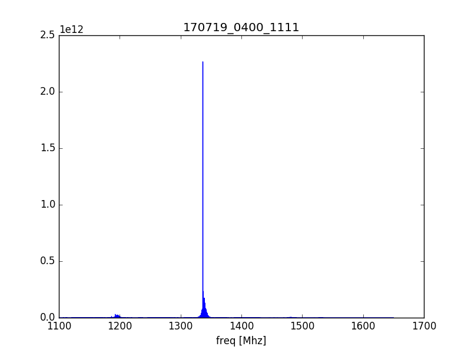
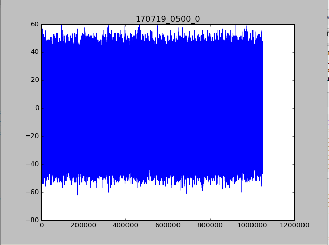
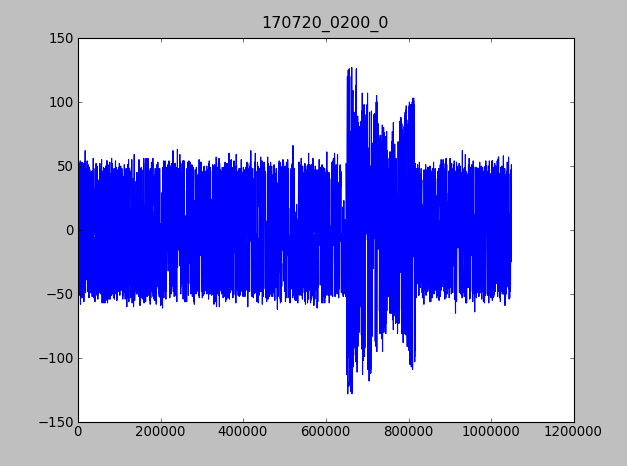
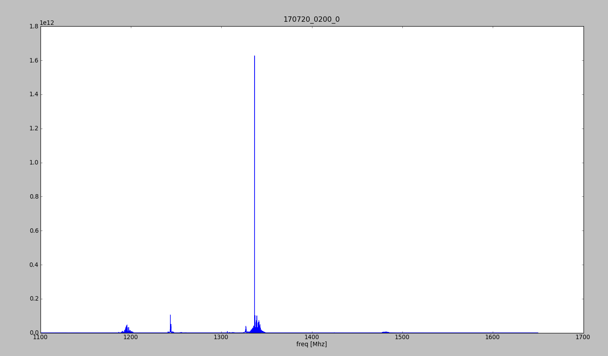
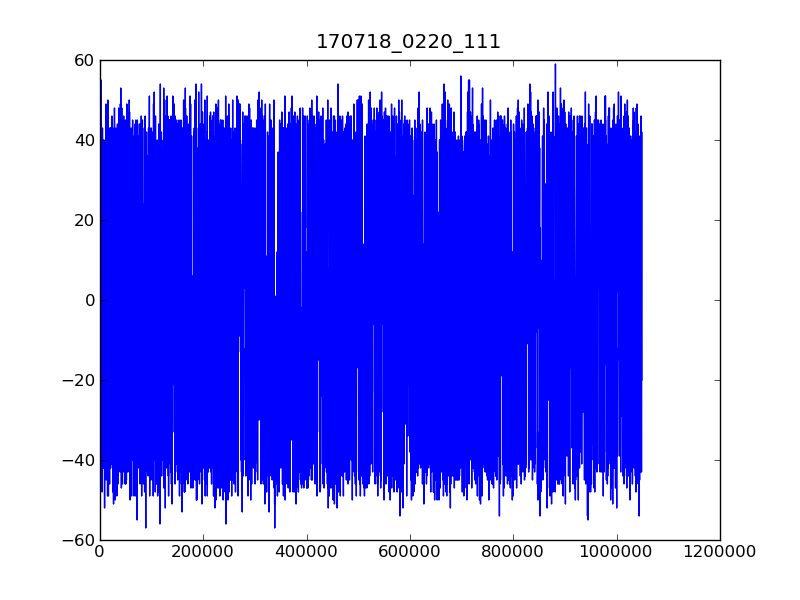

### RFI Rejection Tests

Data chunks of size 2^20 are flagged as RFI if their variance is an outlier among the variances of neighboring chunks. 
Test data was collected in the basin between 7/18/17 and 7/20/17 and the following is a randomly selected sample from all the flagged chunks. Displayed are the waveform and power spectrum for each chunk:

The titles are the date and time, followed by the chunk index.

# 1)

# 2)

# 3)

# 4)

# 5)

# 6)

# 7)

