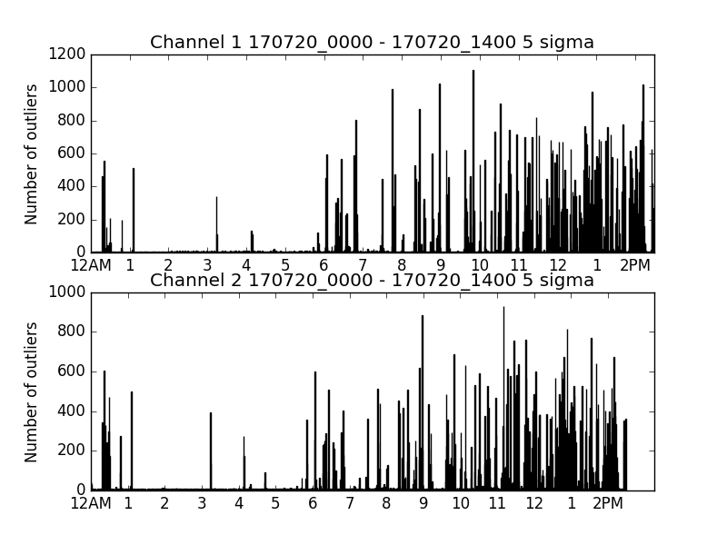
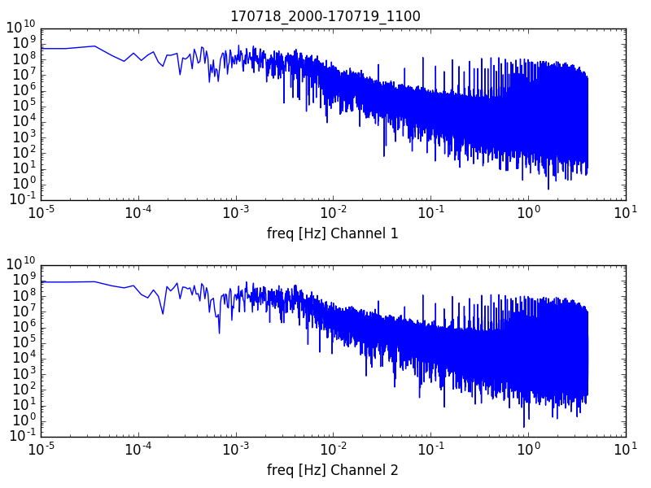

## RFI Rejection Tests

Data chunks of size 2^20 are flagged as RFI if their variance is an outlier among the variances of neighboring chunks. 
Test data was collected in the basin between 7/18/17 and 7/20/17. 

### RFI Density
The following is a plot of RFI density over 16 hours from 8:00 PM, July 18 - 12:00 PM, July 19

The following is a plot of RFI density over 15 hours from 12:00 AM, July 20 - 3:00 PM, July 20

Here are the two time streams overlayed on one plot:

### RFI Frequency
Taking the FFT of the outlier density data gives the following power spectra. Note that the two timestreams display similar peaks at around 2 and 3.7 Hz.

####  8:00 PM, July 18 - 12:00 PM, July 19
Every 1000 frequencies are binned and averaged together:

No binning:

Log scale on the x axis:

#### 12:00 AM, July 20 - 3:00 PM, July 20
Every 1000 frequencies are binned and averaged together:

No binning:

Log scale on the x axis

### RFI Waveforms and Power Spectra
The following is a randomly selected sample from the flagged chunks. Displayed are the waveform and power spectrum for each chunk:
The titles are the date and time, followed by the chunk index.

# 1)

# 2)

# 3)

# 4)

# 5)

# 6)

# 7)

