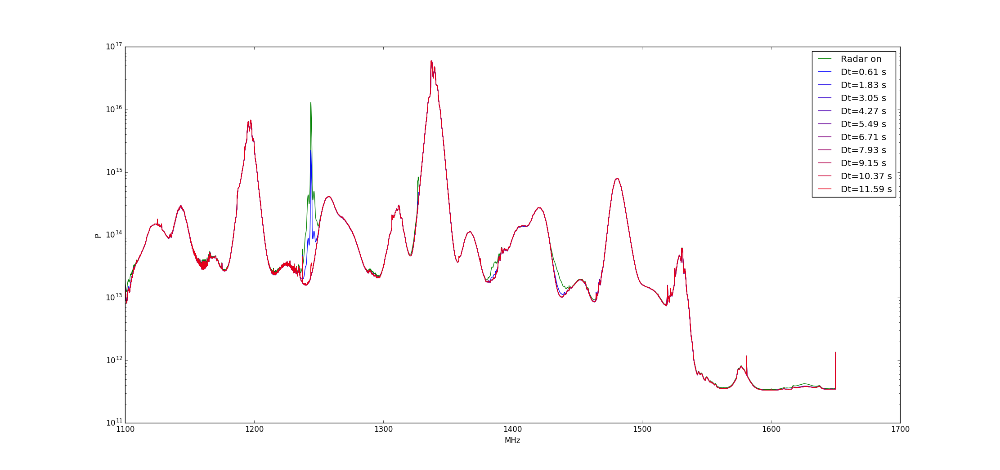
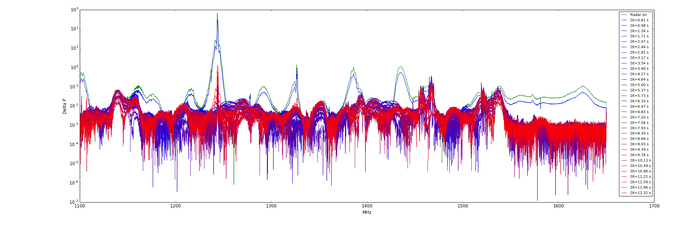
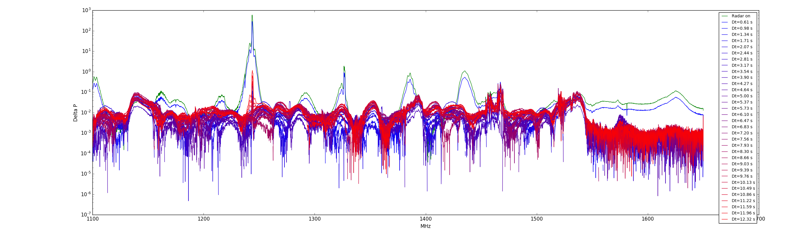

## Radar effect
Anze Slosar

I implemented radar detection in bmxdata. It very reliably comes back
every 12s and can flagged by its peaking at 1245MHz.

I took one hour of data with *OMT in the basin* (i.e. much more
suceptible that we'd be in reality) at 2AM
and then at 3AM when the RFI is at its quietest. 

Then I divided data based on phase wrt to the latest radar detection
and plotted the means.

This doesn't actually look that bad. Next I took the same data, but
with finer phase spacing, and calculate relative excess wrt to the
lowest power. The lower to plot show this for two one hour datasets.

