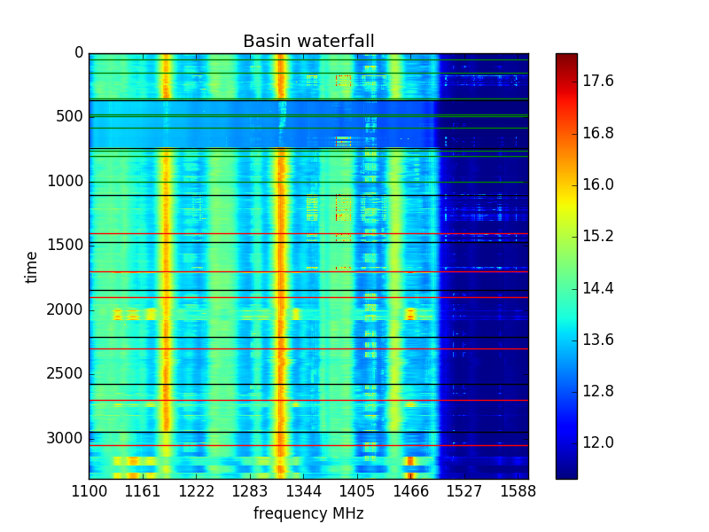
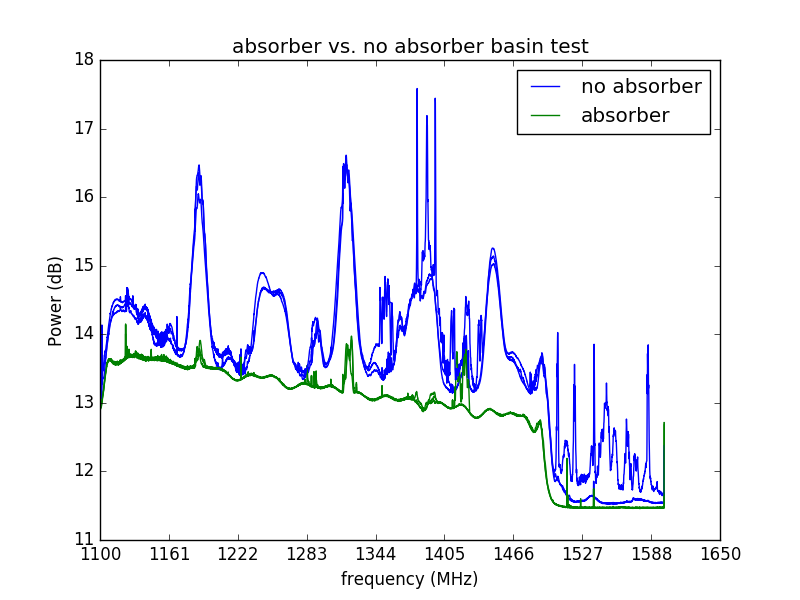
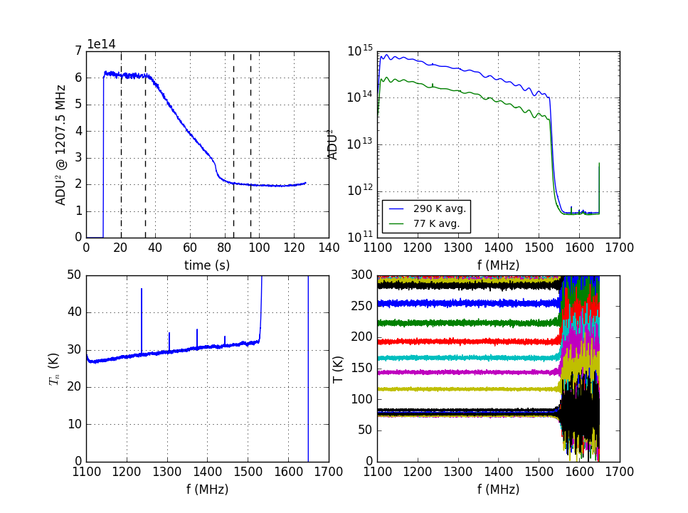
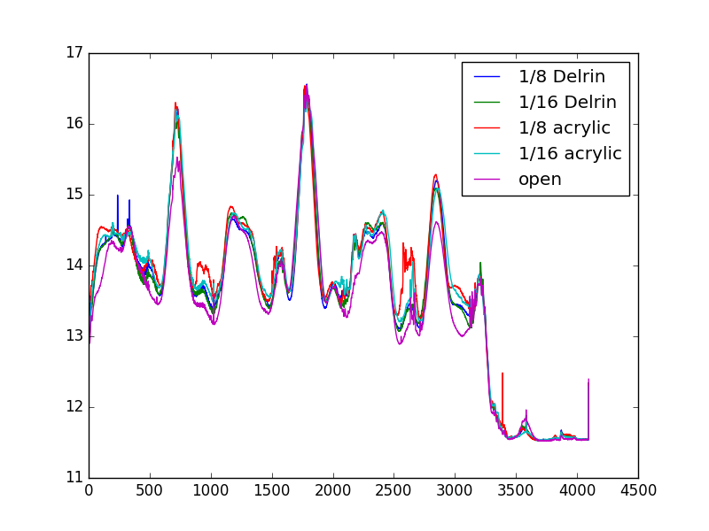
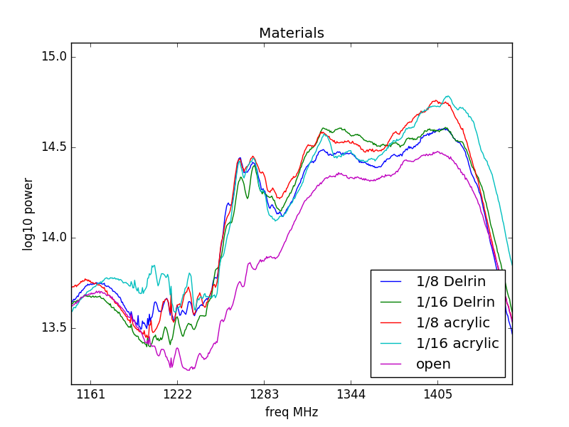

### August 2, 2017 - Basin absorber/no absorber tests
Chandler Conn

### Introduction
Continuing from [this post](postings/20170720_OMT_in_basin/index.md) I present some interesting data. One of the data points that we took out in the basin was a ninefold measurement of various conditions:

(ignore the colors in the first strip at the top, they are a mistake)

The regions are as follows, separated by black strips: 

|Junk|
|:---:|
|**Absorber**|
|**Open (pointing to sky)**|
|**1/8'' Delrin**|
|**1/16'' Delrin**|
|**1/8'' Acrylic**|
|**1/16'' Acrylic**|
|**2'' Acrylic (on a 1/16'' sheet)**|
|**Open**|

Unusually, when the 300k absorber load is placed in front of the OMT, we see a damping of the signal. Let's examine this in closer detail, by taking some slices from the waterfall plot above. The green lines in the waterfall plot for the second and third sections correspond to the traces used below.

One of the blue trials I gathered was fairly noisy or potentially RFI-infected, but the general trend still holds. Each color has ~4 plots behind it if I remember correctly, so as to make sure I wasn't getting a bad plot of each.

While we see peaks in the same areas, many features are just plain lost. So, it is not as simple as a linear holistic reduction of amplitude.

An important comparison is between this data and [previous noise temp data taken by chris](../20170425_noise_temp/index.md). If we examine the green lines in our plot above and compare them with the blue trace in the upper right here by Chris:

We see a general similarity in the shape. Our OMT in the basin plot has a relatively lower amplitude by about an order of magnitude, and it has some extra features not present in the Chris data. I'm not sure what this is a result of - potentially the heat in the basin effecting the amplifiers (although I'm not sure how much of that is an issue) or the fact that we used a slightly different amp chain than the one Chris used (which seems much more likely). We used attenuators in this recent iteration, whereas Chris did not.

-----------------------------
### Acrylic & Friends

Continuing my work with trying to find a decent shielding material for bugs and birds, I choose to analyze slices of this basin waterfall plot for the various materials, printed below. These are the red traces from the waterfall plot.

Fig 2a

Fig 2b (zoom)

As we can see, the amplitudes are very close for all trials (and I tried to choose slices that didn't have an obvious RFI). What is worrying, however, is the behavior upon zoom. It seems that the different materials can switch which is having the largest effect, indicating to me that the effect that a material has on the signal is nonlinear with respect to frequency and is very difficult (or impossible) to calibrate out, without a much higher-precision testing environmnent.

Also unusual is the fact that, in general, the materials *increase* the signal. This is still yet to be understood, but I am struggling to find an explanation using optics. Maybe it is a more sophisticated reason, or maybe I just have no idea! Help welcome.
