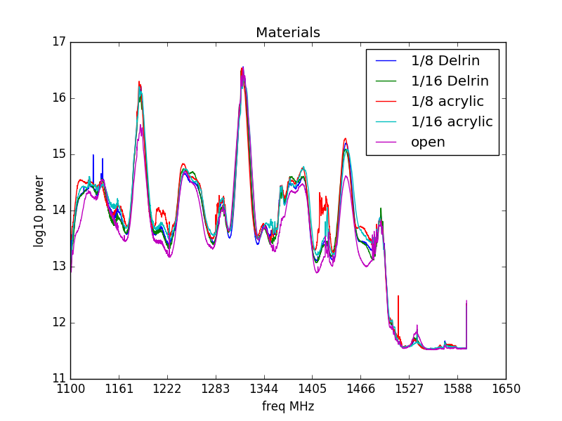

### August 2, 2017 - Basin absorber/no absorber tests
Chandler Conn

### Introduction
Continuing from [this post](postings/20170720_OMT_in_basin/index.md) I present some interesting data. One of the data points that we took out in the basin was a ninefold measurement of various conditions:

The regions are as follows: 

|Junk|
|:---:|
|**Absorber**|
|**Open (pointing to sky)**|
|**1/8'' Delrin**|
|**1/16'' Delrin**|
|**1/8'' Acrylic**|
|**1/16'' Acrylic**|
|**2'' Acrylic (on a 1/16'' sheet)**|
|**Open**|

Unusually, when the 300k absorber load is placed in front of the OMT, we see a damping of the signal. Let's examine this in closer detail:

|Waterfall plot||
|:---:|:---:|
|**Slice**||

One of the blue trials I gathered was fairly noisy or potentially RFI-infected, but the general trend still holds. Each color has ~4 plots behind it if I remember correctly, so as to make sure I wasn't getting a bad plot of each.

While we see peaks in the same areas, many features are just plain lost. So, it is not as simple as a linear holistic reduction of amplitude.

### Acrylic & Friends

Continuing my work with trying to find a decent shielding material for bugs and birds, I choose to analyze slices of this basin waterfall plot for the various materials, printed below:

|Plot|Zoomed plot|
|:---:|:---:|
|||

As we can see, the amplitudes are very close for all trials (and I tried to choose slices that didn't have an obvious RFI). What is worrying, however, is the behavior upon zoom. It seems that the different materials can switch which is having the largest effect, indicating to me that the effect that a material has on the signal is nonlinear with respect to frequency and is very difficult (or impossible) to calibrate out, without a much higher-precision testing environmnent.

Also unusual is the fact that, in general, the materials *increase* the signal. This is still yet to be understood, but I am struggling to find an explanation using optics. Maybe it is a more sophisticated reason, or maybe I just have no idea! Help welcome.
