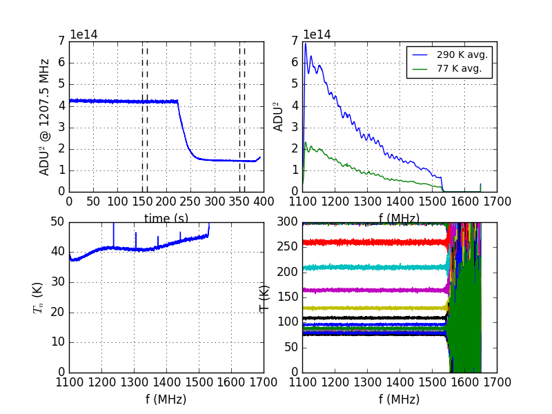

## August 17, 2017: Basin data
Christopher D. Sheehy

### 1 - Introduction

Will, PS and I took date with the horn pointed at the dish in the basin. Here
are plots. Not shown are any timestreams, which seem to show a high frequency
sinusoid heavily enveloped by something else. I'm vaguely aware that strong RFI
sources can mix with each other in addition to linearly adding. We might be
seeing someting like this.

### 2 - Noise temperature

Noise temps are measured with LN2 and terminators at the flexible coax input to
the amp chain box. Both are good, consistent with
[before](../20170425_noise_temp/index.md) except maybe ~10 K higher due to loss
in the new calbes and connectors before the LNA, as expected.

####Chanel 1 (xpol)

####Channel 2 (ypol) 
 

### 3 - RFI

Using the noise and gain calibration fits from the previous section, here are
calibrated spectra for the following cases:

1. 300 / 77 K terminators (flat lines by definition)
2. Horn pointing at dish.
3. Perforated sheet metal covering horn as best as possible. It doesn't
   perfectly close all the gaps.
4. Absorber box in front of horn. This leaves ~2" gaps all along the edge.
5. Horn pointed at the ground. We just moved the dish petals off the platform
   and placed them behind the horn.

In the plot, solid lines are x-pol and dashed are y-pol.

### 4 - Cell phone 

Making calls or turning our phones off didn't change anything but standing under
the horn and switching an iphone in and out of airplane mode made a huge
difference. It seemed to make RFI go down, regardless of switching off or
switching on airplane mode. This is a plot of the uncalibrated and calibrated
spectra showing the effect. The uncalibrated spectra go way down, especially in
one polarization. What's odd is that one of the polarizations goes down so much
that it is below the noise term in the temperature calibration (P = gT+n) so
that the calibrated temperature is negative. This is obviously unphysical and so
points to something else weird going on. RFI mixing? Huge out of band signal
suppressing the in band gain?

We also took data with the Yagi hooked to the amp chain. This has not yet been
looked at.
