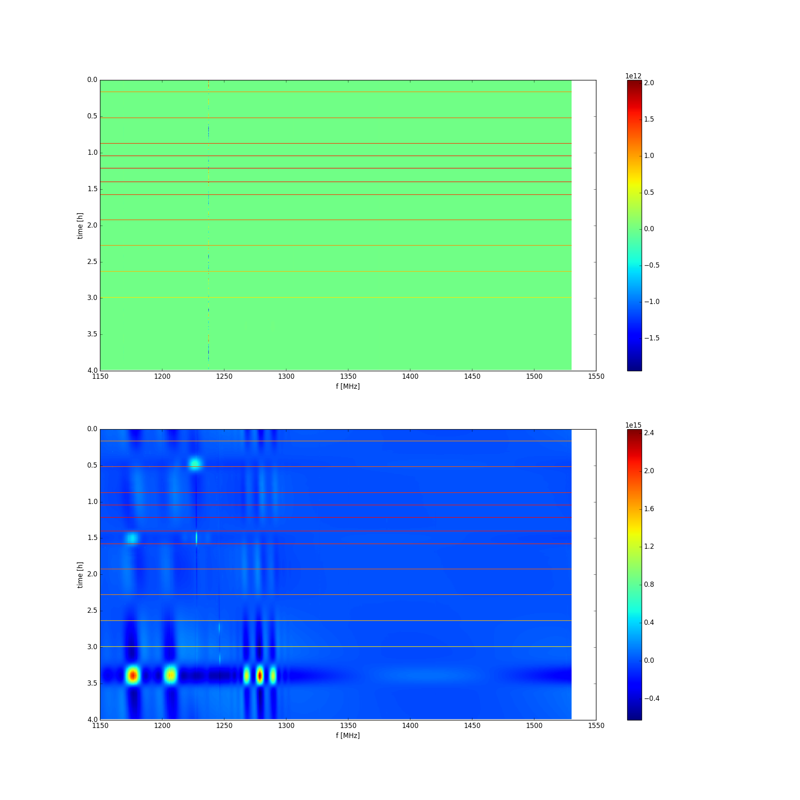

## First light in the 
Anze Slosar

Now that grande Sheehy has fixed our RFI issue, here are some results.

The first plot shows the 21-cm in our own galaxy. The y axis is
galactic b and the x axis is offset from nominal frequency. Only CH2
is working, 21cm is convincingly detected. One can also see velocity
broadening and faint continuum.

The second plot shows my attempt to catch CygA, lines the same as
before, but not the way bigger frequency range. We still see our friends
from last time. This had gentle FFT filtering applied to get rid of
common mode. If you look at the structure from 1250 to 1300, I think it
is pretty clear that something is going in and out of deep sidelobes.

