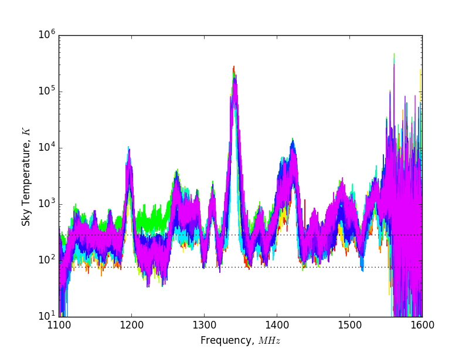

## Aug 31, 2017: SignalHound Measurements and Calibration

On Aug 24, 2017, Chris and I configured the SignalHound in order to investigate/study the
broad RFI. Our objective was to obtain Spectra from the sky, as well as with the
input terminated at two temperatures (290 K, and
77 K), calculate the Gain and Noise Floor Temperature and finally produce a
Calibrated Spectrum.

### Uncalibrated Spectra:

With the SignalHound in place of the Spectrometer(PC), we collected 28 spectra
over the course of about 15 minutes. The .bbr file (CREATE LINK) and the log of changes with loose time-stamps
can be found in the SignalHound folder on the cluster. (CREATE LINK)

To decrease noise/eliminate some time variability, we took averages over a few
 spectra.
1.  Spectra from Sky (averaged over the first and second spectra [0,1])
2.  Spectra with input terminated at 290K (averaged over [19,20.21])
3.  Spectra with input terminated at 77K in liquid nitrogen ([26,27])

### Gain and Noise Floor Calculations:

Power = Gain * (Temperature) + Noise

For a given frequency, a plot of Power (mW) versus Temperature (K) will be a
line segment, with points at T = 290 K, and T = 77 K. The slope of this line
segment is the Gain, and the y-int of the "line" is the noise from the system,
as the Temperature approaches T = 0 K.

In python, Chris helped me do some very simple array operations which calculated
the gain (mW/K), and the Noise (mW). The ratio n/g then yields the Noise
Temperature in K.

### Calibrated Spectra:

Utilizing these values, we calibrate the 16 earliest spectra from the
SignalHound data. The resulting plot of Sky Temperature vs. Frequency can be
seen below.

