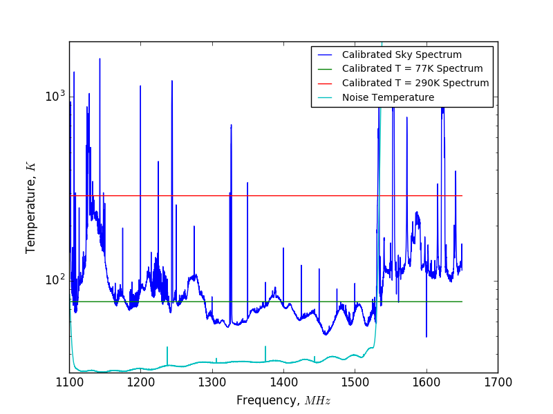

## Sep 06, 2017: Calibrated Spectra - Reduced RFI

On Aug 30, 2017, Chris had a revelation: [the amps were being driven non-linear
by the out of band RFI](postings/20170817_basindata/index.md). We made several modifications to the amp chain, in order
to reduce incoming RFI. The crucial change involved moving both band pass
filters onto the same channel: one after the first amp, to reduce the total
signal being amplified, and one after the last amp to nullify the noise of the
amplifiers. The current configuration of the amp chain is as follows:

Sky -> LNA -> BP -> LNA -> Low Pass -> AMP2 -> BP -> Spectrometer

These spectra were taken before the assembly of the side petals. Only the main
petals were constructed, and they were not joined.
### Uncalibrated Spectra:

On Sep 01, 2017, I attempted to gather the data necessary to calibrate the
spectra. The spectra can be found in the bmxdata folder on the astro cluster:
('/gpfs/mnt/gpfs01/astro/workarea/bmxdata/170901/170901_1219.data').

To decrease noise/eliminate some time variability, I took averages over a
suitable range of spectra for the following cases:
1.  Spectra from sky
2.  Spectra with input terminated at 290K
3.  Spectra with input terminated at 77K in liquid nitrogen

### Gain and Noise Floor Calculations:

Power = Gain * (Temperature) + Noise

For a given frequency, a plot of power (ADU-squared) versus temperature (K) will be a
line segment, with points at T = 290 K, and T = 77 K. The slope of this line
segment is the gain, and the y-int of the "line" is the noise from the system,
as the temperature approaches T = 0 K.

Gain was calculated by subtracting the average 77K spectrum from the average
290K spectrum, and dividing by the difference of the two temperatures. This
yields units of ADU**2/K

The noise parameter was calculated by subtracting off 77K*Gain from the 77K
average spectra, leaving units of ADU**2, which is linearly proportional to
power. 

### Calibrated Spectra:

Now, we can calibrate the average spectra for our above cases by subtracting the
noise and dividing by the gain. The plot below is the average physical temperature of
the sky versus frequency, and the horizontal lines correspond to the terminated
spectra at our two temperatures.

I believe we are seeing low sky temperatures (often below the liquid nitrogen
temperature @ 77K), with sharp narrow RFI peaks. 

Here is the same plot, viewed in log space.

Prediction: In the coming days, the dish will be finished and joined. I would
estimate that the current gaps in the dish account for 5% of the dish area, allowing
the T = 300K ground to contaminate our data. When the dish is joined, the
calibrated spectrum should decrease in temperature by 0.05 * 290K, or 14.5 K.