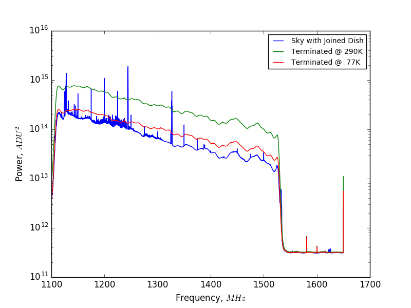
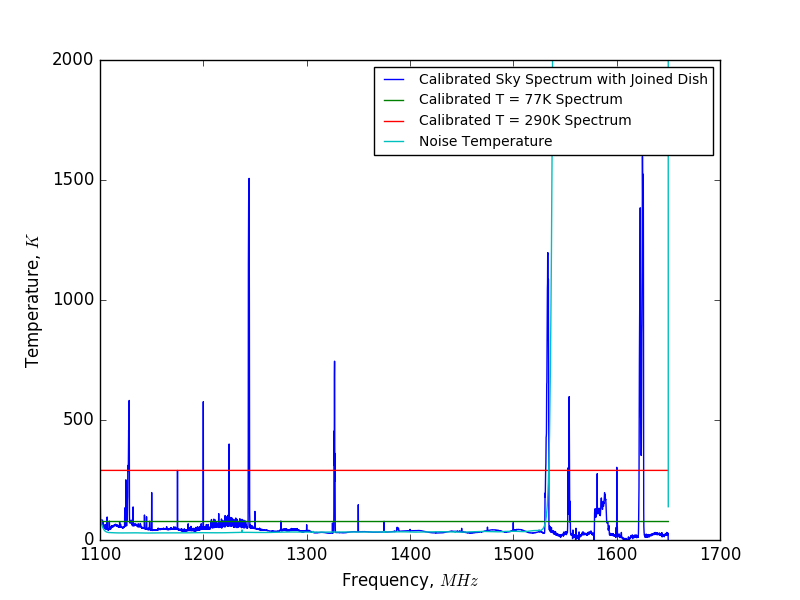
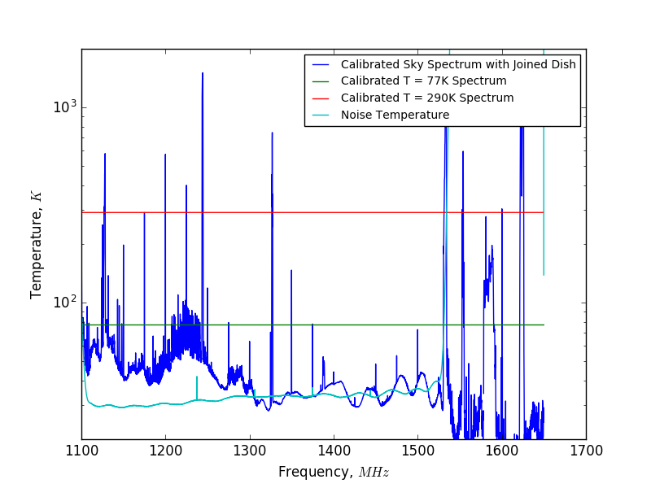
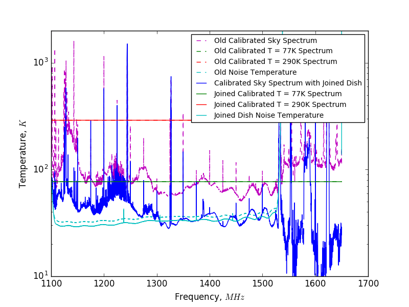

## Sep 08, 2017: Joined Dish Calibrated Spectrum

On Sep 07, 2017, Chris, Evan, and Paul joined the petals of the dish and sealed
them together with aluminum tape, thereby sealing out signal from the T = 300K ground. With the
decreased thermal noise from the ground, the sky spectrum saw a significant
decrease in temperature, as the plots below show. The current configuration of the amp chain is as
previously stated:

Sky -> LNA -> BP -> LNA -> Low Pass -> AMP2 -> BP -> Spectrometer

### Uncalibrated Spectra:

These spectra were taken the morning of Sep 08, 2017, over the course of about
30 minutes. The spectra can be found in the bmxdata folder on the astro cluster:
('/gpfs/mnt/gpfs01/astro/workarea/bmxdata/170908/170908_1154.data').

As in the [previous posting,](../20170906_sans_RFI_calibrated_spectrum/index.md) I took averages over a suitable range of spectra for the following cases:
1.  Spectra from sky
2.  Spectra with input terminated at 290K
3.  Spectra with input terminated at 77K in liquid nitrogen

It is clear that the average sky spectra is, in general, below the terminated T
= 77K spectrum! But let's see how this looks once we calibrate.

### Gain and Noise Floor Calculations:

(This section was presented in the previous posting, but appears here for clarity.)

Power = Gain * (Temperature) + Noise

For a given frequency, a plot of power (ADU-squared) versus temperature (K) will be a
line segment, with points at T = 290 K, and T = 77 K. The slope of this line
segment is the gain, and the y-int of the "line" is the noise from the system,
as the temperature approaches T = 0 K.

Gain was calculated by subtracting the average 77K spectrum from the average
290K spectrum, and dividing by the difference of the two temperatures. This
yields units of ADU**2/K

The noise parameter was calculated by subtracting off 77K*Gain from the 77K
average spectra, leaving units of ADU**2, which is linearly proportional to
power. 

### Calibrated Spectra:

Now, we can calibrate the average spectra for our above cases by subtracting the
noise and dividing by the gain. The plot below is the average physical temperature of
the sky versus frequency, and the horizontal lines correspond to the terminated
spectra at our two temperatures, as before.

Here is the same plot, viewed in log space
.

### Comparison: Before and After:

Here is a log space plot comparing the data from the previous posting (before
the dish was joined) and with the current data. 

