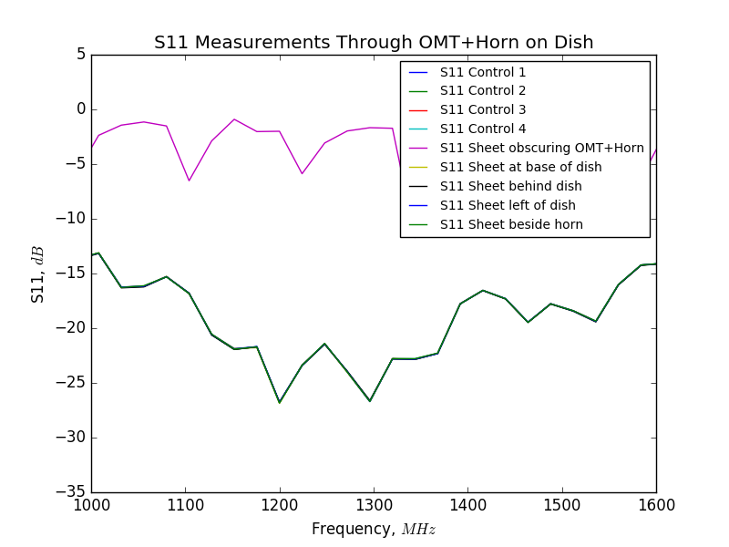

## Sep 15, 2017: OMT S-Parameter Measurements in Basin

On Sep 11, 2017, I used the VNA to measure the S-parameters of the OMT in the
basin, pointing at the freshly joined dish. These results can be directly
compared to the [OMT S11 data previously collected by chris](../20170321_new_omt/index.md), both in a lab
setting with the OMT directed into an absorber, and created in simulations.

### S11 Measurements

First, the VNA was calibrated, and then connected with Port 1 on the Y [chan2]
polarization low loss cable. Signal from the VNA was 'broadcast' through the
horn, and the measurement of S11 will tell us the amount of signal that is being
reflected off the OMT+Horn and dish, back into the low-loss cable.

In this configuration, Chris positioned a 48"x48" aluminum sheet at various
positions relative to the dish and the OMT. Conceptually, if the beam of the OMT
was seeing outside the surface of the dish, changing the geometry of the dish
would change the reflected power. Control measurements were taken before each
alteration, and the measurements themselves are labelled in the plot:

It seems that there is only one line, but in fact, all the lines are essentially
identical. Regardless of the position of the aluminum sheet, the reflected signal
was essentially constant. The resolution of this data is not very good, and
redoing the measurements with a higher resolution may be useful.

Comparing these results to the aforementioned posting, we can see loose overall
consistency between the previous measurements, and the actual beam in the basin.
Again, a higher resolution measurement will likely yield better results.

