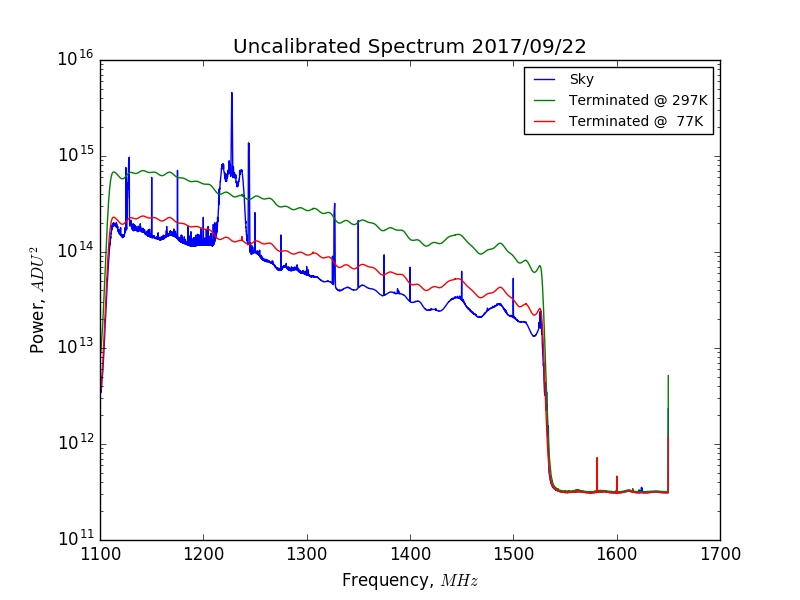

## Sep 22, 2017: Calibration Measurements with Liquid Nitrogen

On Sep. 20, I took calibration spectra with a terminator at 290K and 77K, and
during my calibration spectrum file, some interesting changes
occurred. Initially, the power received from the sky was quite low but by the
end of the test, it had increased by a factor of 3. Further investigation found
that the cable connections were all secure, that the voltage supplied to the
amps did not change, and the noise diode had not been connected to the OMT
before this spectrum was finished. As such, the jump in power is still
unexplained.

On Sep. 22, I had to take another round of calibration data, since the gain of
the system had likely changed. The test was performed in ~75 F weather, which
corresponds to ~297 K. The spectrum was terminated at 297 K and 77 K with liquid
nitrogen. 

### Uncalibrated Spectra:

The spectra can be found here: ('/gpfs/mnt/gpfs01/astro/workarea/bmxdata/incoming/data/170922_1735.data')
Here is a plot of the uncalibrated spectra, from the sky and with the
terminators at the two previously stated temperatures.

### Calibrated Spectra:

This spectra has been calibrated using the same approach as was described in
previous [posting.](../20170906_sans_RFI_calibrated_spectrum/index.md)

And here is the plot in log space:

### Ratio of the gain measurements:

Additionally, Anze was interested in the ratio of the gain for previous
calibrations. Hypothetically this will tell us how the amplifiers have changed
over time, and reveal if there is some change in the gain of the amp chain,
which would explain the mystery factor of 3 discussed earlier.

First is a plot of the gain arrays themselves:

And here is the ratio of these gain arrays:

