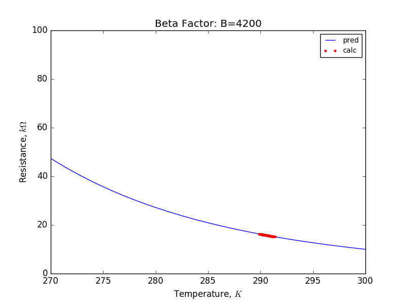
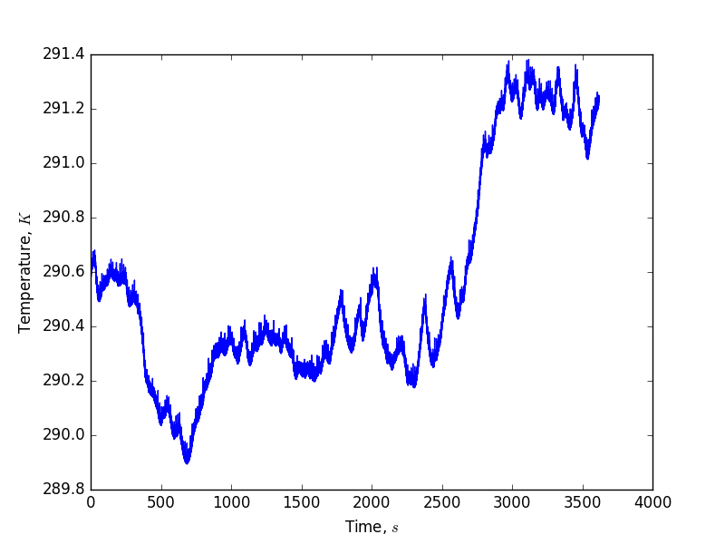
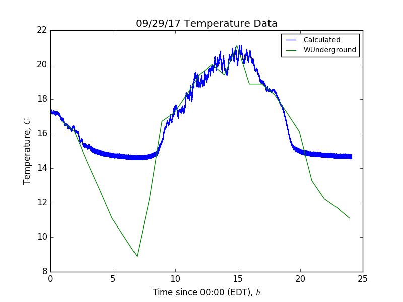

## Oct 2,  2017: Temperature Measurements using a Thermistor

Currently, the noise diode is in thermal contact with a thermistor and attached
to the Y-polarization calibration port on the OMT. Using the LabJack T7, we wish
to supply a fixed current of 200uA, and record the DC voltage drop
across the thermistor. By dividing this voltage measurement by the fixed
current, we can determine the resistance in the thermistor and hence its temperature.

On Sep. 29, I identified the thermistor in question as a mouser electronics 10K
NTC (Negative Temperature Coefficient) thermistor, stock number 334-42103. the
operating specifications for this thermistor can be found at the following url:

    http://www.mouser.com/ds/2/221/0833184-200694.pdf

Unfortunately, I was unable to locate this thermistor in their catalog.

### Beta Parameter Equation:

To model the response of the thermistor to variation in temperature, I used the
Beta Parameter Equation. 

https://en.wikipedia.org/wiki/Thermistor#B_or_.CE.B2_parameter_equation

This thermistor has a Beta parameter of 4200, and a resistance of 10kOhms at 25
C. The following plot shows the relationship between Resistance and Temperature:

The pred line is the relationship as described in the Beta Parameter Equation.
The calc dots are verification that my data points in the plot below in fact
match the values predicted by the equation, and are to be ignored here.

### Temperature variation with time:

To examine the variation in resistance and temperature I first examined a single
data file:
'/gpfs/mnt/gpfs01/astro/workarea/bmxdata/incoming/data/170929_1000.data'

Additionally, it is important to consider what a 24 hour cycle might look
like. These files come from 20170929 as well, from 00:00 EDT to 23:00 EDT. To
actually verify these calculations, I compared them to weather underground from
nearby: 

https://www.wunderground.com/history/airport/KHWV/2017/9/29/DailyHistory.html?req_city=&req_state=&req_statename=&reqdb.zip=&reqdb.magic=&reqdb.wmo=

It is clear that the higher temperature data is very closely matched, but the
lower temperatures are not matched because our system is bottoming out. Chris
suggested this may be due to the noise floor, and suggested using higher power
(higher fixed current). Additionally, the thermistor's minimum recommended
current is 670uA, which is a factor of 3 higher than what we are supplying
with the LabJack. This may pose a problem.
