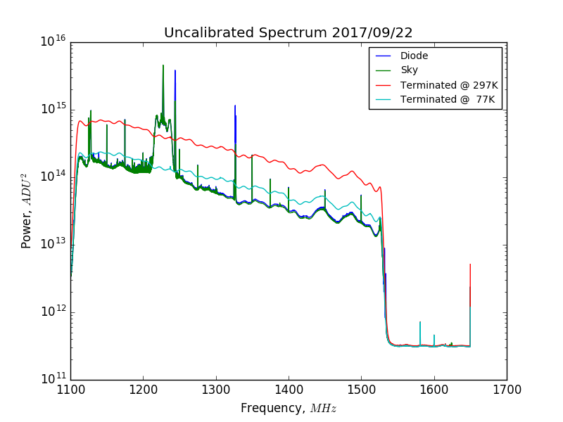

## Oct 2, 2017: S21 Parameters for the OMT

### S-Parameters:

On Sep. 20, I used the VNA to measure the S21 Parameters between the calibration
ports and the data ports of the OMT.

Port 1 was always connected to the Y polarization calibration port of the OMT.
Port 2 was connected to the X and Y polarization ports in the different tests.

The VNA resolution was increased since my [previous posting](../20170915_S-Parameter_Measurements/index.md).

The .csv files which contain these data can be found in the following folder:
        '/direct/astro+u/tyndall/python/20170920_VNA'

### Uncalibrated Spectra:

On Sep. 22, I performed a liquid nitrogen calibration while the noise diode was
operating. The data samples were separated on the basis of whether the noise
diode was on or off. This allowed us observe the power contributed by the
diode. This spectra was taken with the following configuration:

Noise Diode --> 10dB Attenuator --> Calibration Port --> OMT

The data file for this calibration can be found here:

'/gpfs/mnt/gpfs01/astro/workarea/bmxdata/incoming/data/170922_1735.data'

### Calibrated Spectra:

Additionally, the calibrated spectrum can be produced as in [previous
postings](../20170922_Calibration/index.md). 

![cal](calspec.png]

The separation between these two curves is about 3-4K, as predicted by Chris.