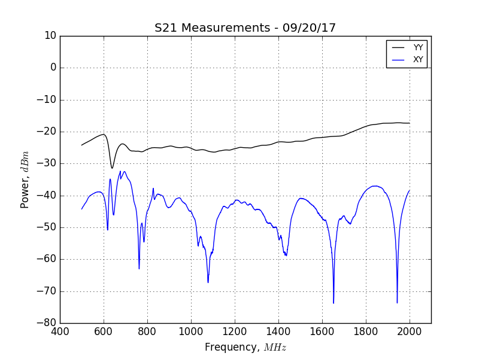

## Oct 2, 2017: S21 Parameters for the OMT

On Sep. 20, I used the VNA to measure the S21 Parameters between the calibration
ports and the data ports of the OMT.

Port 1 was always connected to the Y polarization calibration port of the OMT.
Port 2 was connected to the X and Y polarization ports in the different tests.

The VNA resolution was increased since my [previous posting](../20170915_S-Parameter_Measurements/index.md).

The .csv files which contain these data can be found in the following folder:
        '/direct/astro+u/tyndall/python/20170920_VNA'

