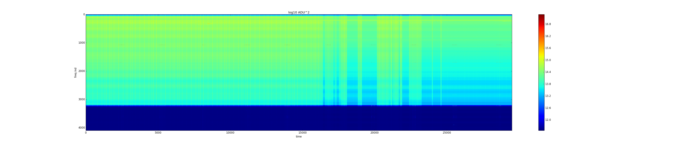
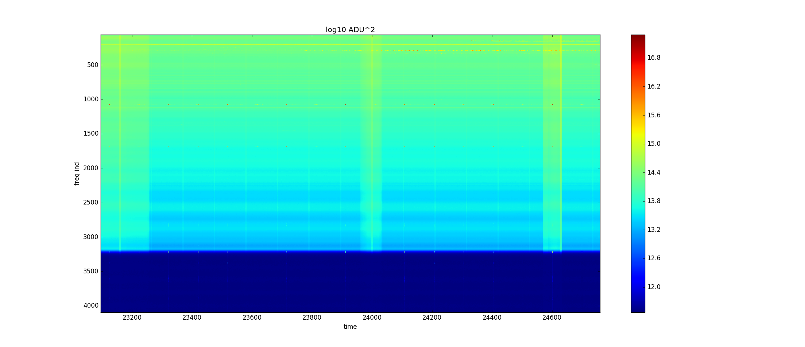
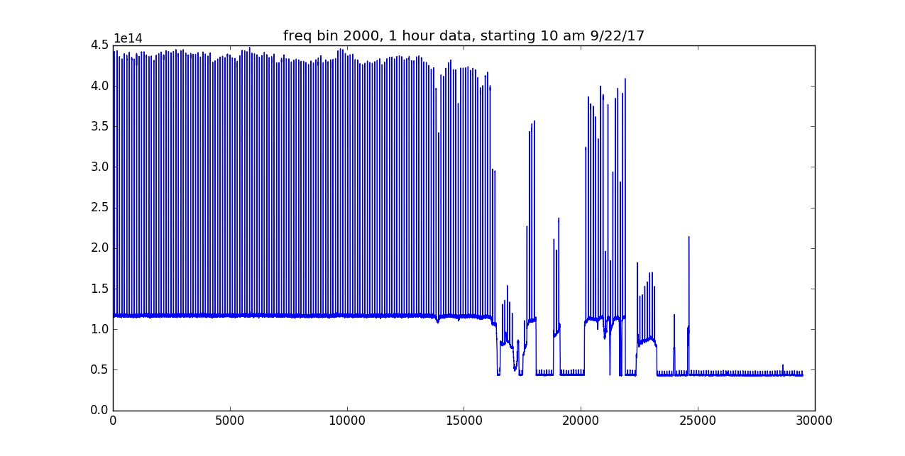
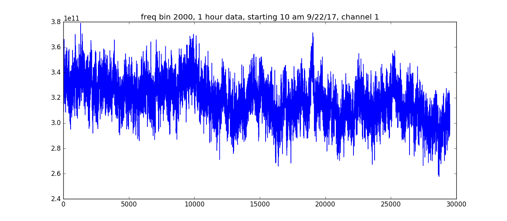
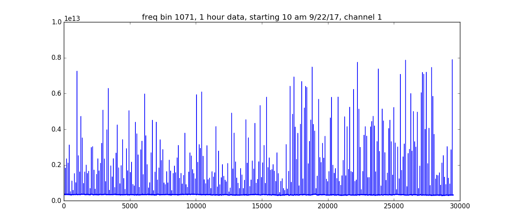
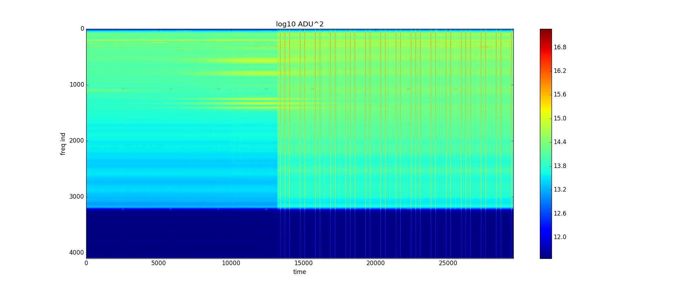
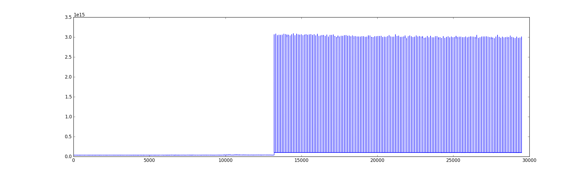
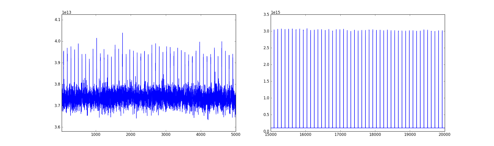
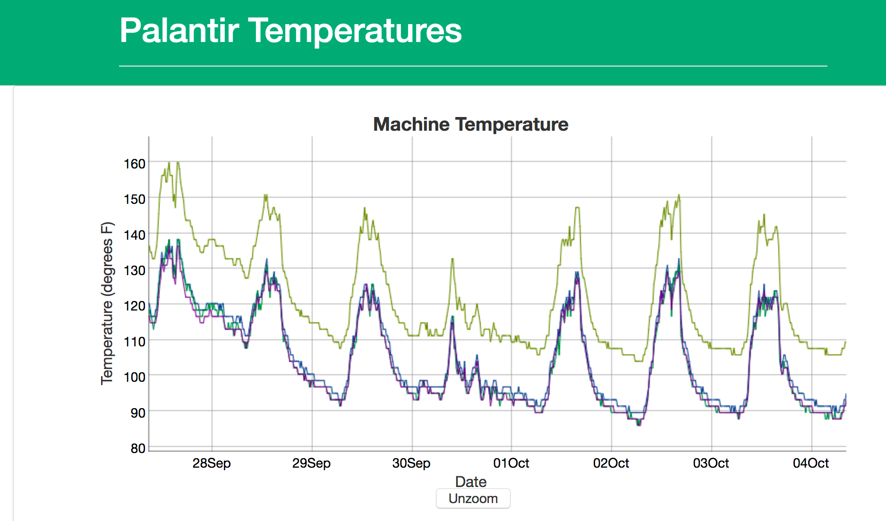
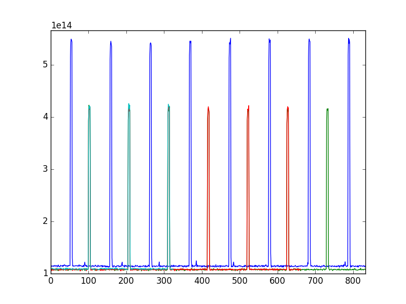

## October 4, 2017: State changes
Christopher D. Sheehy

### 1 - Introduction

We've seen odd behavior of the amp + spetromter system when looking at the sky
in the past. There appear to be some kind of state change that can occur. We
appear to be able to trigger these state changes by messing w/ the system. For
instance, we think we saw one of these during a LN2 calibration a week or so
ago. See Figure 1 in [this posting](../20170922_Calibration/index.md). In this
posting I investigate a bit.

### 2 - Data

Anze, Stankus, and Will installed the noise diode calibrator on 9/20/17. Will
[measured the coupling of the cal port to the signal port with the
VNA](../20171002_VNA/index.md). It is about -25 dB, so we expected a 30 K
signal for the noise diode [Pasternack
PE85N1000](https://www.pasternack.com/sma-calibrated-noise-source-enr-15-db-2-ghz-pe85n1000-p.aspx),
which as 15 dB ENR. Instead they reported they saw 1000's of K. They therefore
put in a 10 dB attenuator between the noise diode and the cal port. This got it
down to a reasonable looking leve, though still much higher than the expected 3
K with the 10 dB pad. (It's actually not a factor of 10, I think it should more like a
factor 7.8 since the attenuator attenuates the bright signal but also adds back
in 300 K. (1+10**(15./10)) / (1+10**(5./10)) = 7.8.)

This state persisted until around 10:30 am on 9/22/17, at which point the data
flickered back and forth between two states before finally settling in a quiet
state. We do not believe anyone was out there at the time. Figure 1 shows the
waterfall plot for that hour of data. Figure 2 shows a zoom in of that waterfall
plot.
Figure 3 shows frequency slice of
(canonically good) frequency bin 2000. Figure 4 shows the time ordered data for
channel 1, which was not hooked up to anything. Figure 5 shows a different
frequency bin of channel 1, which is a strong radar frequency. You can see the
radar pikcup (directly on the ADC?) and it's amplitude doesn't look like it changes.

####Figure 1 - waterfall plot showing state changes
n

####Figure 2 - zoom in of Fig 1
 

####Figure 3 - freq. slice of freq. bin 2000
 

####Figure 4 - freq. slice of freq. bin 2000 on unused spectrometer channel 1
 

####Figure 5 - freq. slice of freq. bin 1071 on unused spectrometer channel 1
showing radar
 

After it went into this quiet state, Will went out and measured the noise diode
temperature at around 1 pm on 9/22. See [last plot
here](../20171002_VNA/index.md.) It is 3-4 K, like we expect. 

Things remained in this quiet state until the photo shoot on 10/2/17. Seeing the
tiny pulse height, I removed the 10 dB attenuation. This triggered a state
change. The pulse heights
jumped up by a huge amount, way more than 10 dB. The power levels with the diode
off also went up. This is shown in Figures 6-8. Fig 6 is the waterfall plot. Fig
7 is the raw time ordered data of freq bin 2000. Fig 8 zooms in on two regions
of Fig 7.

####Figure 6 - waterfall plot showing state changes
n

####Figure 7 - zoom in of Fig 1
 

####Figure 8 - freq. slice of freq. bin 2000
 

### 3 - Interpretation

Tom emailed a plot of copmuter temperatures for the last week. This is shown in
Figure 9. Says Tom: "Highest curve is a CPU temperature. The others are motherboard, memory,
disk." Nothing looks too odd. We know we can trigger a state change by messing
with the input power, and it went from bad to good at 10:30 am on 9/22 (not
shown on the PC temp plot) when it would have still been getting hotter. So this
does not indicate PC temps.

####Figure 9 - PC temperatures
 

I tried putting in various attenuators in front of the noise diode when it was
in the high amplitude state. I don't have a plot, but the 0 dB, 3 dB, and 10 dB
attenuators produced the expected ratios in pulse height. (I only checked this
by eye.)

I then re-installed the 10 dB attenuator and went back to my office. I tried
restarting the DAQ and rebooting the computer. The results are shown in
Fig. 10. Blue is before restarting anything. All other colors are after
restarting DAQ and after reboot. Restarting DAQ makes a small change in power
but does not put it back in the "good state." Rebooting the computer does
nothing. For the DAQ restart I only stopped data taking for a few seconds so
it's hard to see any temperatures changing significantly. 

Interestingly, before the data taking restart I can see the radar at all
frequencies but after I can't. You can see this in diode_fig5 as the little
blips in the blue line that are out of phase with the big blips. The little
blips are not present in the other colors. (Trust me, it's the radar, it
correlates with the known blips we always see at the canonical radar
frequencies.) Is it possible that the spectrometer can start having non-linear
effects for some reason? Cross talk between the ADCs that snaps back and forth?
Something with the clock? I remember with the ROACH board we could trigger state
changes in it by suddenly changing the total power we fed into it. It would go
back to normal after a restart, so we know it wasn't the amplifiers doing weird
things.

Another data point: I also changed the gain of the spectrometer in the .ini file
and the ratio of pulse height to base power level looks the same. So no change
there. 

####Figure 10 - Before (blue) and after DAQ restart and machine reboot (other
colors) 
 

### 4 - Next steps

Will is going to try a few things:

1) putting padding between amplifiers which we currently lack. The idea is that
one can get amplifier "oscillations." Basically, a signal reflects off the input to
a downstream amp, passes back through the upstream amp, reflects again, and gets
re-amplified. If there is no padding, things rapidly go non-linear. It's
supposed to be blindingly obvious when this happens, but it might only be so
obvious in the raw time streams. I can imagine this might be the sort of thing a
little perturbation might set off. We don't currently have much padding, and
this is one of those things you always hear thats you need to do in a well
designed system.

2) Putting the bandpass filter in front of the first LNA. Why not?

3) Hooking up a second amp chain, terminated at the input. This will help us
disentangle spectrometer changes from amp changes. The fact that channel 1 shows
no change during a state change in channel 2 points to the amps, however. Do we
know how much ADC hardware channels 1 and 2 really share, though?