## Oct 12, 2017: Diode Troubleshooting

### Two-State System?
On Oct 06, Some strange behavior was recognized in the noise diode
system. Initially, there appeared to be two states:

1) A quiet and well behaved state
2) A high gain/noise state

This plot shows the power recorded in a single frequency bin versus time for the
morning of Oct 06 (171006_XX00.data), starting at midnight and ending around 11:00 AM. These curves
seem thick, because the noise pulse of the diode occurs quite frequently.  Initially, the
system is in the quet state, characterized by the lower background power and
smaller pulse heights. Around 4:00 AM, the system fluctuates between the loud
and quiet states, eventually settling in the loud state until about 9:20 AM.

(Note: The noise diode was attached to a -10dB attenuator and then to the (Ypol
= channel2) calibration port.)

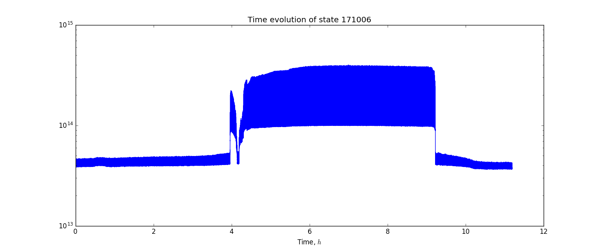

All of these data files were acquired automatically, so there was no change due
to restarting the daq over this time period. 

### Amp-Chain Padding:
Chris advanced the idea that reflections in the system were being amplified,
potentially driving the system into non-linearity. His prescription to
test/solve this issue was to move the 1st band pass filter to the front of the
amp chain, and insert 3dB attenuators into the amp-chain to "pad" the
amplifiers, and minimize reflected signal. I took ill on Oct 06, and so this
problem had to wait until monday.

During the rain on monday Oct 09, I altered the configuration of the amp-chain.
The aforementioned changes were made, and the current configuration inside the
box is as follows, where square brackets indicate the walls of the box:

Low-loss —> [BP1 —> LNA1 —> 3dB Atten. —> LNA2 —> low pass —> stage 3 Amp -> short cable]
-> BP2 -> 15ft Cable

Initially I wanted to put additional attenuators inside the amp-chain, but due
to structural limitations this was not feasible. The size of the breadboard
makes additional connections impossible.

This plot shows the same relationship as above for frequency bin 2000 (1368.62
MHz). The blue
curve is the  9:00 AM hour of data from Oct 06, in which the system smoothly
transitioned from the loud state to the quiet state. It appears here for
comparison. the green line shows the 11:00 AM data from Oct 09
(171009_1100.data). This shows the system is
in the quiet state before I aborted the daq to install the attenuator padding,
which can be seen in the red curve. The system appears to stay in the quiet
state, with a lower power throughput after the attenuator appears in the
amp-chain.

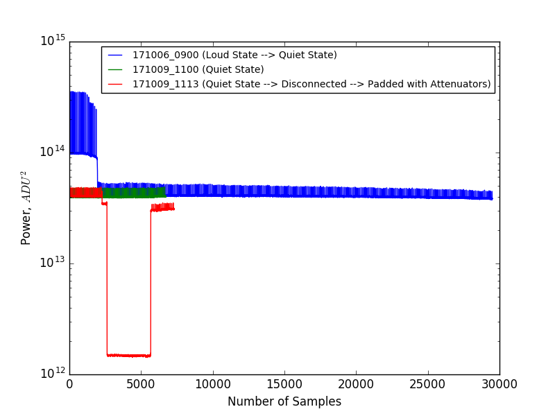

And here is a slightly better view of the above plot:

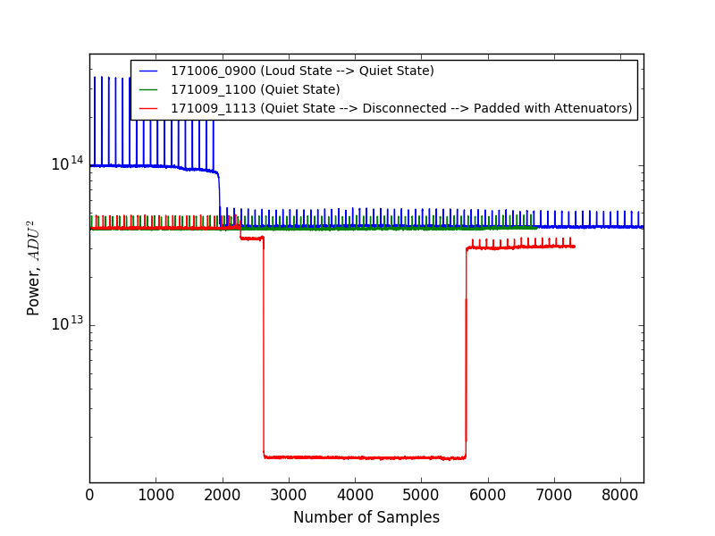

After the padding was installed on the amplifier chain, I sealed the box and
left the data acquisition running in the quiet state.

### Attempting to Trigger Loud State Transition:

In a [previous posting](../20171004_state_changes/index.md) Chris was able to
manually trigger a state change (from quiet state to loud state) by removing the
10dB attenuator from the noise diode, and instead connecting the diode directly
to the calibration port. In order to examine whether or not the attenuator
padding was sufficiently reducing the reflections (and thus stopping the amplified
reflections from driving the amps non-linear) Chris suggested that I attempt to
trigger the state change by following the same procedure. If the state changed,
then the padding isn't really accomplishing anything. If it prevents the state
from changing, and the changing still occurs without the padding, then we might
be onto something.

Again, lets observe the measured power in the same frequency bin, as a function
of time. At 1:00 PM (171009_1300.data) The system was still in the quiet state, as shown
in the green curve. I then stopped the data acquisition, and restarted the system at
1:05 PM (171009_1305.data). The blue curve shows this data file, initially in
the quiet state. Around sample 1200, I removed the noise diode and 10dB
attenuator from the calibration port, and removed the 10dB attenuator. The noise
diode was then connected directly to the calibration port without
attenuation. The system recorded spectra for about 350 seconds, before I thought
I had collected enough samples to observe the state change. I disconnected the
noise diode from the calibration port, and re-installed the 10dB attenuator
between the calibration port and the noise diode. The pulse heights and
background level returned to normal levels for the quiet state after the
attenuator was replaced.

Because the pulse height increased so much, and the background level also
increased, I first suspected that the system did change state and was dejected with this
result. Chris had a different opinion: The pulse height simply increased because the
attenuator was removed, and the background increase could be explained by other
processes (still being examined as of 20171012) or for other reasons.

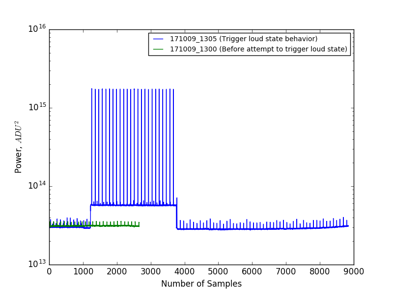

For the sake of context, I wanted to compare these curves with the previously
generated curves. 

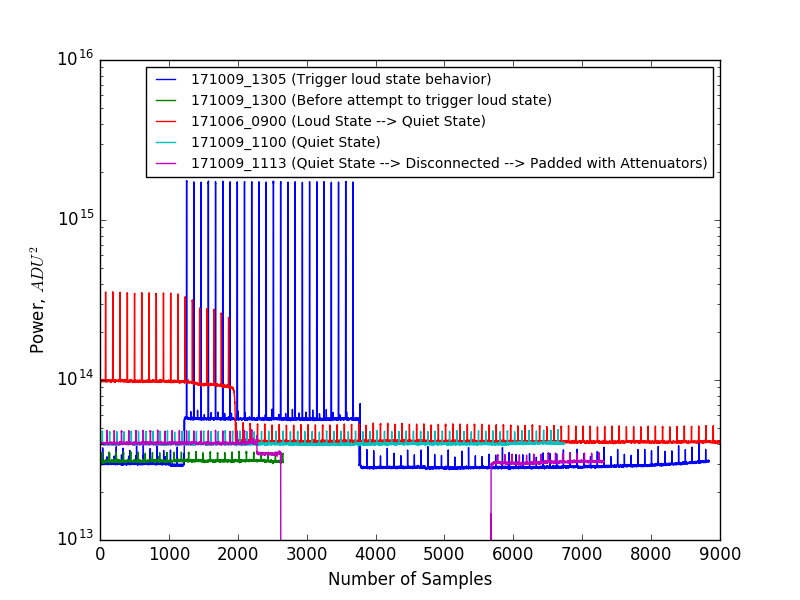

### Trouble with the Curves!

After the 1:05 PM data was acquired (171009_1305.data) I returned to the physics
building to escape the rain. From the Corus network, I remote accessed the
bmxdaq machine in the basin and I aborted the data acquisition for the 1305.data
file. I then restarted the data acquisition at 1:23 PM (171009_1323.data), using the basin_diode.ini
file. This data acquisition continued overnight, before Chris realized that
there was a problem:

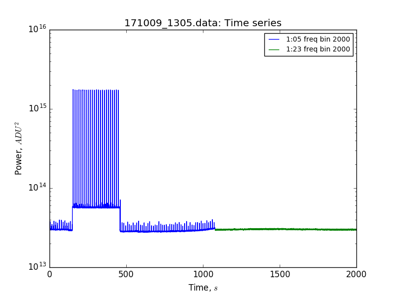

The ONLY thing that changed between these two data files was restarting the
daq. I wasn't even in the basin when this process happened, yet the 1:23 PM data
file seems as if there is NO DIODE at all!

The data that were collected between 1:23 PM on Oct 09 and 1:11 PM on Oct 11
(171011_1311.data) resemble the green curve above. The pulses from the diode are
not visibly impacting the received power.

### S. Holmes and the Disappearing Diode:

At first I suspected that I had started the data acquisition with the wrong .ini
file, and the signal to turn on the noise diode from the LabJack was not being
implemented. On Tuesday Oct 10, I verified that the data acquisition file was in
fact the proper .ini file, and that the signal to turn on the diode was being
sent by the LabJack. 

Next, I thought that I had reconnected the noise diode to the attenuator or the
attenuator to the calibration port improperly. But as shown in the 1:05 PM data
file from Oct 09, it is clear that the pulse heights are being recorded by the
spectrometer, but once the data acquisition is restarted the pluses from the
noise diode suddenly disappear.

I tested the connections between the diode, LabJack, computer, and power supply,
and couldn't diagnose any issues. Indeed, the LED and relay were being properly
controlled by the LabJack, and the power supply was reading the proper voltage
of 28V DC. When the LED comes on, and the relay circuit closes, the noise diode
turns on, and the power supply registers that a current flows:

1) When the relay is open the LED is off, and the noise diode is off. The power
supply reads 28.0V 0.000A.
2) When the relay is closed the LED comes on, and the noise diode comes on as
well. The power supply reads 28.0V 0.002A. (The minimum current for the noise
diode as listed on the pasternack spec sheet is 20mA, but I suspect because the
signal is so fast, the power supply doesn't refresh the current reading fast
enough to capture the full scale of the 0.020A current which is presumably
flowing.)

So, in my time of desperation I thought that perhaps the signal from the noise
diode turning on wasn't high enough to show a change in power in the spectrum. I
tried to observe whether or not removing the 10dB attenuator between the
calibration port and the noise diode would sufficiently boost the signal such
that it could be observed in plotLive. 

The data file in which this change occurs was started at 1:11 PM on Oct 11
(171011_1311.data). Initially the system is not registering the pulses from the
diode, but after the attenuator is removed (t~550s) the pulses return with the
same period as specified by the LabJack. The frequency bins observed in this
plot are the 2000th (f=1368.62 MHz) and 1300th (f=1274.62 MHz) bins.

I am not sure why there appears to be a parabolic shape in power over time in
the 1274.62 MHz bin, but if anyone has a theory I would love to hear it.

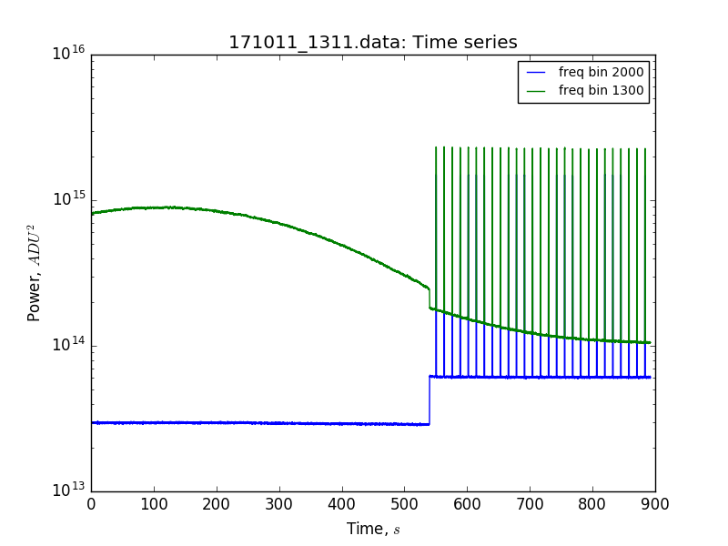

It is clear that the diode is now functioning as intended again, when the 10dB
attenuator is removed. This is a good sign!

Perhaps the system returned to a more cooperative state when the diode was
connected directly to the calibration port? Perhaps if the 10dB attenuator is
replaced, the pulse heights will still be visible and be comparable to the data
observed at 1:05 PM on Oct 09?

I attempted to test this at 2:46 PM on Oct 11 (171011_1446.data.new) this data
file seg faulted while plotLive was running. Frustratingly, this data file shows
that reinserting the 10dB attenuator made the diode disappear entirely! I was
extremely careful to avoid a faulty connection between the noise diode +
10dB attenuator + cal port. Still, the evidence suggests that attenuating the
signal seems to relegate it to obscurity.

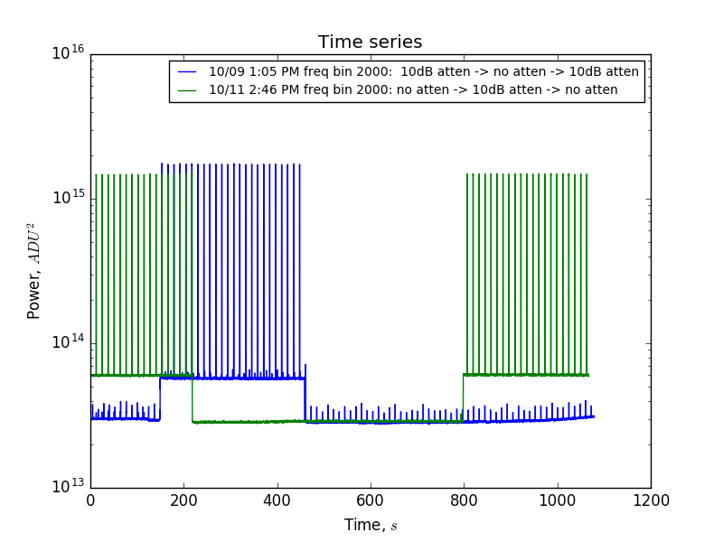

Chris wanted me to calculate the expected change in the diode's  noise
temperature with and without the 10dB attenuator. That is still the subject of
some debate and we are currently attempting to zero in on those
measurements. However, even with the -10dB of attenuation and -25dB of
"attenuation" [from the S21 VNA measurements of the
coupling](../20170915_S-Parameter_Measurements/index.md) the noise diode pulse
height should still appear in the spectra.

### Varying Attenuation between Diode and Cal-Port:

Chris suggested changing the amount of attenuation between the noise diode and
the calibration port in order to examine the changing pulse heights, and see if
perhaps 10dB is too much attenuation to still see the pulse
height. Alternatively, perhaps this specific 10dB was damaged in some way and
isn't making an adequate connection to the calibration port or the noise diode?

This data acquisition was started at 3:09 PM on Oct 11 (171011_1509.data). The
attenuator values were slowly increased, and the pulse of the noise diode was
still visible for all values of attenuation, even the 10dB attenuators! I also
tested this with a second 10dB attenuator, labelled in the plot as alternate,
and with the original 10dB attenuator, labelled in the plot as original.

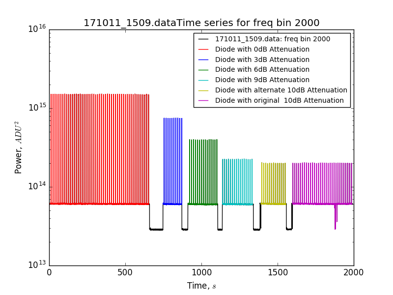

In this plot, it doesn't seem like the background level is changing despite
going from NO ATTENUATOR through a whole gamut of attenuator values.
I took the average power of the 2000th freq. bin with the diode pulse off, and
diode pulse on (with extreme care!!) and the following plot happened to tumble
out: 

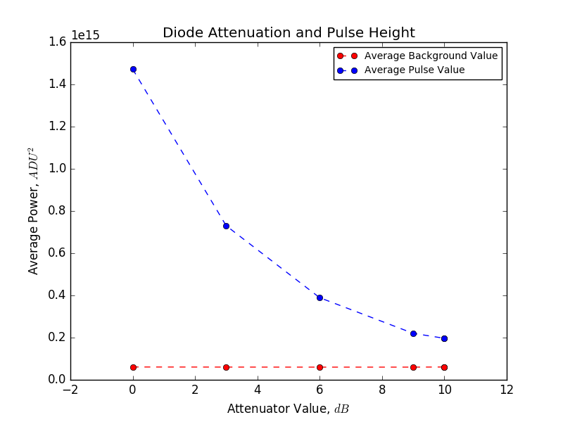

Indeed, there seems to be a negigable difference in the average background
power, which we expected for the diode being off. Subtracting off this
background power, we can see the relative heights of the pulses with the varying
attenuator values:

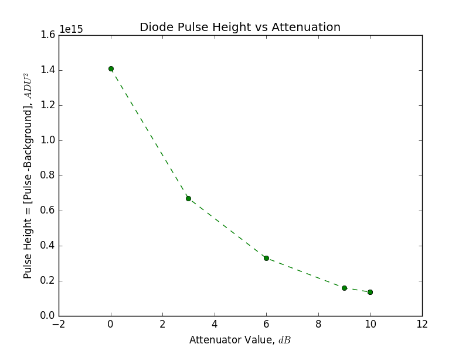

These pulse height changes are visible by eye using plotLive while the data
acquisition is running, and if they can't be observed by eye, then the problem
remains. 

There are additional calibration steps that can be taken with this data, and
this posting will be updated to flesh out more analysis of the changing pulse
heights and how it relates to the noise temperature/power of the noise diode.

After this test, the (Ypol = channel 2) low loss cable was disconnected from the
OMT Data port, and was instead connected to the noise diode with 23dB of
attenuation in between them.

### Blaming the Mantis Religiosa:

There were many alterations to the system, and still we found no smoking
gun. Perhaps the problems lie with the digitizer? Or perhaps the praying mantis
was symbolic of a "bug" in the code. Restarting the data acquisition seemed to
impact the "state" of the system (if such a thing exits, jury still out), so a
software/spectrometer issue is being advanced as a leading candidate for these
instability issues. Without altering any of the mechanical/electrical components
of the system, our testbed becomes restarting and forcibly terminating the data
acquisition frequently to attempt to sniff out our problem.

For the ominous weekend starting Oct 13, the data acquisition will be running on
1000 sample runs, with the daq stopping at the end of each 1000 samples and
restarting itself, as though it were being manually cancelled and
reset. Hopefully this will give us some indication of the implications of
stopping and restarting the system as it pertains to state changes and
stability.

The diode_test_files.ini file is being called by the diode_exec.sh executable,
which seems to be working as of tonight at 6:30 pm. This creates a new data file
every ~2 minutes, where the signal on channel 1 is a terminator with no
band-pass filter, and the signal on channel 2 is the noise diode + 23dB
attenuation connected to the low loss cable in the configuration at the top of
this posting. Paul Stankus suggested more rigorous conventions regarding the
configuration of the amp chain, and it seems like a reasonable and wise request.