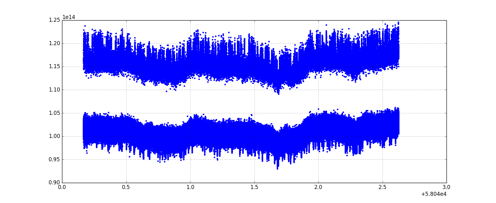

## Oct 12, 2017: Diode Troubleshooting

### Data Acquisition with nSamples = 1000:

In my [previous posting](../20171012_DiodeTest) I left off with a description of
the data acquisition that ran over the weekend (10/13-10/16). The daq runs for 1000 samples
(~2 minutes) and then restarts itself. This was specified in the executable file
by changing the nSamples variable from 0 (infinite samples) to 1000 (stop after
1000 samples are collected.) The goal was to observe the impact of a hard reset
on the digitizer level, if all other parameters were held
constant. The "signal" was the noise diode connected to the low-loss cable, with
23dB of attenuation, meaning there is no variability due to RFI, the sky,
etc. This data acquisition ran all weekend, and was stopped on monday around 5:00 PM. 

The system was configured as before:

Noise Diode --> 23dB Atten. --> Low-Loss --> [Amp Chain] --> [Spectrometer]

Analysis of these data files indicated slight variations in power were possible
by restarting the daq, without changing any other parameters.

### Time Series of these data:

Here is a familiar style of plot of spectrometer power in a given frequency bin
versus time. The frequency bins selected were f2000 = 1368.62MHz, and f1300 =
1274.62MHz. Time here is specified in mjd, collected from the data files. 

These plots were generated by collecting the data from each of the exposures,
and sorting by time. the MJD axis reflects the fact that the time axis was
produced from the ['mjd'] array within the BMXFile architecture. The files were
sorted, so these power jumps are happening in real time from file to file.

This plot contains many data files, and hence the power values from many
spectra. There is too much information to analyze the behavior from file to
file, so lets take a closer look at the first few data files:

### Small-Scale Variations in f2000

This plot shows the small-scale variations from the f2000 data, again from the
beginning of the large data set shown in the first plot. It would be interesting
to see what the spectra look like from one exposure to the next, when we witness
the power level changing.

Here is the power variation in f2000, now presented with the index on the
x-axis:

There is a noticable jump in power around index 5000, where the data switches
from one file to the next. Lets examine the spectra from before and after the
data acquisition was restarted:

The file before the power change is 171014_0009.data. (low background)

The file after the power change is 171014_0011.data. (high background)

We will look at the diode off and the diode on spectra for the two
files:

There are slight changes in the spectrum between the two curves, but if we
consider the region of the plot outside the band-pass (f~1500-1650MHz) there are
power offsets that might indicate a change in spectrometer properties.

### f2000 as Points not Lines

For the f2000 data, Chris tried plotting these data files as points instead of
lines. This produced the following plot which clearly presents the two populations:
diode on and diode off.

To examine the changes over time, it would be interesting to see the time
evolution of the mean value for each of these populations.

