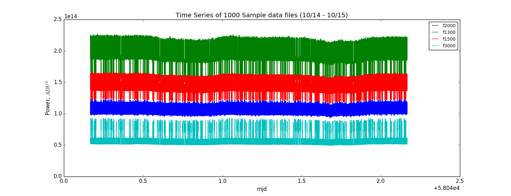
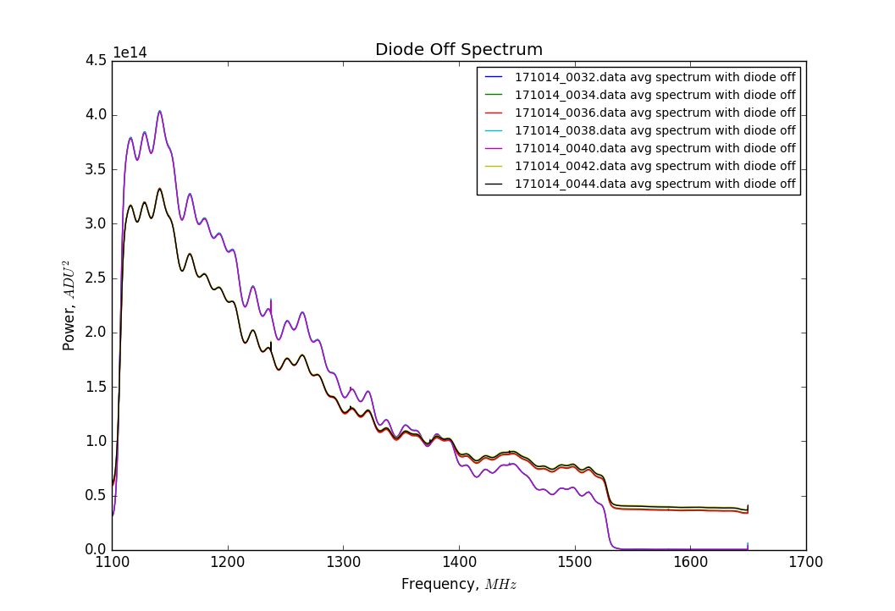

## Oct 12, 2017: Diode Troubleshooting

### Data Acquisition with nSamples = 1000:

In my [previous posting](../20171012_DiodeTest) I left off with a description of
the data acquisition that ran over the weekend (10/13-10/16). The daq runs for 1000 samples
(~2 minutes) and then restarts itself. This was specified in the executable file
by changing the nSamples variable from 0 (infinite samples) to 1000 (stop after
1000 samples are collected.) The goal was to observe the impact of a hard reset
on the digitizer level, if all other parameters were held
constant. The "signal" was the noise diode connected to the low-loss cable, with
23dB of attenuation, meaning there is no variability due to RFI, the sky,
etc. This data acquisition ran all weekend, and was stopped on monday around 5:00 PM. 

The system was configured as before:

Noise Diode --> 23dB Atten. --> Low-Loss --> [Amp Chain] --> [Spectrometer]

Analysis of these data files indicated slight variations in power were possible
by restarting the daq, without changing any other parameters.

### Time Series:

Here is a familiar style of plot of spectrometer power in a given frequency bin
versus time. Time here is specified in mjd, collected from the data files. The
chosen frequency bins are as follows:

1) f1300 = 1274.62MHz
2) f1500 = 1301.48MHz
3) f2000 = 1368.62MHz 
4) f3000 = 1502.89MHz

**Figure 1**

These plots were generated by collecting the data from each of the exposures,
and sorting by time. the MJD axis reflects the fact that the time axis was
produced from the ['mjd'] array within the BMXFile architecture. The files were
sorted, so these power jumps are happening in real time from file to file.

This plot contains many data files, and hence the power values from many
spectra. There is too much information to analyze the behavior from file to
file, so lets take a closer look at the first few data files:

**Figure2**

With the addition of the f1500 frequency bin, the correlations between files
becomes very clear. The changes in background level in the f1300 and f1500 bins
seem to correlate with changes in pulse height (and sometimes background level)
in the f2000 bin. Stranger still, when we examine the f3000 bin, there is a
strong anti-correlation to the power changes in the f1300 and f1500 bins...

This seems incredibly strange but the answer lies in the spectra.

### Impact of Power Change on Spectra:

Now we shall consider a region of the plot where a power change occurs from one
file to the next. For each file I will plot the average spectrum with the diode
off, and the average spectrum with the diode on.

If we consider the files starting from around 0.03 on the MJD Axis, we can see a
few power changes that will be good candidates for examining these changes.
These correspond to the 16th through the 23rd file in our two days of data.

The files in question are the files shown in the following time series plot,
shown here in various colors representing each separate file, for f1300 bin:

**Figure 3**

Looking at these time series curves, its possible that we are observing some
type of two-state system. There appears to be a higher energy "loud state" and a
lower energy "quiet state", perhaps similar to (though weaker than) before. The
system is switching between the two for some reason.

When we examine what the spectra look like before and after these power
switches, it is clear that the shape of the entire spectrum is changing! Here
are plots of the average spectrum with the diode off, and the average spectrum
with the diode on:

**Figure 4**

If you look closely, the blue, cyan, and purple spectra shown here all lie on
essentially the same curve. The green, red, yellow, and black curves all follow
the same line as well. And, these colors and files correpsond to the two
different power levels observed in the time series plot!

Comparing these two different spectral curves, it appears that there is a change
in gain from one to another. (i.e. the slope of the spectrum is changing, when
the system is in either the low or the high state. This is the reason for the
correlation between power level changes in the f1500 bin relative to the f1300
bin, and the anticorrelation between power changes in the f3000 bin relative to
the f1300 bin.) This was essentially unobserved when only considering the f2000
bin, because that appears to be the point where the changes are minimal, because
it is near the common point of both spectra. That is also the reason why the
f2000 and f1300 power changes appeared initially uncorrelated.

We witness precisely the same bahavior in the diode on spectra:

**Figure 5**

Again, the same color curves are right on top of each other, in agreement with
the previous plot. I think this is a good indication that the system is
switching between two states, and it looks like the effects of this state change can be
described by changes in two parameters:

1) Gain
2) Offset Power Level

If this is an accurate depiction of the behavior of the system, then we should
be able to calculate the difference between diode on and diode off, and still
observe a resemblance:

**Figure 6**

We can also calculate a unitless gain, by taking the diode on - diode off plot,
and dividing by the diode off power. 

**Figure 7**

Here we observe the correlation again between the colors. From these curves, it
is apparent that the gain is switching with the changing power levels observed
in the time series plots.
 
### Evolution of the System over Time:

To really prove that the system is changing between two states over the course
of our exposures, it would be beneficial to calculate the change in gain over
time. If it is merely switching between the two, we should be able to observe a
binary unitless gain.

If we plot the power in a given frequency bin as a function of time over all of
the data files, but use points rather than lines, we see multiple populations of
points that center around the background and diode pulse values. For frequency
bins 1300, 1500, and 3000, there are between 3 and 4 groups of points, because
the background level and the pulse height values change tremendously. However,
the f2000 bin is relatively well behaved.

If we observe the f2000 frequency bin as a function of time, and plot these
values as points instead of lines, we see two distinct populations of points:

**Figure 8**

All points below 1.07e14 are the diode off population (which contains 1,311,750 points), and all points above
1.07e14 are the diode on population (which contains 61,875 points).

If we take an average value over a small range of mjd for each population of
points, we can calculate and plot the unitless gain as before:
 
(Diode on - Diode Off) / Diode Off.

Here is a plot of the unitless gain as a function of time in mjd:

**Coming Soon!**

