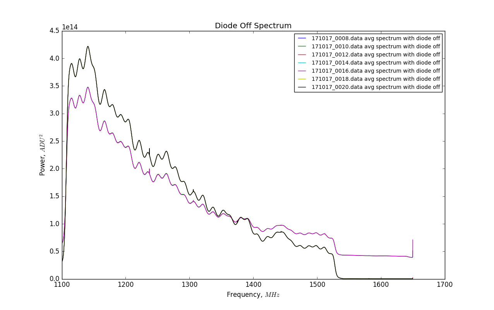

## Oct 20, 2017: Terminated 30dB Coupler with Noise Diode

### Data Acquisition with nSamples = 1000:

In my [previous posting](../20171018_1000_Sample_Data/index.md) I presented a
case for a two state oscillation between a loud and quet state, triggered by
restarting the data acquisition. In those data files, the signal was the noise
diode connected directly to the low-loss cable, with 23dB of attenuation. 

The current configuration sought to simulate the effects of the noise diode
connecting to the OMT coupling, by using a standard 30dB coupler. The coupler
has 3 ports, and is traditionally used in the "forward" direction:

Signal connects to input, where it is split into two compontents: Output port
which receives a majority of the input signal Gain = (999/1000), and a 30dB
coupled calibration port, which has Gain = (1/1000).

 We have connected the standard coupler in the "reverse" direction:

 Signal passes into the output port, and is combined with the signal from the
 noise diode. This then passes through the input port which is connected to the
 amp chain. Operating the coupler in reverse is doing exactly what it should, as
 verified by the VNA. The response to the noise diode is parabolic, but is
 approximately 30dB in band.

In this posting I will be replicating the plots we saw previously, but with the
new data taken with the noise diode connected via the 30dB coupler.

### Time Series:

This plot shows the spectrometer power in a given frequency bin
versus time. Time here is specified in mjd, collected from the data files. The
chosen frequency bins are as follows:

1) f1300 = 1274.62MHz
2) f1500 = 1301.48MHz
3) f2000 = 1368.62MHz 
4) f3000 = 1502.89MHz

**Figure 1: Time Series of all data**

Here we see more large-scale variations in power over the course of the data
files, which seems to suggest a diurnal behavior. This perhaps has to do with
temperature changes altering the performance of the system.

Again, lets consider a smaller timescale to better observe these changes:

**Figure 2: Time Series (Zoomed)**

And again, lets consider a small region of interest near the beginning of the
data. It is safe to assume that there are no major state changes occuring, but
only the small scale oscillation between power levels as seen before.

This is only the f1300 bin, over the course of seven samples from the beginning
of the larger plot above:

**Figure 3: Time Series of Power Switching Candidates**

Here we have selected 5 high energy data files and two low energy files, so we
expect to see two spectra bunched together in the low energy configuration, and
the other 5 to be bunched together in the high energy spectral shape.

### Impact of Power Change on Spectra:

Here are plots of the average spectrum with the diode off:

**Figure 4: Average Diode Off Spectra (Candidates)**

The five high energy files are indeed bunched together (blue, red, cyan, yellow,
black) and the two low energy curves (green, purple) also appear together.

We witness precisely the same bahavior in the diode on spectra:

**Figure 5: Average Diode On Spectra (Candidates)**

Again, the same color curves are right on top of each other, in agreement with
the previous plot. This supports the previous suggestion that the oscillaction
in power level/gain is changing between two states with some likelihood when the
digitizer restarts.

Now we consider the difference in power between the diode on and off:

**Figure 6: Diode On minus Diode Off (Candidates)**

We can also calculate a unitless gain, by taking the diode on - diode off plot,
and dividing by the diode off power. 

**Figure 7: Unitless Gain**

Here we observe the correlation again between the colors. From these curves, it
is apparent that the gain is switching with the changing power levels observed
in the time series plots. There is some slight difference between the purple and
green curves, but they are quite similar.
 
### Evolution of the System over Time:

I wanted to try to separate the diode on and diode off power using the same
methods as before, but because of the increased attenuation of the pulse heights
in the f2000 bin, It is going to be more difficult to separate the diode on and
diode off spectra. The large scale changes in power also serve to obfuscate the
different spectra. It could be done, in the future if necessary.

**Figure 8: Point Populations for f2000**

more: **Coming Soon!**

