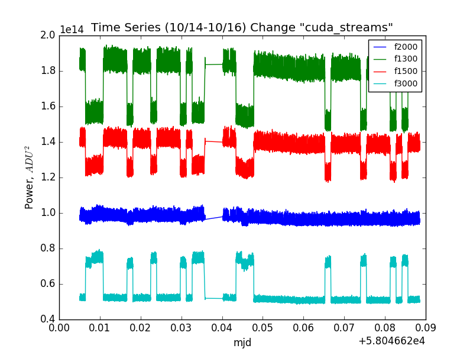
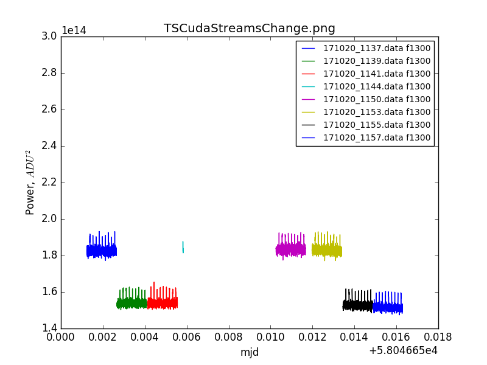
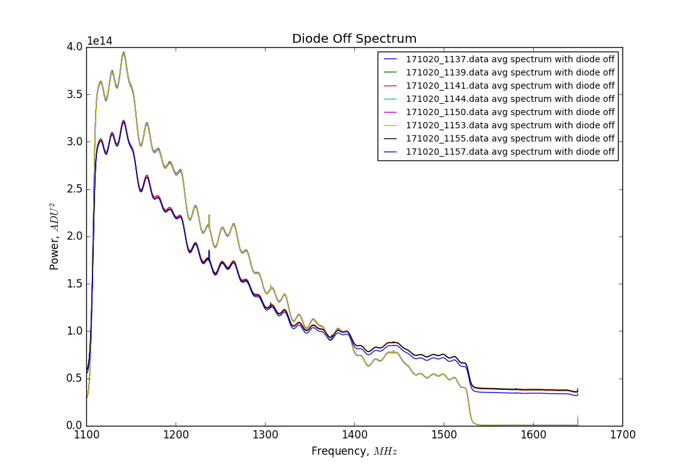
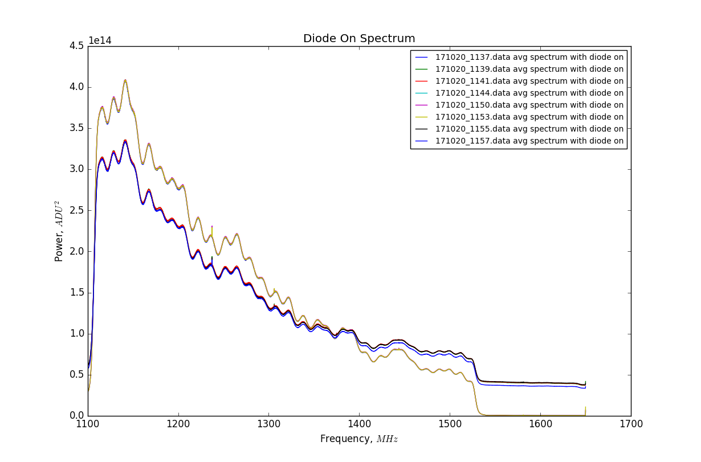

##Oct 20, 2017 - Varying cuda_streams Parameter:

### Investigating Cuda Streams Parameter:

Anze requested we try running the daq after changing the cuda_streams parameter
in the diode_test_files.ini file. The parameter value was changed from 2 to 1:

cuda_streams= 2    -->    cuda_streams= 1

Here are the same plots as before, but now for channel 2 with the new
cuda_streams parameter...

**Figure 14: Time Series with cuda_streams Change**

This plot is such a little timespan, that we don't really need to zoom in. The
cuda streams parameter was changed and daq was restarted at 11:53pm, show here
as 0.04 on the mjd axis. There is a flat region where no daq was running, then
daq resumes after the parameter change.

This seemed to have no effect on the state switching from channel 2, as shown in
the following plot:

**Figure 15: Time Series Candidates around Cuda Streams Change**

I apologize for the blue color reappearing here, but I don't think it makes much
of a difference for our purposes. These 8 data files correspond to the change in
cuda streams parameter, and the daq was actually aborted during the alloted time
for the cyan curve, hence its small size. As we can see, the two-state behavior
persists on channel 2 even after this change, it seems to have had no effect.

**Figure 16: Diode off Spectra for Cuda Streams Change**

We still observe the grouping of spectra based on gain/power level, and the
associated colors still appear together.

**Figure 17: Diode on Spectra for Cuda Streams Change**

The same behavior is present here as well: no change from before to after the
parameter was changed.