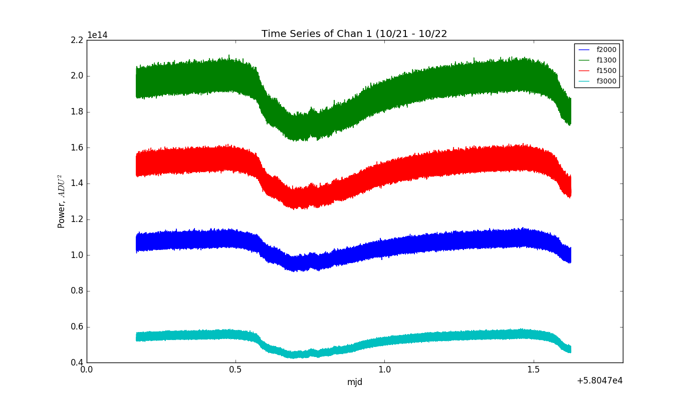
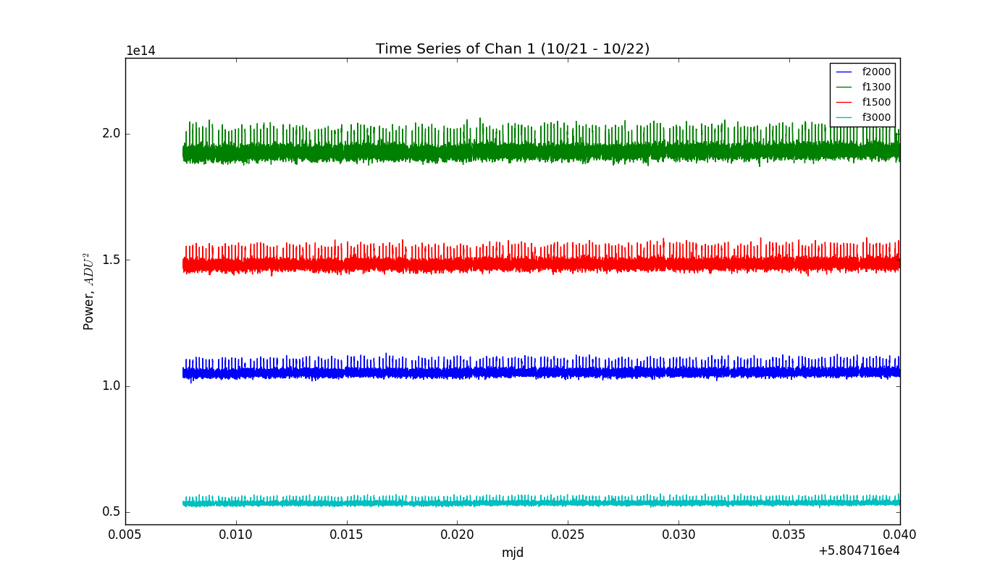
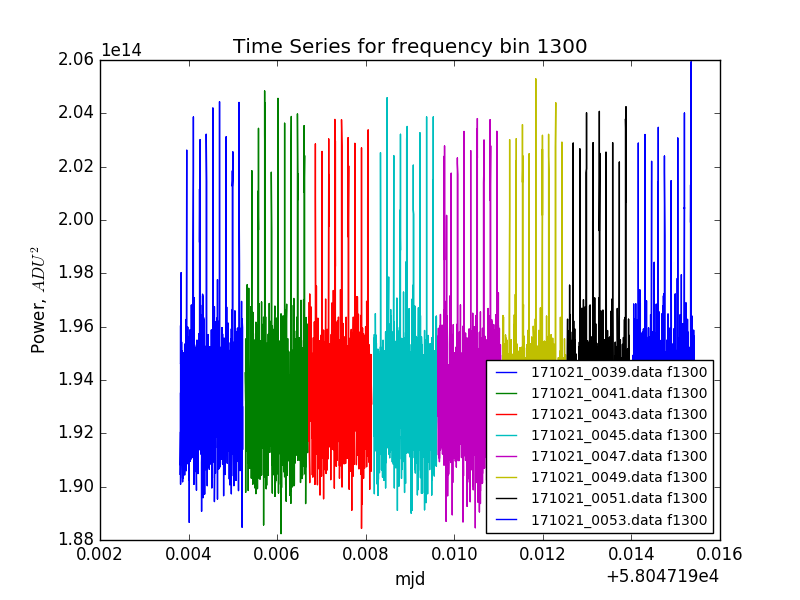
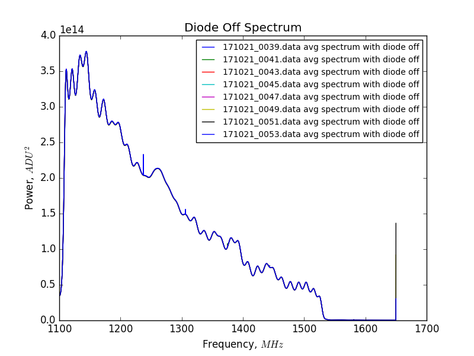
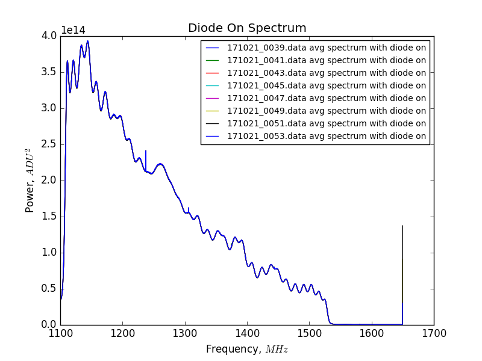
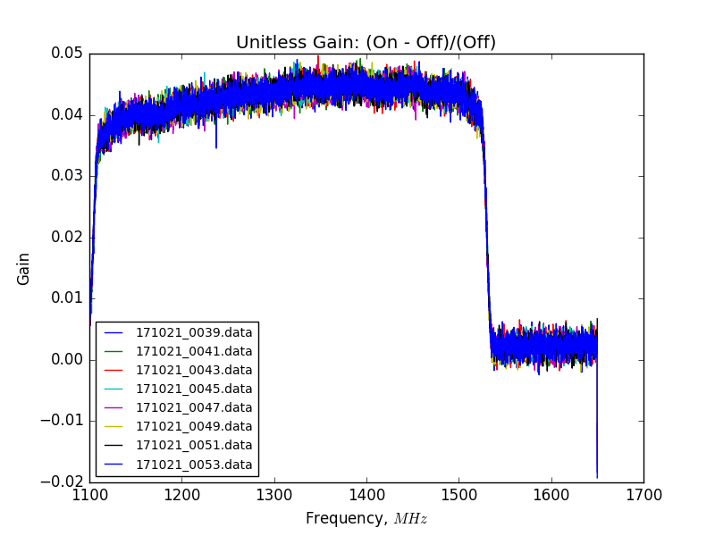

<<<<<<< HEAD
## Oct 23, 2017 - Invert Spectrometer Channels:
=======
## Oct 23, 2017 - Invert Spectrometer Channels
>>>>>>> 0cbaae5a24deabb6513f887b0909f97df862d476

### Invert the Spectrometer Channels:

In the [last posting](../20171020_1000_Sample_TermCoupler/index.md), we
found that the signal on channel 2 from the noise diode attached to the 30dB coupler was
still having the same power switching relationship observed with the diode
directly connected to the low-loss cable. However, the signal on channel 1
(terminator on amp chain) seemed relatively stable. There appeared to be no
correlation between switching states on channel 2 and the data coming in on
channel 1. 

Suspecting a possible malfunction in the digitizer card/spectrometer, we decided
to switch which polarization was leading into the digitizer ports.

On friday Oct 20, I removed both data cables from the spectrometer, and
connected them opposite their initial position. (i.e. the terminated amp chain Xpol
is now leading into channel 2, and the 30dB coupler with the noise diode Ypol is
now connected to channel 1.) 

### Time Series:

The data acquisition was as before, taking 1000 samples (2min) of data
repeatedly, and restarting the data acquisition after each file. Here is a time
series plot showing multiple frequency bins from midnight on 10/21 to about noon
on 10/22.

**Figure 1: Time Series of Noise Diode Signal**

The macro-level changes in power seen here are diurnal, and the thickness of the
curves is a consequence of the diode pulse height.

Let's take a closer look at the beginning of the data acquisition period and see
if there is any power switching behavior:

**Figure 2: Time Series Stable Behavior**

It is clear from this plot that the switching behavior is gone when we run the
data acquisition on channel 1! This suggests a malfunction in the digitizer
somewhere in channel 2. 

I am going to familiarize myself with the digitizer manual and see if something
obvious jumps out at me. It is interesting to say the least that this switching
behavior only presents itself on channel 2.
<<<<<<< HEAD

Following the same style of analysis as before, let's take a sample of 7 data
files and plot their spectra and gain curves. Here is the sample of 7 from near
the beginning of the data:

**Figure 3: Sample Time Series**

### Spectra and Unitless Gain:

Now let's examine the spectra with the diode off:

**Figure 4: Diode Off Spectrum**

All of the average curves lie essentially on top of each other, there are no
switching states.

And now lets examine with diode on: see same behavior.
**Figure 5: Diode On Spectrum**

**Figure 6: Unitless Gain**

Here we see the unitless gain drop in the higher frequencies of the band, as
expected. 
=======
>>>>>>> 0cbaae5a24deabb6513f887b0909f97df862d476
