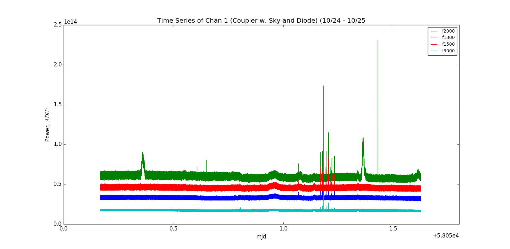
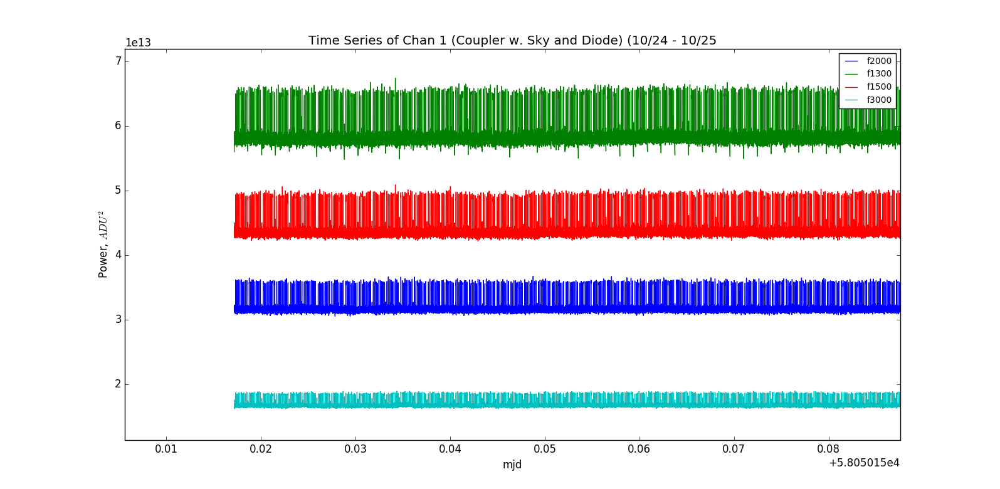

## Oct 25, 2017 - Sky on Coupler

### Replace Terminator with Sky:

The system is configured as in the [last
posting](../20171023_InvertChannels/index.md). The OMT+Horn is directed into the
amp chain, and the noise diode is connected to the 30dB port. We have continued
taking data on channel 1, and the system appears stable and well behaved.

### Time Series:

The data acquisition was as before, taking 1000 samples (2min) of data
repeatedly, and restarting the data acquisition after each file. Here is a time
series plot showing multiple frequency bins from midnight on 10/23 to about noon
on 10/25. 

There is a strange behavior seen in the green curve, which repeats every 24h
around 6:00 AM? There also are some very sharp noisy curves, which are
potentially lightning? (There was some discussion that we could potentially
observe lightning with the telescope.)

**Figure 1: Time Series of Sky Signal**

And here is a closer look:

**Figure 2: Time Series Stable Behavior**

As we can see, the behaviors are stable for the most part, and the diurnal
changes have subsided since we aren't looking at the terminator changing
temperature.

The gain state here looks like the well behaved state observed in [Chris's
posting](../20171004_state_changes/index.md). The amplitude differs slightly,
because the loss from the coupler is 30dB rather than 24dB of the OMT coupler.