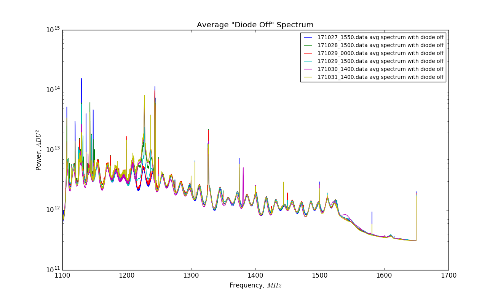

## Nov 1, 2017 - Damaged Digitizer Card Ports

### Palantir 2 Channel Card Status:

In my [last posting](../20171025_SkyWithDiode/index.md), the system appeared to remain
stable over the course of ~36 hours, with no erratic changes in gain. This
stable behavior was present despite the fact that the digitizer ports had
already been damaged at this time as shown in the pictures below.

Some time within the past few weeks, I damaged the SMA connections that are
soldered to the digitizer card. I clearly failed to properly connect the cables,
and then damaged the connectors by securing the nuts.

The damaged card is the 2 channel digitizer card, which only had one stable channel (chan1). We
believe that one of the (chan 2) ADCs is not properly functioning, and is causing the
gain to fluctuate when we restart the data acquisition. Consequently, only
channel 1 is operational for looking at sky data, and data has been
collected from 10/24/17 to today, 11/6/17. 

The system is configured as in the last posting: the OMT+Horn is connected via
low loss cable to the 'output' port of the 30dB coupler, the noise diode is
connected to the 30dB port, and another low loss cable connects the 'input' port
of the coupler, which leads to the amplifier chain.

### Damage to Digitizer Card

We wanted to further pin down a faulty ADC as the culprit behind the gain
switching, but in the process of conducting that test, I noticed the damaged
ports on the digitizer card. Progress was halted, and the computer was returned
to the physics building.

This image was sent around by email, and shows the damage to the digitizer card:

**Figure 1: Impacted Ports**

The impacted ports were opened back up using a round tipped set of tweezers, to
delicately push the petals apart. 

**Figure 2: 'Repaired' Ports**

You may notice labels indicating the digitizer channels (Ch1, and Ch2) on
the backplate of the digitizer card. These are in fact the OPPOSITE of the data
streams labelled ['chan1_0'] and ['chan2_0'] that we have in the BMXFile data.

The ['chan1_0'] port seems to have suffered more substantial damage, which is
unfortunate because it is the more stable port in terms of 'gain-state
fluctuation'. To evaluate the performance of the card in its current damaged
state, we turn to the time series and the spectra:

### Full Time Series (10/24 - 10/31)

This time series plot shows the behavior of the system over the past week or so,
from Oct 24 to Oct 31. The system was initially (10/24 - 10/27) stopping the
data acquisition every two minutes, then recording a new data file. After the
card was damaged on 10/27, the data acquisition was changed to hour long
samples.

**Figure 3: Full Time Series of Sky Signal on Channel 1**

The most noticable feature of this plot is a sharp decrease in received power on
10/27, after I reconnected the data cables to the 'repaired' digitizer
ports. From this plot, we can see several similar patterns in the shape and
order of the curves. I have separated them via vertical lines in the plot
below. The yellow dots represent the data files I chose to examine, in order to
get a sense of what the spectrometer was recording in these different regions.

**Figure 4: Time Series for Hour Samples (10/24 - 10/31)**

In the typical spectrum which I will define as the 'STABLE' BEHAVIOR, we see a
relatively monotonic decrease in power with frequency. We again use the same
frequency bins as last time:

1) f1300 = 1274.62MHz - (Green)
2) f1500 = 1301.48MHz - (Red)
3) f2000 = 1368.62MHz - (Blue)
4) f3000 = 1502.89MHz - (Cyan)

For these bins, in the stable behavior, we should see: Green > Red > Blue > Cyan

However, both before and after the ports were tampered with, there are regions
of time in which the spectrometer behavior changes from this expected
behavior. In this case, which I define as 'INVERTED' BEHAVIOR, we see: Blue > Red > Green > Cyan

Where a strange oscillatory trend appears in the spectrum. Although it is
generally following the same decreasing behavior, the oscillation may suggest a
poor electrical connection with some reflective behavior. By coincidence, these
oscillations make the power level in the f2000 and f1500 bins larger than the
received power in the f1300 bin.

The vertical lines separate the time series data into 14 'regions' some of which
share similar 'behaviors'. Here I will list the regions, separated by times in
MJD, and describe the corresponding events. The regions separated by the blue lines are as follows:

1) Beginning  - (58052.235)   || 'Stable' Behavior (cables connected to damaged ports)
2) (58052.235) - (58052.619)  || Unprompted State Change (no human intervention, system changes on its own)
3) (58052.619) - (58053.167)  || Unprompted State Change (no human intervention, INVERTED BEHAVIOR)
4) (58053.167) - (58053.653)  || No Data Files (accidental deletion from morning of 10/27)
5) (58053.653) - (58053.673)  || Return to 'Stable' Behavior (data acquisition restarted remotely)
6) (58053.673) - (58053.777)  || No Data Files (computer returns to physics, attempted port repairs)
7) (58053.777) - (58053.881)  || 'Stable' Behavior (reconnect computer, restart 2 minute samples)
8) (58053.881) - (58054.565)  || 'Inverted' Behavior (hour long sampling begins within this region)
9) (58054.565) - (58056.068)  || 'Stable' Behavior (persists for 2 days, no intervention)
10) (58056.068) - (58056.709) || Unexamined swings and instabilities?
11) (58056.709) - (58056.850) || 'Stable' Behavior (short duration after system 'settles')
12) (58056.850) - (58057.633) || 'Inverted' Behavior (lasts for almost 24 hours)
13) (58057.633) - (58057.875) || 'Stable' Behavior
14) (58057.875) - End of Plot || 'Inverted' Behavior

I chose to examine 16 data files (yellow dots) over the course of this time
period, and examined their average spectra with the diode off. The files
examined include the following:

Cables Connected Via Damaged  Ports
1)  '171024_0712.data' || Region 1 (Stable)
2)  '171025_0900.data' || Region 1 (Stable)
3)  '171025_2221.data' || Region 1 (Stable)
4)  '171026_0520.data' || Region 2 (?)
5)  '171026_1610.data' || Region 3 (Inverted)
6)  '171027_1147.data' || Region 5 (Stable)
After Tampering with Damaged Ports and Reconnecting
7)  '171027_1550.data' || Region 7 (Stable)
8)  '171028_0200.data' || Region 8 (Inverted)
9)  '171028_1500.data' || Region 9 (Stable)
10) '171029_0000.data' || Region 9 (Stable)
11) '171029_1500.data' || Region 9 (Stable)
12) '171030_1400.data' || Region 11 (Stable)
13) '171030_1900.data' || Region 12 (Inverted)
14) '171031_0600.data' || Region 12 (Inverted)
15) '171031_1400.data' || Region 13 (Stable)
16) '171031_2100.data' || Region 14 (Inverted)

### Examining Spectra:

To understand what these states represent, I examined the average spectra for
these data files when the noise diode was not pulsing. Here are all of the
spectra together, viewed in logspace. The two 'families' of curves (one at
higher overall power, and one at lower overall power) are from before (high) and
after (low) the cables were reconnected.

**Figure 5: All Spectra (Average per data file, diode off)**

First, lets examine the spectra from the first 6 data files, from the high power
state before the digitizer card was disconnected from the cables.

**Figure 6: Spectra Before Disconnecting from Damaged Ports**

Here we see the expected shape of the spectra for the 4 curves from the 'stable'
behavior state (Blue, Red, Green, Yellow), which are fairly aligned. 

However, in the 'inverted' state (Cyan and Purple), an oscillatory behavior is
present, deviating significantly from the typical shape of the spectrum.

Second, we will examine the spectra after the cables were disconnected from the
damaged ports and reconnected to the 'repaired' ports. 

**Figure 7: Spectra After Reconnecting to 'Repaired' Ports**

There are two families of curves, corresponding to the 'stable' and 'inverted'
behaviors, though it may be hard to see in this image.

It should be obvious that the oscillatory behavior now utterly dominates the
spectra in all cases. There are still sharp RFI peaks, which I believe indicate
that we are collecting signal from the OMT+Horn, but the overall trends of the
previous spectra are no longer noticable.

For the sake of diligence, I will separate the files from the 'stable' and
'inverted' behaviors, for the data files collected AFTER the cables were
reconnected to the 'repaired' ports. They do follow different overall shapes.

**Figure 8: Spectra for 'Stable' Behavior**

**Figure 9: Spectrum for 'Inverted' Behavior**

These behaviors do have different spectral profiles, but I think the electrical
connection to the digitizer card should be called into question, due to the
oscillatory behavior that I believe looks like a reflection.
