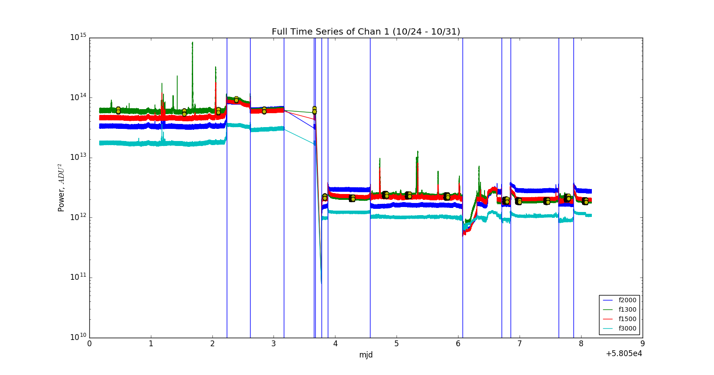
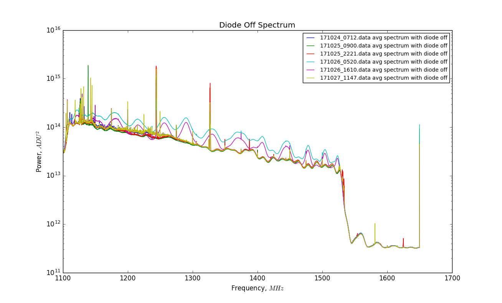
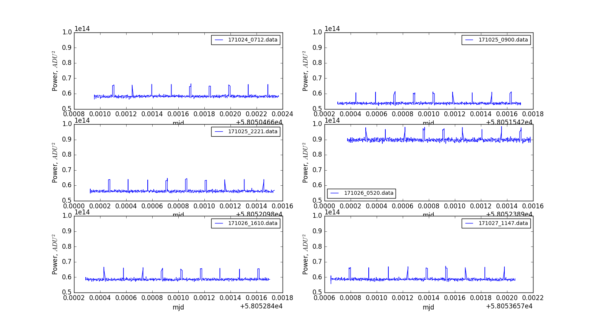

## Nov 6, 2017 - Examining Inversion

### System in High Power Behavior

In my [last posting](../20171106_ResolvedPortIssues/index.md) I exposed that the
digitizer card works properly, but that the data cable connecting to the port
was not properly inserted. Consequently, all data from 10/27 - 11/05 is not
significant. By reconnecting the cable to the digitizer port with the
3dB attenuator, the electrical connection was actually made, and the overall
power level decreased by a factor of 2 from before the cable was improperly
connected.

In this time series plot from [the posting outlining the
issue](../20171101_DamagedPorts/index.md), we shall consider only the first 5
regions of the plot, before the drastic reduction in received power.

**Figure 1: Behavior Bins and Selected Files from Time Series**

The first 3 data files (shown as yellow points) from 10/24 - 10/25 are
relatively similar with the expected spectral shape. At the time, we thought the
system appeared stable and believed we had a stable system after switching
digitizer channels to avoid the faulty ADC. However, in the 4th and 5th data
file, the system has changed power and settled in the 'inverted' state.

The spectra from these data files looks drastically different, as shown in this
figure, also from a previous posting.

**Figure 2: Spectrum for first 6 Data Files**

This spectrum shows the stable state spectra following the same trend, but the
purple and cyan curves (from the inverted state) deviate.

Hopefully, with the addition of the 3dB attenuator the system will remain in
this high power region. Unfortunately, we must still over come the state
inversion shown in figure 1.

### Comparison to Previous State Changes

One of the [previous instability
problems](../20171004_statechanges/index.md) shown here in figure 3, was
identified by Chris about a month ago. In this configuration, the noise diode
was connected to the calibration port on the OMT, not the 30dB coupler.

Of primary interest is the changing pulse height of the noise diode, which
characterized these state changes. Chris asked me to examine the pulse heights
of the 6 data files from the beginning of figure 1, to see if these state
changes had similar behaviors.

**Figure 3: Constant Diode Pulse Heights**

Here it seems that the pulse height of the diode is unchanged from one state to
another. I don't think the two were related but it will take more hunting to dig
up something useful.