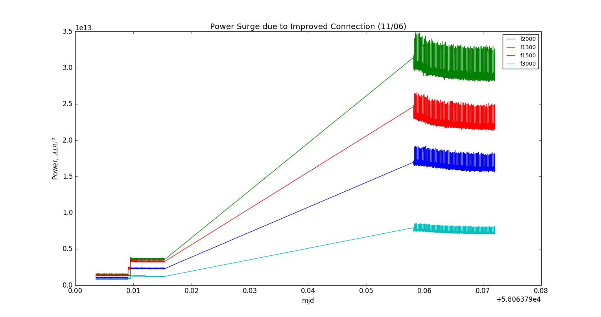
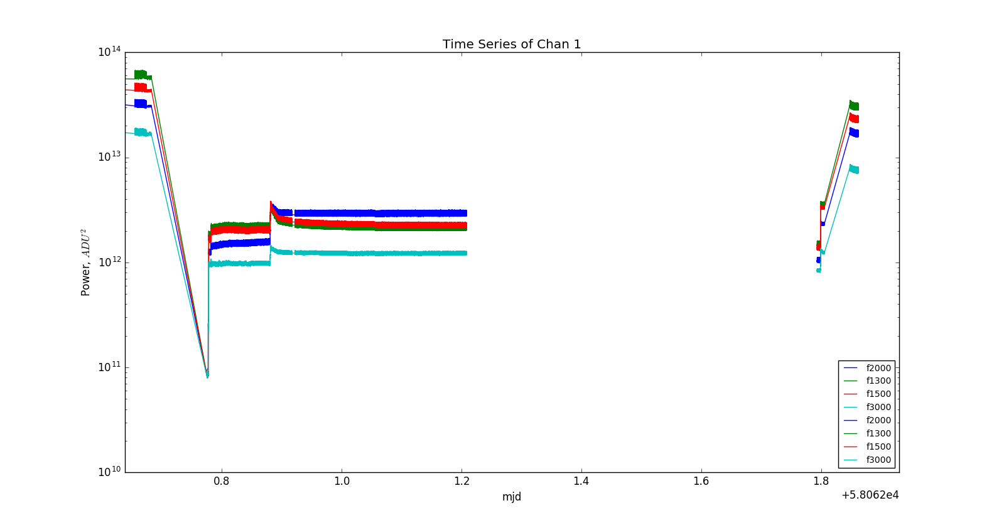
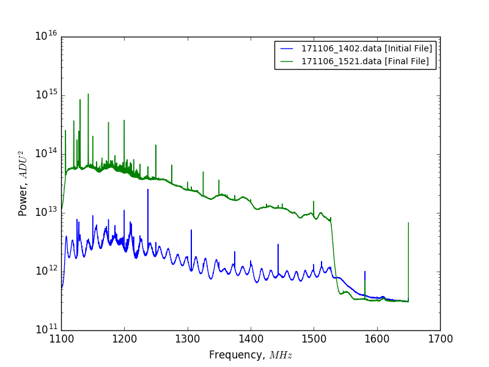

## Nov 6, 2017 - Attenuators on Digitizer Ports

### Palantir 2 Channel Card Status: Alive and Kicking

In my [last posting](../20171101_DamagedPorts/index.md) I examined the
performance of the digitizer card after I damaged its input ports. I found a
disturbing reduction in overall received power by almost a factor of
100. Additionally, the collected spectra from 10/27 - 11/06 had oscillatory
behavior that dominated the shape of our typical spectra. 

The reason for these drastic system changes was trivial -- a faulty electrical
connection between the 15ft data cable and the digitizer card, and does not seem
to be due to internal damage on the digitizer ports.

My initial suspicion was that the oscillatory behavior in the
spectra was due to a poor connecton with the damaged port causing significant
reflections within the 15 foot cable. To test this suspicion, I sought to
compare the terminated and on sky spectra from the digitizer card and the signal
hound. At the conclusion of these measurements, I reconnected the data cable to
the digitizer card, with the addition of a 3dB attenuator. My motivation for
adding the attenuator was to dissipate any reflected signal. 

After restarting data acquisition, I found the shape of the spectra had returned
to its former glory, and that the total power was reduced by a factor of 2 from
the initial level from my last posting, due to the added 3dB attenuator. This
discovery rendered the SignalHound measurements moot, but they indicated that
the amplifier chain was operating as expected.

### Current Configuration:

As before, the OMT+Horn is connected via low-loss cable to the output port of a
30dB coupler operating in reverse. The noise diode is connected to the 30dB
port. The input port of the 30dB coupler is connected via low-loss cable to the
amplifier chain as follows:

BP -> LNA1 -> 3dB -> LNA2 -> LP -> Amp3 -> 3ft Cable -> BP -> Data Cable

As stated earlier, this data cable connects to a 3dB attenuator, which is
attached to the digitizer card port. Chris suggested placing attenuators on all
digitizer ports in the future, to reduce reflections in the data cables and to
protect the port from an excessive amount of connection/reconnection.

### Spectrometer Data Acquisiton from 11/06:

This time series plot shows the data files collected on 11/06 in the process of
debugging the system:

Frequency Bins are the same as before:

1) f1300 = 1274.62MHz - (Green)
2) f1500 = 1301.48MHz - (Red)
3) f2000 = 1368.62MHz - (Blue)
4) f3000 = 1502.89MHz - (Cyan)

**Figure 1: Time Series of Spectrometer Acquisitions (11/06)**

I was convinced that I had destroyed the card ports, and I sought to prove
it by comparing spectra collected with the digitier card to spectra generated
with the SignalHound. 

The first measurements I took were sky spectra and terminated spectra collected
with the spectrometer, before altering any other connections.  The first data
file (LEFT in plot below) starts with the sky spectrum, after which I
disconnected the OMT+Horn from the 30dB coupler output port, and terminated the
port instead.

After this test concluded, I disconnected the data cable from the spectrometer
card, and repeated these measurements using the SignalHound, hence the gap in
the plot below.

As previously stated, I restarted the data acquisition after I reconnected the
data cable to the spectrometer, with the attenuator in place. The second data
file (RIGHT) shows the system operating at much higher power than the initial
files. I believe this is because the attenuator actually made a connection to
the digitizer card port, whereas the cable previously must not have been
adequately connected. 

This power surge led me to believe that the system had returned to the state
shown in the beginning of the last posting, and that the digitizer card was
operating as expected. That comparison is difficult to depict, but I have
attempted to show it here. 

**Figure 2: Comparison to Data from 10/24 - 10/27**

The 4 curves on the left of the image are the tail end of the data collected on
10/27, (displaced by 9 days on the MJD axis!!). 
The 4 curves on the right are the same as the plot shown in figure 1 of
this posting.

Note that the low power values in the middle of the plot are of comparable
power. Additionally, note that the final power values (RIGHTMOST) are a factor
of 2 lower than the (LEFTMOST) initial high power values, due to the addition of
the 3dB attenuator.

So yes, the cause of much of my anxiety was due to a faulty cable connection... 

### Spectra from 11/06:

Further evidence that this connection was the issue can be observed in the
spectra from these data files. 

**Figure 3: Spectra from before and after fixing the data cable connection**

The low power spectrum clearly matches the spectra seen from the low power state
of the previous few days, and the high power spectrum shows the features we
typically see in our sky spectra.