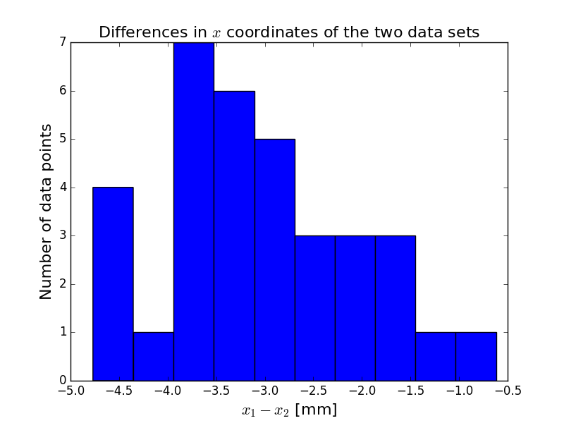

## 6 November 2017 - PhotoModeler Repeatability using RAD Targets

### Quick General Update on Photogrammetry

We are proceeding with photogrammetry to model the dish surface (and to get the correct dish-horn alignment, though we are not concerned with that here) by way of RAD coded targets -- a type of target included with the PhotoModeler software.  Each RAD target corresponds to an (x,y,z) point that will be used in analysis.  As of now, there are a total of 34 RAD targets on the dish surface.

In addition to the 34 targets on the dish surface, there are also 3 targets on the dish platform that are used to define the x and y axes.  They also define the scale, as the three points form a right triangle with legs of length 1 meter.  When standing with your back to the tower, the x axis runs left to right while the y axis runs away from you, such that the z axis points upward by the right-hand-rule.

### The Two Sets of Photos

On 16 Oct 2017, I went out to the basin and took a total of 8 photos of the dish surface.  I split the photos into two sets for reasons that will be made clear in a moment.

**Photo Set 1:**

**Photo Set 2:**

### The Position Differences 

In order to test how precisely PhotoModeler can generate a point cloud from a set of photos, we will cross-reference these two sets of four photos point-by-point.  The scale and orientation is done in PhotoModeler before exporting the data.  We therefore only need to subtract the x, y, and z coordinates of corresponding data sets.

Now, each RAD target has a unique numerical ID attached to it (there are 999 of these).  In a perfect world, when one exports a .txt list of xyz values, the array would be in increasing order of target ID.  Unfortunately, PhotoModeler has an annoying habit of 'willy-nilliy' exporting the xyz data points.  This is to say that the output array is in no aprticular order.  This would not necessarily be a problem except for the fact that our two different data sets will not have rows that match up with eachother.  So the first row in data set 1 could be for target number 3 while the first row for data set number 2 could be for target number 11.  In order to ameliorate this, I have written a [code](bmxproject/dish/sort_photomodeler_output.py) that sorts the PhotoModeler output.

For simplicity, I have also written another [code](bmxproject/dish/position_differences_photomodeler.py)  that computes the differences in x, y, and z for two data sets and plots histograms.

**Difference in x coordinate**

The x differences in mm are [ 1.472  2.79   3.73   2.378  3.436  3.917  2.198  3.306  4.57   1.998
  3.126  3.537  2.571  3.821  4.7    2.982  3.509  3.662  1.377  2.901
  4.471  2.621  3.661  3.705  2.164  3.516  4.339  3.522  4.769  0.619
  1.664  2.94   1.55   2.866]

**Difference in y coordinate**

The y differences in mm are [ 0.556  1.633  3.361  1.082  3.33   4.967  1.134  2.289  4.992  0.59
  2.104  4.335  1.374  2.406  3.981  1.215  3.253  6.126  0.57   1.306
  2.609  0.376  1.875  4.331  0.171  0.5    1.513  0.172  0.03   0.271
  0.663  1.134  0.511  0.968]

**Difference in z coordinate**

The z differences in mm are [ 0.256  0.962  0.927  0.702  1.342  1.012  0.654  0.736  0.285  0.263
  1.254  1.575  0.635  0.259  0.078  0.989  1.682  2.22   0.336  0.21
  0.403  0.189  1.623  2.135  0.469  0.79   2.062  0.05   1.384  0.107
  0.246  0.159  0.028  0.616]

